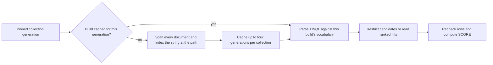

# Full-text search

[Documentation](../README.md) / [API guides](README.md) · [Development status](../status.md)

A **tin index** is VibeDB's full-text index over one JSON string path. It
answers TINQL queries (terms, phrases, wildcards, fuzzy terms, proximity,
positional filters) and ranks matches with BM25. The same engine serves three
interfaces:

| Interface | Declare | Search |
| --- | --- | --- |
| Native Go | `Collection.CreateTinIndex(name, path)` | `Collection.TinSearch(path, tinql, topK)` |
| Typed query | Declare through the native API | `query.Match(path, tinql)` predicate |
| SQL and pgwire | `CREATE INDEX name ON table(path) USING tin` | `path ==> 'tinql'` and `SCORE()` |

Full-text search is a development feature. Read [limitations](#limitations)
before relying on it for a large or write-heavy collection: an index is
rebuilt in memory for every new collection generation that is searched.

## Search from Go

This complete program uses a disposable durable database. Run it from a module
that requires `github.com/thesyncim/vibedb`:

```go
package main

import (
	"errors"
	"fmt"
	"os"

	"github.com/thesyncim/vibedb"
	"github.com/thesyncim/vibedb/query"
)

func main() {
	if err := run(); err != nil {
		fmt.Fprintln(os.Stderr, err)
		os.Exit(1)
	}
}

func run() (err error) {
	dir, err := os.MkdirTemp("", "vibedb-search-*")
	if err != nil {
		return err
	}
	defer os.RemoveAll(dir)

	db, err := vibedb.Open(dir)
	if err != nil {
		return err
	}
	defer func() { err = errors.Join(err, db.Close()) }()

	articles := db.Collection("articles")
	for key, doc := range map[string]string{
		"a1": `{"title":"Vintage watches","body":"Collecting vintage watches at auction"}`,
		"a2": `{"title":"Café guide","body":"The best CAFÉS for watching the harbour"}`,
		"a3": `{"title":"Repairs","body":"Restoring a vintage watch with vintage parts"}`,
	} {
		if _, err := articles.Put(key, []byte(doc)); err != nil {
			return err
		}
	}
	if err := articles.CreateTinIndex("articles_body", "/body"); err != nil {
		return err
	}

	// Ranked search: best BM25 score first.
	hits, err := articles.TinSearch("/body", `vintage AND watch*`, 10)
	if err != nil {
		return err
	}
	for _, hit := range hits {
		fmt.Printf("%s %.4f\n", hit.Key, hit.Score)
	}

	// Filter inside a typed query. Folding makes "cafes" match "CAFÉS".
	q := query.Select(query.Path("title")).
		Where(query.Match("body", "cafes")).
		OrderBy("title", query.Asc)
	result, err := articles.Run(q)
	if err != nil {
		return err
	}
	defer result.Release()
	for row := range result.RowCount {
		title, _ := result.Columns[0].Cells[row].Text()
		fmt.Println(title)
	}
	return nil
}
```

Expected output:

```text
a1 1.5876
a3 1.5680
Café guide
```

`a1` ranks first although `a3` contains `vintage` twice: `vintage` occurs in
two of the three documents, so its inverse document frequency is low, while
`watches` is rare and `a1` is the shorter document. `a2` does not match `vintage AND watch*` even though `watching`
matches `watch*`, because it lacks `vintage`.

### Native API contract

- `CreateTinIndex(name, path)` takes a catalog name and exactly one RFC 6901
  JSON Pointer. It materializes a lazy collection. A duplicate name returns
  `store.ErrIndexExists`; `UNIQUE` is not available for tin indexes.
- On `Memory`, `CreateTinIndex` builds the index for the current generation
  before returning. On `Durable` and `Buffered`, it publishes the declaration
  without building postings; the first search of each generation builds them.
  The declaration can first split wide primary leaves to the 256-slot
  geometry that index masks address, the same preparation an exact index
  build performs, so it is not always a metadata-only operation.
- `TinSearch(path, tinql, topK)` searches the collection's current generation
  and returns at most `topK` hits by descending score. `path` must be spelled
  exactly as it was declared (for example `/body`, not `body`).
- `topK <= 0` returns no hits and no error. A path with no tin index, or an
  absent collection, returns `store.ErrIndexNotFound`. An invalid query returns
  its TINQL parse error.
- Equal scores are ordered by internal document identity. That order is
  lexical key order on disk profiles and physical slot order on `Memory`; do
  not depend on tie order across profiles.
- The facade has no method to drop a tin index. SQL `DROP INDEX` drops one in
  a SQL catalog.

`query.Match(path, tinql)` takes a dotted path or a JSON Pointer, like other
builder predicates. It requires a tin index over that path in the source
being queried.

## Search from SQL

SQL tables in the [`database/sql` driver](sql.md) and the [pgwire
adapter](pgwire.md) use the same index:

```sql
CREATE TABLE docs (id STRING PRIMARY KEY, body STRING);
INSERT INTO docs (id, body) VALUES
    ('d1', 'Luxury vintage watches'),
    ('d2', 'Luxury goods and café culture'),
    ('d3', 'Cheap watches');
CREATE INDEX docs_body_tin ON docs(body) USING tin;

SELECT id, SCORE() FROM docs
WHERE body ==> 'luxury'
ORDER BY SCORE() DESC
LIMIT 10;
```

```text
d1 | 0.8220882430338363
d2 | 0.6545683746420357
```

- `path ==> 'tinql'` is true when the string at `path` matches. The right side
  may be a `?` parameter. Non-string, null, and missing values never match;
  under `NOT`, those rows are also excluded, as with `LIKE`.
- A statement over a path without a tin index fails with an error naming the
  path. `DROP INDEX` removes the declaration; later `==>` statements over that
  path fail.
- `SCORE()` returns the row's BM25 score for the statement's single `==>`
  predicate, or `0` for a row that does not match. It may appear in the SELECT
  list, `ORDER BY`, and `WHERE` (for a relevance cutoff).
- Scoring needs exactly one `==>`, placed in the top-level WHERE. With none,
  several, or one inside a join or subquery, preparation fails. `SCORE()` with
  GROUP BY, aggregates, or set operations is not supported.
- `SCORE` is a function only when followed by `(`, so a column named `score`
  still works.
- `CREATE UNIQUE INDEX ... USING tin` is refused. A declaration over a path
  that no document has is legal and matches nothing. A durable catalog holds
  at most 64 tin declarations.

Declarations survive reopen through the native, SQL, and pgwire interfaces,
and survive `TRUNCATE`. The RF3 schema image carries tin declarations, but
distributed `==>` execution has no qualification record.

## Text analysis

Indexing and query terms use the same analyzer:

- A token is a maximal run of letters, digits, and underscore. Punctuation,
  whitespace, and `-` separate tokens, so `wi-fi` is two tokens.
- ASCII letters are lowercased. Latin-1 accented letters fold to one ASCII
  letter (`é` to `e`, `ß` to `s`, `Æ` to `a`). Other Unicode letters and digits
  are lowercased with `unicode.ToLower` but not accent-folded.
- Positions are 0-based token ordinals inside the analyzer; TINQL positional
  filters count from 1.
- There is no stemming, stop-word list, synonym table, or language-specific
  segmentation. `watch` does not match `watches` unless the query uses a
  wildcard or fuzzy term.
- Terms are identified internally by a 64-bit FNV-1a hash of the folded
  spelling. Distinct spellings that collide would be treated as one term.

## TINQL quick reference

TINQL follows the published PlanetScale TIN query language; a parity suite
in `internal/tin` pins the documented rules. Keywords are UPPER CASE only:
`and` in lowercase is an ordinary search term.

| Form | Examples |
| --- | --- |
| Terms, implicit AND, boolean | `luxury goods`, `a AND b`, `a OR b`, `a AND NOT b`, `(a OR b) c` |
| Phrases, slop, gaps, per-position alternatives | `"fuji apple"`, `"fuji apple"~1`, `"xy [a b] z"` |
| Wildcards, fuzzy, regular expressions, ranges | `brew*`, `apple~1`, `apple~0:1`, `(MATCHES hop.*s)`, `aardvark TO cat` |
| Counting | `AT LEAST 2 OF [alpha beta gamma]`, `AT LEAST 50% OF [a b c d]`, `ALL OF [a b]` |
| Proximity and order | `a NEAR/3 b`, `a THEN/0 b`, `(a OR b) WITHIN 4`, `a BEFORE b` |
| Span relations | `(security NEAR/10 threat) ENCLOSES critical`, `apple ENCLOSED BY (apple NEAR/1 fuji)` |
| Positional filters | `apple IN WORDS 1 TO 3`, `apple IN FIRST 5 WORDS`, `a IN LAST 25 %` |
| Spelling-only match and boosts | `CONTAINS beer~1`, `"alpha beta"^1.5` |

Numeric arguments must fit an unsigned 32-bit integer; boosts lie in
`[0, 10000]`. A query that analyzes to no tokens (empty or only punctuation)
matches nothing; explicit empty syntax such as `""` is a parse error.

Expansion operators (wildcard, fuzzy, `MATCHES`, and ranges) resolve against
the vocabulary of the generation being searched, when the query is parsed:

- A fuzzy term `word~N` is anchored on `word`'s own spelling in that
  vocabulary. If `word` occurs in no indexed document, the fuzzy term matches
  nothing; it does not find near spellings of an unseen word. The default
  shared prefix is one character; `word~P:N` sets it to `P`. Edit distance is
  byte-wise Levenshtein.
- Wildcards and `MATCHES` compile to Go RE2 regular expressions and are tested
  against every vocabulary entry. There is no cap on the number of expanded
  terms.

## Ranking

Scores use BM25 with `k1 = 1.2` and `b = 0.75` and the smoothed inverse
document frequency `ln(1 + (N - df + 0.5) / (df + 0.5))`, computed from the
searched generation's own statistics. Document
length is the token count of the indexed string. A phrase contributes its
span count as the term frequency; `AND` and `OR` sum the scores of matching
children; boosts multiply.

Scores are relative within one generation. They change when any document in
the collection changes, and they are not comparable with scores from another
engine or another VibeDB revision. SIMD and scalar builds compute identical
scores; see [SIMD kernels](../simd.md#full-text-fold-and-bm25-kernels).

## How execution uses the index



Scope: one collection. The index is always derived from the same generation
that the query reads, so results never mix postings from different states.

- The first search after a write builds a new index by reading every document
  in that generation. On disk profiles the build parses each stored document.
  Later searches of the same generation reuse the cached build.
- In SQL and typed queries, the index restricts the scan to candidate rows,
  which are then rechecked. On an in-memory snapshot, a lone `==>` with one
  `ORDER BY SCORE()` key and a `LIMIT` reads the index's ranked hits instead
  of scanning and sorting every row; its output equals the full sort's prefix,
  ties included.
- In-memory snapshots with at least 32,768 documents, on runtimes with
  `GOMAXPROCS >= 2`, search up to eight index segments in parallel under one
  shared statistics view. Rankings match the single index.

## Transactions and sources

| Source | `==>` / `query.Match` |
| --- | --- |
| Native `Collection.Run`, `Session.Run`, and `TinSearch` | Supported on every profile |
| Native `TxCollection.Run` with no staged writes to that collection | Supported |
| Native `TxCollection.Run` after staging writes to that collection | Refused on every profile |
| SQL transaction reading a table with staged writes | Refused; also refused in join inner plans and correlated subqueries on that path |
| `query.FromSegment` and `query.FromValidatedRaw` sources | Refused with a statement error |

The refusal exists because the index describes the committed generation, not
the transaction's pending overlay. Commit or roll back first, or run the search
outside the transaction.

## Limitations

- **Rebuild on change.** Postings are not maintained incrementally. Each new
  generation that is searched pays a full scan of the collection, and a
  write between every pair of searches makes every search pay it. On the
  `Memory` profile the build holds the collection's writer lock, so writes to
  that collection wait for it.
- **Resident memory.** Durable declarations are persisted, but postings are
  never written to disk. Each cached build (up to four generations per
  collection, plus segmented builds on large in-memory snapshots) holds the
  complete inverted index, vocabulary, and key table in memory. Plan memory
  for the largest searched collection; the index cannot exceed RAM.
- **Single path.** One index covers one string path. Fields are not combined,
  and arrays of strings are not indexed.
- **Analyzer.** No stemming, stop words, synonyms, or configurable analyzers;
  accent folding covers Latin-1 only.
- **Expansion cost.** Wildcard, regex, range, and fuzzy operators scan the
  whole vocabulary per query and have no expansion cap.
- **Surface gaps.** No highlighting or snippets, no per-field weighting, no
  facets, and no `SCORE()` with grouping or set operations. Distributed
  execution is unqualified.

## Source map

- Analyzer, TINQL parser, index, and BM25: [internal/tin/tin.go](../../internal/tin/tin.go), [token.go](../../internal/tin/token.go), [fold.go](../../internal/tin/fold.go), [parse.go](../../internal/tin/parse.go), [dict.go](../../internal/tin/dict.go), [bm25.go](../../internal/tin/bm25.go)
- Heap builds and segment cache: [store/store_index_tin.go](../../store/store_index_tin.go)
- Durable generation builds: [store/durable/store_file_tin.go](../../store/durable/store_file_tin.go)
- Facade API: [vibedb.go](../../vibedb.go) (`CreateTinIndex`, `TinSearch`), [vibedb_tin_test.go](../../vibedb_tin_test.go)
- Query binding, ranked top-K, and scoring: [query/match.go](../../query/match.go), [query/match_file.go](../../query/match_file.go), [query/tin_topk.go](../../query/tin_topk.go), [query/score.go](../../query/score.go)
- TINQL parity tests: [internal/tin/parse_parity_test.go](../../internal/tin/parse_parity_test.go), [internal/tin/parse_test.go](../../internal/tin/parse_test.go)
- SQL end-to-end and reopen tests: [sql/driver/tin_fulltext_test.go](../../sql/driver/tin_fulltext_test.go)
