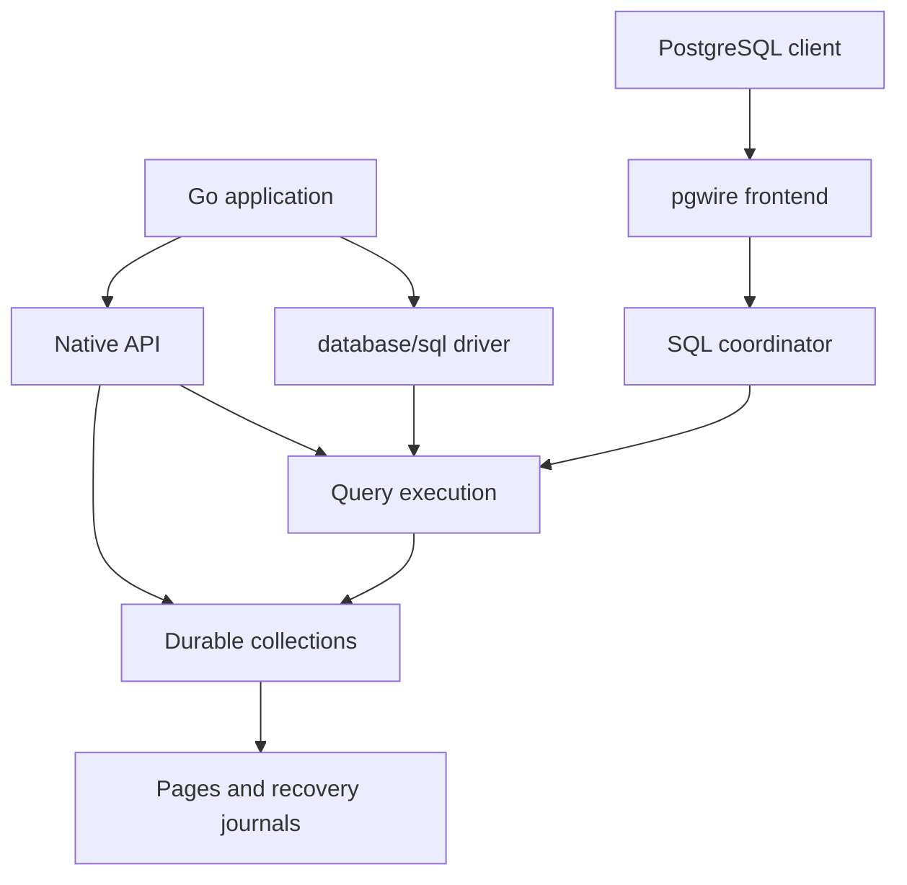
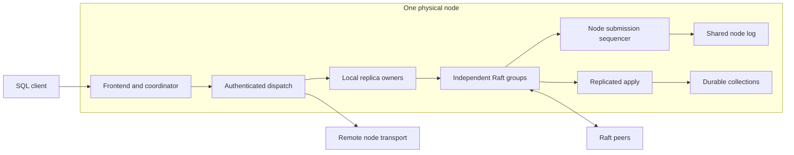

# Architecture

[Documentation](README.md) / [Design](design/README.md) · [Development status](status.md)

VibeDB is an embedded database first. SQL and distributed execution reuse the
same collection and publication machinery; they are not separate storage
engines.

## System map

The native facade owns the database lifecycle. The SQL driver adds a catalog,
table schemas, and SQL transactions. The query engine executes against pinned
sources from the heap or durable store; the heap store also serves as a
reference model. Read [storage engines](store.md) before owning those lower
handles directly.

In distributed mode, a physical node combines a frontend/coordinator, a set
of Raft group replicas, and shared storage scheduling:

Local dispatch avoids a socket and wire encoding while retaining identity,
authorization, bounds, and serving checks. Remote requests use authenticated
transport. The local launcher defaults to three physical serving nodes, with
RF3 replicas placed across them; six-node placement is also available.
Physical-node count, Raft-group count, and replication factor are separate
quantities. See the [local cluster guide](operations/local-cluster.md).

Each owner retains its handles until dependent work is released. This applies
to borrowed bytes, snapshots, query results, sessions, and network reservations.

## Embedded write path

1. The facade validates the collection name, key, document, and selected
   profile.
2. JSON documents are canonicalized unless an expert low-level opaque mode is
   used. The root facade should be treated as JSON-only.
3. The collection builds a new immutable logical generation and maintains exact
   index postings with the primary row.
4. The selected durability lane records or schedules persistence.
5. Publication exposes one immutable generation to new readers.

Readers pin a generation and do not observe an in-place mutation of that
generation. Heap snapshots are lightweight immutable values. Durable snapshots
hold explicit leases and must be closed.

## Publication vocabulary

Three terms prevent misleading atomicity claims:

- **Logical publication** is the visible rows and exact-index postings.
- **Topology publication** changes a content-equivalent physical shape, such as
  a split or representation generation, without changing logical content.
- **Durable publication** is the recoverable cut established by the selected
  journal/root/certificate protocol.

A batch provides **logical failure-atomic publication**: all admitted logical
changes become visible or none do. Preparing that batch may first publish a
**content-equivalent topology generation**. **Generation may advance** even
when the later logical mutation is rejected. Code must compare content or the
appropriate durable fence, not infer “row changed” from a generation number.

## Embedded transaction path

Native transactions take a coherent database cut, stage changes per collection,
and validate serializable dependencies at commit. A one-collection commit uses
the collection batch path. A multi-collection durable commit prepares each
participant, synchronizes those prepares, records one decision, then publishes
the participant cut. An ambiguous decision poisons the catalog until reopen.

SQL uses the same durable collection machinery but adds a catalog, declared
table metadata, statement overlays, isolation levels, and savepoints. DDL is
not accepted inside a transaction.

## Query path

The typed query engine compiles immutable plans. Heap execution reads a pinned
snapshot. Durable execution late-binds persistent exact indexes, admits bounded
workspace, and falls back to a full scan when an optimization cannot fit. A
candidate posting is always rechecked against the document.

Result memory is a separate budget from intermediate work. One-off results and
session-owned results have different lifetimes; both must follow their API's
release rule.

## Distributed path

A coordinator pins one immutable catalog generation for routing, endpoints,
table metadata, and RF3 identities. It admits and authenticates the request
before dispatching to a local owner or remote node.

A read obtains a group-local cut: leader reads use quorum-backed ReadIndex;
explicit follower reads wait for the requested applied floor. Cross-group
results combine independent group cuts and do not provide a global timestamp.

Writes use the domain appropriate to the operation. Eligible single-participant
SQL writes retain their request result in the data group. Coordinated writes
use the request ledger and participant protocol. Each domain has its own
identity and sequencing rules; after an uncertain response, recovery must use
the original identity. [Distributed write domains](distributed-write-lane-proposal.md)
records the protocol and its introduction.

RF3 is a placement and membership policy above the generic Raft kernel.
Ordinary Raft `MsgSnap` is refused; snapshots move through a separate certified,
non-serving artifact pipeline. Replica replacement uses sequential membership
changes and an RF4 intermediate. The detailed [distributed design](operations/distributed.md)
covers fences, recovery, and failure cases.

## Why these boundaries exist

| Choice | Benefit | Cost or constraint |
| --- | --- | --- |
| Immutable published generations | Readers retain a coherent view while writers prepare a successor. | Long-held views retain resources and must be released. |
| Exact index candidates with document rechecks | Index acceleration preserves the document comparison rules. | Index maintenance and rechecks still consume work. |
| Bounded query workspaces | Admission and allocation have explicit limits. | A query can fall back or fail when a required operator cannot fit. |
| Shared physical-node persistence | Independent groups can share append and checkpoint scheduling. | Group identities, ordering, and acknowledgement fences must remain independent. |
| Co-located frontend and storage | Local requests can avoid transport work. | Remote routing and quorum coordination still apply. |

## Security boundaries

The embedded packages open no network listener. An embedding application owns
its process, filesystem, and network boundary.

Distributed service paths bind TLS 1.3 identities to exact binary NodeIDs and
separate traffic classes. Authorization policies grant explicit capabilities
and generations. Development plaintext is opt-in and literal-loopback only.
TLS rotation can close an in-flight stream; a lost response can therefore mean
the operation committed.

Writer locks coordinate cooperating processes. They cannot prevent an external
administrator or process from truncating, replacing, copying, or editing live
files.

## Boundaries that matter

- `ResidentBytes` bounds selected cache and mutable overlay memory, not total
  process RSS, exact-index epochs, catalogs, or every off-heap allocation.
- A successful socket write is not peer receipt or consensus acknowledgement.
- A follower applied-index floor is not a linearizable or bounded-staleness
  guarantee.
- Backup certificates bind per-group cuts; they are not global wall-clock
  snapshots.
- Autosplit records pressure and proposes desired state; it does not by itself
  publish a manifest or move data.
- The planner package is infrastructure. Operator names and test rules do not
  imply that every physical plan is used by SQL.

## Source map

| Area | Implementation and tests |
| --- | --- |
| Native ownership and transactions | [Facade](../vibedb.go), [transactions](../vibedb_txn.go), [snapshot regressions](../vibedb_txn_snapshot_internal_test.go) |
| Query and optimizer | [Query package](../query/), [planner](../planner/), [execution guide](design/query-execution.md) |
| Physical-node provisioning | [Placement](../cmd/vibedb/cluster_dev_physical.go), [composition tests](../cmd/vibedb/cluster_dev_physical_test.go) |
| Embedded frontend | [serve-node](../cmd/vibedb-shard/serve_node.go), [gateway runtime](../internal/gatewayruntime/) |
| Consensus and persistence | [Replica ownership](../internal/raftmember/), [Multi-Raft](../internal/multiraft/), [node log](../internal/raftstore/) |
| Storage and apply | [Durable store](../store/durable/), [replicated state](../internal/replicatedstate/) |
