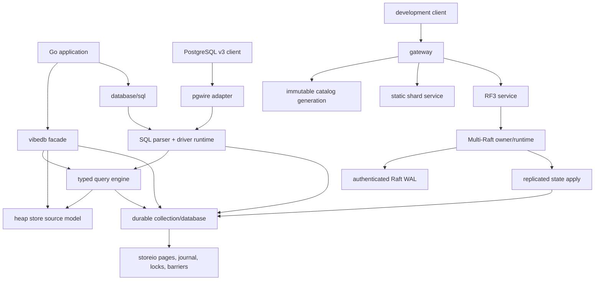
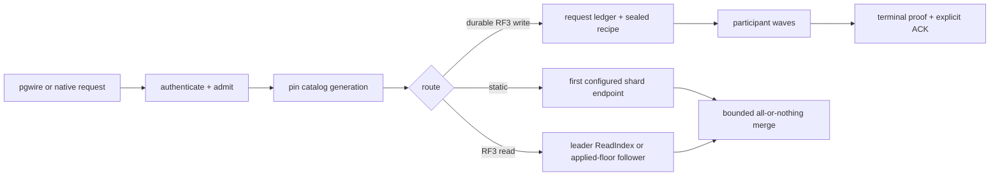

# Architecture

> [!CAUTION]
> This is the architecture of one unreleased commit. APIs, commands, protocols,
> and persisted representations may change without migration. Use the docs and
> binary from one exact commit and only disposable or recoverable data.

VibeDB is an embedded database first. SQL and distributed execution reuse the
same collection and publication machinery; they are not separate storage
engines.

## System map

The primary ownership boundary is visible in the arrows: a higher layer owns a
lower handle and must release it before its backing state. Borrowed bytes,
snapshots, query results, sessions, and network reservations have explicit
lifetimes.

## Embedded write path

1. The facade validates the collection name, key, document, and selected
   profile.
2. JSON documents are canonicalized unless an expert low-level opaque mode is
   used. The root facade should be treated as JSON-only.
3. The collection builds a new immutable logical generation and maintains exact
   index postings with the primary row.
4. The selected durability lane records or schedules persistence.
5. Publication exposes one immutable generation to new readers.

Readers pin a generation and do not observe an in-place mutation of that
generation. Heap snapshots are lightweight immutable values. Durable snapshots
hold explicit leases and must be closed.

## Publication vocabulary

Three terms prevent misleading atomicity claims:

- **Logical publication** is the visible rows and exact-index postings.
- **Topology publication** changes a content-equivalent physical shape, such as
  a split or representation generation, without changing logical content.
- **Durable publication** is the recoverable cut established by the selected
  journal/root/certificate protocol.

A batch provides **logical failure-atomic publication**: all admitted logical
changes become visible or none do. Preparing that batch may first publish a
**content-equivalent topology generation**. **Generation may advance** even
when the later logical mutation is rejected. Code must compare content or the
appropriate durable fence, not infer “row changed” from a generation number.

## Embedded transaction path

Native transactions take a coherent database cut, stage changes per collection,
and validate serializable dependencies at commit. A one-collection commit uses
the collection batch path. A multi-collection durable commit prepares each
participant, synchronizes those prepares, records one decision, then publishes
the participant cut. An ambiguous decision poisons the catalog until reopen.

SQL uses the same durable collection machinery but adds a catalog, declared
table metadata, statement overlays, isolation levels, and savepoints. DDL is
not accepted inside a transaction.

## Query path

The typed query engine compiles immutable plans. Heap execution reads a pinned
snapshot. Durable execution late-binds persistent exact indexes, admits bounded
workspace, and falls back to a full scan when an optimization cannot fit. A
candidate posting is always rechecked against the document.

Result memory is a separate budget from intermediate work. One-off results and
session-owned results have different lifetimes; both must follow their API's
release rule.

## Distributed path

A gateway operation pins one immutable catalog generation for routing,
endpoints, table metadata, and RF3 identities. It authenticates and admits the
request before dispatch. There is no HTTP API.

Static mode is a development routing lane without Raft failover. RF3 groups use
leader election, a durable authenticated WAL, deterministic replicated apply,
and exact serving fences. Cross-group observations are a vector of independent
group cuts, not one global timestamp.

The generic Raft kernel is not inherently RF3. RF3 is a higher-level placement
and membership policy. Ordinary Raft `MsgSnap` is refused; snapshots move
through a separate certified, non-serving artifact pipeline. Replica
replacement uses sequential membership changes and an RF4 intermediate, not
joint consensus.

## Security boundaries

The embedded packages open no network listener. An embedding application owns
its process, filesystem, and network boundary.

Distributed service paths bind TLS 1.3 identities to exact binary NodeIDs and
separate traffic classes. Authorization policies grant explicit capabilities
and generations. Development plaintext is opt-in and literal-loopback only.
TLS rotation can close an in-flight stream; a lost response can therefore mean
the operation committed.

Writer locks coordinate cooperating processes. They cannot prevent an external
administrator or process from truncating, replacing, copying, or editing live
files.

## Boundaries that matter

- `ResidentBytes` bounds selected cache and mutable overlay memory, not total
  process RSS, exact-index epochs, catalogs, or every off-heap allocation.
- A successful socket write is not peer receipt or consensus acknowledgement.
- A follower applied-index floor is not a linearizable or bounded-staleness
  guarantee.
- Backup certificates bind per-group cuts; they are not global wall-clock
  snapshots.
- Autosplit records pressure and proposes desired state; it does not by itself
  publish a manifest or move data.
- The planner package is infrastructure. Operator names and test rules do not
  imply that every physical plan is used by SQL.

## Source map

- `vibedb.go`, `vibedb_txn.go`, and `vibedb_query.go`
- `store/engine.go`, `store/store_database_txn.go`, `store/durable/`
- `query/`, `sql/`, `sql/driver/`, and `pgwire/`
- `gateway/catalog.go`, `gateway/executor.go`, and `gateway/replicated_*`
- `internal/raftservice`, `multiraft`, `raftmember`, `raftmodel`, `raftstore`
- `internal/replicatedstate` and `replication`
