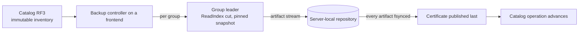

# Backup and restore internals

[Documentation](../README.md) / [Design](README.md) / Backup and restore · [Development status](../status.md)

An RF3 backup is a certified *vector* of per-group Raft cuts. A restore turns
that vector into a new cluster with fresh identities. This page explains why
the design has that shape. The commands and recovery steps are in the operator
guide: [back up and restore RF3 data](../operations/backup-restore.md).

## Backup: a vector of group cuts

1. The catalog supplies one immutable inventory of every group: catalog,
   request ledger, and data.
2. For each group, the controller resolves and rechecks the leader over
   authenticated shard control. The leader reaches a `ReadIndex` cut and pins
   that snapshot.
3. The exporter scans the pinned snapshot twice: once to compute exact size
   and hash, once to stream. The repository writes each artifact straight into
   its draft file, with no second copy.
4. After every artifact draft is validated and fsynced, the repository
   publishes the certificate last, and the catalog operation advances.

The certificate binds the catalog generation and ordered group inventory to
each group's snapshot index and term, lineage, relation manifest, and artifact
hash and size. There is no common applied index across groups. The vector
restores each group to its own cut, which is a consistent recovery point per
group, not a cluster-wide point in time.

Design choices:

- **Certificate last.** Only the certificate is publication authority. Before
  it exists, artifacts have no authority and repository recovery removes
  orphans. After it exists, replay is idempotent.
- **Export is target-free.** The export path is independent of replica
  movement; a learner snapshot is target-bound and is not a backup.
- **Separate capability.** `backup` grants no data, topology, membership, or
  serving authority ([security](security.md)).

## Restore: fresh identities, closed until activated

Restore never reuses source serving authority:

1. A sealed restore operation binds the certificate, the complete artifact
   vector, a sealed target schema set, a fresh generation-one catalog, and the
   policy.
2. Each target root is built non-serving with fresh cluster, group, member,
   node, store, and process-incarnation identities. Restore verifies each
   artifact against the source schema and derives the target machine manifest
   independently. The catalog import discards every source row and installs
   only fresh head, witness, genesis, and restore-policy rows.
3. The staged WAL is adopted; the manifest is published last.
4. Restored replicas start closed. `restore-activate` installs every group,
   writes one activation witness through the target catalog RF3 group, reads
   it back with a separate `ReadIndex` observation, and only then installs
   per-replica serving grants. Grants are process-local: a restarted replica
   closes again until the activation is re-observed.

## Limitations

- No cluster-wide consistent snapshot, recovery-time objective, or
  recovery-point objective.
- Cross-build restore, schema migration during restore, and mixed-version
  recovery are unsupported.
- Operation assembly still uses builder APIs; there is no single provisioning
  command and no production PKI.
- Backup has no mandatory multi-process gate with foreground load, leader loss,
  retention release, or restore readback. Every export pays twice its logical
  bytes in scan reads.

## Evidence

| Claim | Proof |
| --- | --- |
| Restored catalog and base/global-index data serve, and an acknowledged write survives leader `SIGKILL`, re-observation, and regrant | [`restore-rf3-external.yml`](../../.github/workflows/restore-rf3-external.yml) runs `TestRestoredRF3ExternalProcessServingAndFailover` three times. |
| Every activation publication cut recovers within bounds | `TestActivationExternalProcessRecoversEveryPublicationCutWithinBounds` in CI "repository contracts". |
| Restore roots build and recover without source authority | `TestGroupInstallerBuildsAndRecoversThreeAuthorityFreeRoots` in the same job. |

## Source map

| Area | Implementation | Decisive tests |
| --- | --- | --- |
| Certificate and repository | [`clusterbackup/certificate.go`](../../internal/clusterbackup/certificate.go), [`clusterbackup/repository.go`](../../internal/clusterbackup/repository.go), [`clusterbackup/live_collect.go`](../../internal/clusterbackup/live_collect.go) | `internal/clusterbackup` tests |
| Backup controller | [`gateway/backup_operation.go`](../../gateway/backup_operation.go), [`gateway/backup_repository_coordinator.go`](../../gateway/backup_repository_coordinator.go) | `gateway` backup tests |
| Restore | [`clusterrestore/operation.go`](../../internal/clusterrestore/operation.go), [`clusterrestore/serving_grant.go`](../../internal/clusterrestore/serving_grant.go), [`restoreservice/installer.go`](../../internal/restoreservice/installer.go) | [`restore_rf3_process_test.go`](../../cmd/vibedb-shard/restore_rf3_process_test.go) |
