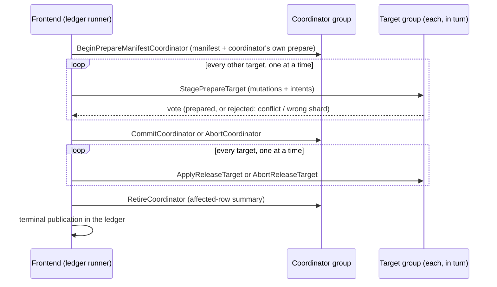

# Distributed transactions

[Documentation](../README.md) / [Design](README.md) / Distributed transactions · [Development status](../status.md)

A replicated write whose mutations span several Raft groups (several shards,
or a base table and an independently placed global index) commits through a
participant protocol that is driven by the [request ledger](exactly-once-writes.md).
This page describes that protocol, what it guarantees, and what it does not.
For embedded and single-process SQL transactions, see [transactions](../transactions.md).

## What a distributed transaction is

On the RF3 path a distributed transaction is one *write program*: the lowered
mutations of one `exec_batch` request or one PostgreSQL autocommit statement.
It is atomic across groups: every participant applies its mutations, or none
does. There is no interactive multi-statement RF3 transaction, no read set
validated at commit, and no global timestamp. Isolation comes from per-key
intents held between prepare and apply, and from the exact old-value guards
carried by computed updates.

## Participants and roles

- One participant group also acts as the **coordinator**. It stores the
  transaction control record and the canonical manifest of participants, and
  its own prepare is fused into the begin proposal.
- Every group that owns mutations is a **target**.
- The request ledger stores the sealed program and the decision cursor. The
  frontend that runs the program is stateless: any authorized frontend can
  resume it from ledger state.

Relation IDs are dense integers authenticated by the route's schema
generation. SQL text and relation names never enter the Raft log.

## The fused commit schedule

The success path fuses adjacent steps into single proposals: the coordinator's
begin with its manifest, each target's stage with its prepare vote, and each
target's apply with its release. With a manifest that fits in one command, a
commit therefore takes `2 × targets + 2` sealed waves, and an abort
`3 × targets + 2` (manifests larger than fifteen 64 KiB pages add one wave per
extra command). The ledger records the expected wave counts in the sealed
program and refuses any mismatch.

Each arrow is one ledger wave with its own [route-gate
session](exactly-once-writes.md#route-gate-sessions): acquire, run, settle, and
release. The ledger's continuation cursor records progress after every wave, so
a crash at any point resumes at the next unfinished wave with the same bytes.

A request whose mutations all belong to one group skips the coordinator and
uses the single-proposal `ApplySingleTarget` operation, or the
[direct lane](exactly-once-writes.md#direct-lane), which avoids the ledger
entirely.

## Invariants

- **Atomic prepare.** A target's prepare writes its intent rows and retained
  mutation payload in one apply. A rejected vote (index conflict or wrong
  shard) leaves only a compact control witness: nothing needs cleanup.
- **Decision before visibility.** Target mutations become visible only in the
  apply-and-release step, after the coordinator has durably recorded commit.
- **Byte-bounded, not count-bounded.** A transaction's resident state on one
  group is capped at 128 MiB of encoded system keys and values. Manifests are
  paged, and there is no participant-count ceiling.
- **Replay, not recomputation.** Recovery re-proposes retained command bytes
  and reads participant state through a leader-only, `ReadIndex`-fenced
  transaction-recovery reader. It never re-evaluates SQL.
- **Retirement before completion.** The coordinator retires its manifest before
  the ledger records completion. The retirement tombstone is accepted as
  evidence only for the final pending wave.
- **Recovery authority is separate.** Reading hidden transaction state requires
  the `transaction_recovery` capability. Ordinary data readers and writers
  cannot discover targets or decisions (see [security](security.md)).

## Intents and conflicts

An intent binds a `(relation, key)` to its transaction from prepare until
release. Intent scopes are half-open virtual-bucket intervals, sorted and
coalesced. While an intent is active:

- a conflicting prepare is rejected, and the whole transaction aborts;
- an exact-key point read of that key is refused with
  `ErrTransactionIntentActive`;
- a general SQL read on that group is refused if the group holds *any*
  unresolved intent. This check is conservative at group granularity.

Readers receive a typed refusal (`ErrReplicatedReadIntentActive` at the
frontend) rather than waiting. The frontend's automatic read retry does not
cover it; the caller decides whether to retry.

## Recovery

Because the program is sealed in the ledger, recovery is deterministic:

1. Reopen the ledger head and continuation cursor.
2. If a wave advanced but its route release is outstanding, finish that
   release first.
3. Before a decision, recover the prepared prefix to learn any rejected vote.
4. After a decision, continue the chosen branch. Participants may already be
   applied and released, and their old prepare state is not required.
5. Publish the terminal result and release the execution pin
   ([terminal publication](exactly-once-writes.md#request-ledger-lifecycle)).

The replicated coordinator also supports bounded logical *recovery pulses* (at
most three) that authorize abort of an abandoned coordinator without a clock.
The static-lane recovery path uses them. The RF3 runner instead resumes the
sealed program from ledger state.

## The static lane

Static development shards (`vibedb-shard serve`) have their own journal-based
transaction engine with inline and root-bound paged coordinator manifests. It
is exposed only through one single-base-owner `exec` whose independently
placed global-index writes add participants. General multi-statement or
cross-base-shard static `exec_batch` is not exposed, and public `exec_batch` is
reserved for RF3.

> [!WARNING]
> Static-lane journal compaction omits coordinator recovery-pulse records.
> Reopening after compaction can reset pulse state, so a compacted static
> journal is not qualified recovery authority for an in-flight coordinator.

## Tradeoffs

| Choice | Benefit | Cost |
| --- | --- | --- |
| Sequential waves, one target at a time | Bounded memory; every step is a durable, resumable ledger cut. | Commit latency grows linearly with participants; no parallel prepare. |
| Ledger-sealed program | Any frontend recovers; no process-local registry. | Several ledger and route-gate proposals per wave. |
| Group-granular SQL read refusal | Reads never observe a half-applied transaction. | Unrelated reads on a busy group fail while any intent is active. |
| No global timestamp | No clock dependency and no timestamp oracle. | Cross-group reads return independent per-group cuts; see [reads and time](reads-and-time.md). |

## Limitations

- No interactive or read-write RF3 transactions; only atomic write programs.
- No parallel participant preparation.
- `RETURNING`, `ORDER BY`, `LIMIT`, nested targets, and `ON CONFLICT` are
  refused on RF3 writes.
- External chaos gates use whole-document updates; computed-update recovery
  under process faults is not qualified.
- The external process gates do not bound total Raft or network bytes.

## Evidence

| Claim | Proof |
| --- | --- |
| Two independently led data groups, isolation, exact hidden-command retry, former-leader refusal | `TestTwoRealRF3GroupsExecuteFusedTwoTargetTransactionAcrossLeaderIsolation` (clock and fault matrix) and `internal/raftservice` RF3 transaction tests. |
| Multi-relation atomicity with cross-hosted global indexes under partition, leader kill, and frontend replacement | [`durable-rf3-multirelation.yml`](../../.github/workflows/durable-rf3-multirelation.yml). |
| Replacement-frontend terminal replay and ACK recovery | [`durable-rf3-external.yml`](../../.github/workflows/durable-rf3-external.yml). |

## Source map

| Area | Implementation | Decisive tests |
| --- | --- | --- |
| Operation vocabulary | [`distributedtxn/replicated_codec.go`](../../internal/distributedtxn/replicated_codec.go), [`distributedtxn/codec.go`](../../internal/distributedtxn/codec.go) | `internal/distributedtxn` tests |
| Replicated apply | [`transaction_apply.go`](../../internal/replicatedstate/transaction_apply.go), [`transaction_codec.go`](../../internal/replicatedstate/transaction_codec.go), [`data_read.go`](../../internal/replicatedstate/data_read.go) | [`owner_rf3_multigroup_transaction_test.go`](../../internal/raftservice/owner_rf3_multigroup_transaction_test.go) |
| Runner | [`replicated_request_transaction_runner.go`](../../gateway/replicated_request_transaction_runner.go), [`replicated_transaction_protocol.go`](../../gateway/replicated_transaction_protocol.go), [`replicated_transaction_recovery.go`](../../gateway/replicated_transaction_recovery.go) | [`owner_rf3_transaction_test.go`](../../internal/raftservice/owner_rf3_transaction_test.go) |
| Static lane | [`gateway/transaction.go`](../../gateway/transaction.go), [`gateway/recovery.go`](../../gateway/recovery.go), [`distributedtxn/journal.go`](../../internal/distributedtxn/journal.go) | [`recovery_test.go`](../../gateway/recovery_test.go) |
