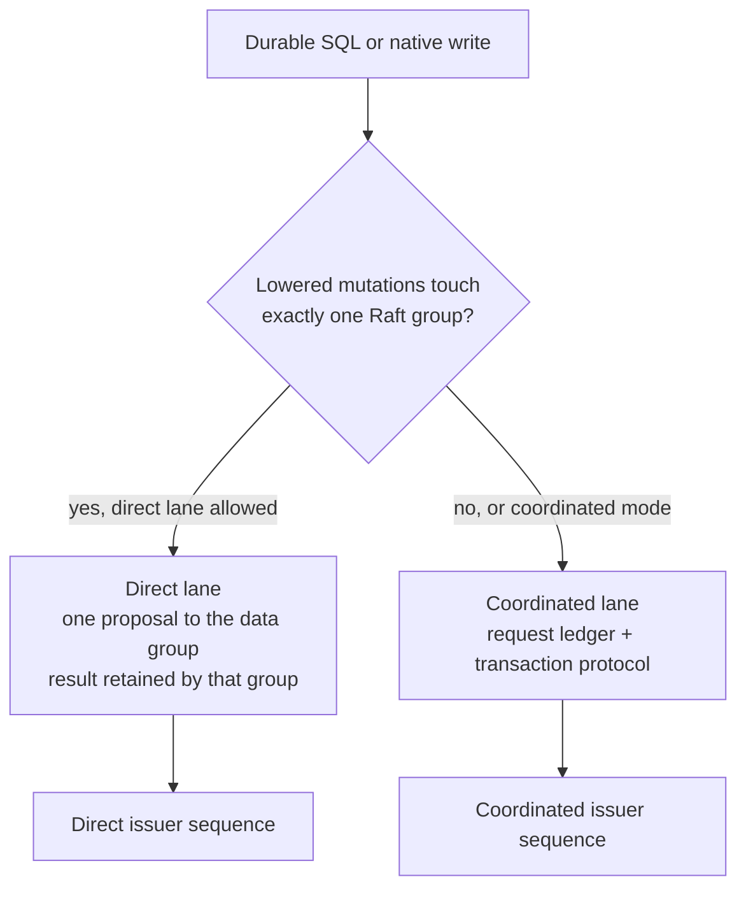
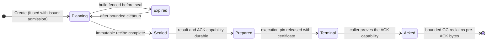

# Exactly-once writes

[Documentation](../README.md) / [Design](README.md) / Exactly-once writes · [Development status](../status.md)

A replicated write can commit even when its caller sees an error: a leader can
apply an entry and then lose the connection before replying. VibeDB therefore
never asks a caller to guess. Every durable write carries a request identity,
the first committed application of that identity is retained, and recovery
re-drives the *same* identity until it learns the result. This page explains
the identities, the two write lanes, the request ledger, and the rules for
retrying. [Distributed transactions](distributed-transactions.md) covers the
participant protocol that a coordinated request runs.

## The rule

After a request may have been admitted, retry the exact canonical request
bytes under the same identity. Do not mint a new request ID, change the
payload, or infer failure from a lost connection. A new identity is safe only
after a *typed pre-admission refusal*, which proves this attempt reached no
Raft log.

| Result class | Meaning | Safe action |
| --- | --- | --- |
| Terminal committed or aborted | The identity has a retained final outcome. | Use it. Acknowledge it (coordinated lane) so it can be collected. |
| Pre-admission refusal (`ErrDurableSQLNotAdmitted` with a proposal refusal or serving-fence cause) | No proposal was admitted by this attempt. | Rebuild from the original request, including under a newer catalog. |
| Outcome unknown (lost connection, cancellation, leader change after admission) | The entry may still commit and apply. | Re-drive the same identity and bytes. |
| Deterministic abort (a failed preimage guard, or an intent or transaction-control conflict) | The state machine durably rejected the command. | That abort is the identity's outcome. Some abort codes are retryable as an operation (for example once a conflicting intent clears), but a new attempt needs a new identity. |

Transport retry and request retry are different mechanisms. Resending a peer
frame repairs Raft delivery. Re-driving a request identity settles whether the
logical operation committed and what it returned.

## Two write lanes



The two lanes have independent issuer lanes and sequence counters. A
direct-only request never falls through to the ledger silently: if it cannot
be lowered to one group, it returns `ErrDurableSQLDirectIneligible` together
with `ErrDurableSQLNotAdmitted`, and only then may the caller switch lanes. An
unknown outcome must be recovered in the lane that produced it.

### Direct lane

`ReplicatedExecutor.DirectMutate` applies one complete single-group mutation in
one consensus entry, with no ledger, execution pin, route gate, coordinator, or
intent. The target group's transaction control retains the terminal result
under the request identity. An exact retry of the lane's latest request returns
the original applied index and affected-row count.

An eligible `UPDATE` (exact primary-key equality, declared top-level columns,
supported scalar expressions, no primary-key move) is prepared once. The
frontend reads the current row, evaluates the assignments simultaneously,
canonicalizes the postimage, and seals it with the old row's length and
SHA-256 digest. The read may use the leader's committed state rather than a
`ReadIndex`, because apply performs an exact old-value compare-and-swap. A
concurrent writer makes the guard fail, and the request aborts
deterministically instead of overwriting. Retries replay the sealed bytes; the
expression is never evaluated again.

Recovery can rebind a retained direct recipe only to the *same* logical shard,
group, and allocation with a fence that advanced (for example after a leader
change or replica move). After a split moves the key to another group, the old
identity cannot be recovered on the new route.

### Coordinated lane

Everything else (multiple groups, global-index maintenance, multi-statement
`exec_batch`) runs through the request ledger. `DurableRequestService` owns the
lifecycle. It keeps no process-local request registry, so any frontend
authorized for the issuer can recover a request.

## Request identity

A `requestledger.RequestKey` is the complete idempotency identity:

| Field | Purpose |
| --- | --- |
| Scope and principal | How the issuer was authenticated (TLS principal or persisted local installation). |
| Request ID | Caller-chosen 128-bit identity. |
| Tenant digest | Binds the authenticated tenant. |
| Issuer epoch, lane, and sequence | A replicated issuer grant. Sequences are admitted contiguously. |

Admission of sequence *n* happens in the same replicated transaction as the new
request head, so a gap, a replay under a different digest, or sequence reuse
cannot pass admission even when several frontends race. An issuer high-water
mark retires old sequences: a retired identity is refused before any
per-request lookup, which prevents a collected request from being resurrected.

The request key also derives a *ledger home*: a uniformly distributed hash
whose high bits select a ledger range from the catalog. Changing ledger
capacity is a catalog range operation; it does not change any request's home.

## Request ledger lifecycle

The ledger is a dedicated RF3 group with a byte-canonical grammar. Its phase is
monotone:



- **Sealed recipe.** The planned program is streamed into immutable plan pages
  (512 KiB pages, 1 GiB plan ceiling). After sealing, recovery replays these
  bytes; SQL is not planned or evaluated again. A replacement frontend can
  replay a sealed request from the key alone. Only an unsealed request needs
  the original program to finish planning.
- **Waves.** Physical work is a sequence of *waves*, each naming exact target
  and command bytes inside the sealed recipe. A pending-wave record can name
  up to 256 steps. Wider programs use more waves. There is no
  participant-count ceiling, only byte bounds.
- **Terminal publication in three transitions.** First the prepared result and
  raw ACK capability are persisted. Then the co-located execution pin is
  released atomically with its certificate; this checks the current frontend
  principal and exact lease in the same apply. Then the terminal result is
  published. A frontend that lost the reply recovers the certificate from the
  ledger under its own service identity; it needs neither the original
  frontend's credentials nor a separate release session.
- **ACK and collection.** The client acknowledges by proving possession of the
  ACK capability. Collection deletes pre-ACK rows in bounded chunks (256 rows
  per step). The ACK becomes final only after every pre-ACK byte is reclaimed,
  and the ACK row itself is never a collection target.

## Route-gate sessions

Each data shard has a replicated *route gate*: a small state machine in that
shard's Raft group that orders request waves against topology changes.

| Operation | Effect |
| --- | --- |
| `AcquireShared` | A request wave pins the shard at the current gate epoch. Refused while a drain is pending or active. |
| `ReleaseShared` | Releases one pin. |
| `BeginExclusive` | A split, move, or schema drain. It is pending while pins are active and becomes active when the last pin releases. |
| `ReleaseExclusive` | Ends the drain and increments the epoch. Later commands with the old epoch are refused as stale. |

A wave runs through a fixed durable sequence that `RunWave` can resume from
any ambiguous return:

```text
route intent -> route proposal -> route proof -> pending work -> work settlement
-> continuation -> release intent -> release proposal -> release proof
```

The route-pin row in the ledger is the session's exact-command journal. A lost
`Open`, acquire, or release response is recovered from ledger state on any
frontend, without a frontend-local file. If a session's deterministic `Open`
was already superseded by another attempt of the same wave, the runner
resumes from the refreshed ledger cut instead of failing. A lost
`ReleaseShared` response is settled by reading a *release receipt*: the
retained completion in the source session ring, read after a leader-only
quorum barrier with the request-ledger capability.

## Execution pins

The logical program is also pinned against catalog and schema changes by an
*execution pin* in the catalog group. Its lease is not a duration. It is an
interval of catalog applied indexes: by default a lease stays valid through
one further applied position, and every unfinished wave refreshes it. A
recovering frontend opens a new session and performs a compare-exact
`Recover`, which the replicated kernel accepts only strictly beyond the
previous lease fence. Takeover therefore needs catalog progress, not elapsed
time. See [reads and time](reads-and-time.md).

## Retry layers

| Layer | Scope | Purpose |
| --- | --- | --- |
| In-flight waiter registry (`raftserve.Registry`) | One process | Coalesces exact repeats of a local attempt onto one enqueue; changed fences create a distinct attempt with the same logical result identity. |
| Replicated session ring | One group | Retains recent sequence outcomes per session for exact duplicates; cumulative ACK advances the retained floor. |
| Request ledger | Cluster | Recovers multi-step and cross-group work from the sealed recipe through ACK and collection. |

A duplicate within a session's retained window returns the retained result.
Changed bytes under the same logical identity conflict. A sequence below the
retained floor is refused as retired, never guessed.

## PostgreSQL writes

The PostgreSQL protocol has no idempotency key, so the loopback PostgreSQL
endpoint acts as a durable client on the application's behalf:

- Coordinated writes go through one serialized, fsynced outbox per table (at
  most 64 tables). Direct writes use a bounded concurrent pool with its own
  outbox. The outbox persists the identity, lane, and exact recipe before
  execution.
- A pre-admission refusal caused by a membership or ownership transition is
  retried for up to 10 seconds with 20–250 ms backoff. If the retained recipe
  can be re-driven, it keeps its identity; otherwise it is dropped and
  re-planned under a new one.
- An attempt that stays unknown is reported to the client as an unresolved
  outcome. It is resolved before the next statement on that table's lane.

This makes the frontend's own attempt exactly-once. It does not make an
*application* retry after a lost PostgreSQL connection exactly-once: a new
connection issuing the same statement creates a new identity. Applications that
need end-to-end idempotency should use the native `exec_batch` endpoint with
their own persisted identity, or make statements idempotent.

## Limitations

- Direct recipes cannot be recovered across a split of their key's group.
  Their outcome must be resolved before the split completes, or it remains
  unknown to that client.
- The coordinated lane executes waves one target at a time. Its latency grows
  linearly with the number of participant groups, and each wave pays several
  ledger and route-gate proposals. The direct lane exists because of this cost.
- Ledger-home ranges are immutable catalog metadata. The request ledger has no
  online range split.
- Large completion-digest references have no durable blob-store fulfillment
  path.
- `RETURNING`, `ORDER BY`, `LIMIT`, nested targets, and `ON CONFLICT` are fenced
  on RF3 writes. The PostgreSQL endpoint exposes writes only as durable
  autocommit statements.
- The external chaos gates use whole-document updates. Computed-update
  recovery is covered by local tests only.

## Evidence

| Claim | Proof |
| --- | --- |
| Terminal and ACK recovery across leader partitions, two frontends | `TestTwoGatewayDurableSQLRF3RecoversTerminalAndAckAcrossLeaderPartitions`, three runs in the CI "Recovery, replica replacement and PostgreSQL clients" job. |
| Lost terminal and ACK responses, killed ledger leader, replacement frontend with a different principal, rolling voter restarts | `TestGatewayDurableRF3ExternalProcessRecovery` in [`durable-rf3-external.yml`](../../.github/workflows/durable-rf3-external.yml). |
| Multi-relation writes with cross-hosted global indexes under partition, leader kill, and replacement | `TestGatewayDurableRF3MultiRelationChaosProcess` and `TestTwoGatewayDurableSQLRF3RecoversUnfinishedWaveWithDefaultPinSpan` in [`durable-rf3-multirelation.yml`](../../.github/workflows/durable-rf3-multirelation.yml). |
| Byte-identical retry after `SIGKILL` settles | `TestServeRF3ShippedFaultHarness` in the [clock and fault matrix](../../scripts/ci/clock-fault-matrix.sh). |

The process gates bound exact public request and response bytes, snapshot
payload bytes, latency, RSS, storage, and WAL allocation. They do not measure
total Raft or network traffic.

## Source map

| Area | Implementation | Decisive tests |
| --- | --- | --- |
| Ledger grammar | [`requestledger/types.go`](../../internal/requestledger/types.go), [`issuer_highwater.go`](../../internal/requestledger/issuer_highwater.go), [`pending_wave.go`](../../internal/requestledger/pending_wave.go), [`route_pin.go`](../../internal/requestledger/route_pin.go), [`prepared_terminal.go`](../../internal/requestledger/prepared_terminal.go), [`ack_gc.go`](../../internal/requestledger/ack_gc.go) | `internal/requestledger` tests |
| Ledger apply | [`request_ledger_apply.go`](../../internal/replicatedstate/request_ledger_apply.go) | [`owner_rf3_request_ledger_fault_test.go`](../../internal/raftservice/owner_rf3_request_ledger_fault_test.go) |
| Request service | [`replicated_request_service.go`](../../gateway/replicated_request_service.go), [`replicated_request_lifecycle_runner.go`](../../gateway/replicated_request_lifecycle_runner.go), [`replicated_request_terminal_coordinator.go`](../../gateway/replicated_request_terminal_coordinator.go) | [`durable_rf3_external_process_test.go`](../../internal/gatewayruntime/durable_rf3_external_process_test.go) |
| Route gates | [`routegate/machine.go`](../../internal/routegate/machine.go), [`replicated_request_route_gate_session.go`](../../gateway/replicated_request_route_gate_session.go), [`raftservice/route_settlement.go`](../../internal/raftservice/route_settlement.go) | `internal/routegate` tests |
| Execution pins | [`executionpin/transition.go`](../../internal/executionpin/transition.go), [`replicated_request_execution_pin_authority.go`](../../gateway/replicated_request_execution_pin_authority.go) | `internal/executionpin` tests |
| Direct lane | [`replicated_direct_mutation.go`](../../gateway/replicated_direct_mutation.go), [`durable_sql_prepared_direct.go`](../../gateway/durable_sql_prepared_direct.go), [`durable_sql_request_executor.go`](../../gateway/durable_sql_request_executor.go) | `gateway` direct-mutation tests |
| PostgreSQL outbox | [`pgwire_write.go`](../../internal/gatewayruntime/pgwire_write.go), [`pgwire_write_tables.go`](../../internal/gatewayruntime/pgwire_write_tables.go) | [`seamless_scale_process_test.go`](../../internal/gatewayruntime/seamless_scale_process_test.go) |
| Waiter registry | [`raftserve/registry.go`](../../internal/raftserve/registry.go) | `internal/raftserve` tests |
