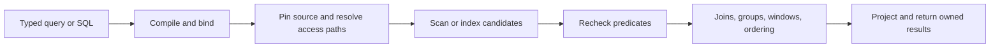

# Query execution and operators

[Documentation](../README.md) / [Design](README.md) / Query execution

VibeDB turns a typed query or SQL statement into a plan over pinned collection
sources. Access paths reduce the candidate set; operators apply exact value
semantics, combine rows, and build the result within explicit budgets.

Use the [query API](../api/query.md) to write a query and the
[SQL reference](../reference/sql.md) to check supported syntax. This page
explains the work behind those interfaces.

## From a statement to rows



This is a conceptual data flow. A particular plan can fuse stages, avoid an
intermediate result, or use a specialized packed-column operation. Operators
remain responsible for the same comparison and cardinality rules.

Compilation retains immutable plan metadata. Execution binds source
capabilities and index definitions, acquires its workspace, and owns the
snapshot and result lifetimes required by its API. Reusing a plan does not
permit concurrent reuse of one mutable execution workspace.

## Access paths

| Path | Work performed | Constraint |
| --- | --- | --- |
| Primary point lookup | Resolve a complete primary key directly. | The source and predicate must support that key shape. |
| Primary range | Traverse an admitted primary-key interval. | Preserve predicate, ordering, offset, and limit semantics. |
| Exact secondary index | Probe scalar or compound postings to select candidate rows. | Recheck candidates against document values. |
| Full scan | Visit the source when no admitted shortcut applies. | Charge intermediate and result work; cancellation still applies. |
| Packed-column count or extrema | Count or reduce eligible compressed values without reconstructing documents. | Exact predicate, encoding, source, and overlay conditions must match. |

An optimization may decline and leave execution on a general path. It must
not omit rows on the basis of an approximate estimate. Packed counts and
integer extrema have scalar and SIMD implementations; see
[packed-column execution](../simd.md) for the actual dispatch conditions.

## Relational operators

| Operator family | Purpose | Behavior to account for |
| --- | --- | --- |
| Filter and projection | Select rows and output expressions. | Missing paths, explicit null, and exact numbers retain their defined semantics. |
| Join and semijoin | Match rows or test whether a match exists. | SQL joins and builder joins have different cardinality rules; pair and workspace limits bound work. |
| Group and aggregate | Maintain one accumulator set per group. | Exact aggregate state has its own budget; cardinality determines retained state. |
| Sort and limit | Produce requested order and result window. | A small limit does not prove that the source can avoid scanning or sorting. |
| Window | Evaluate functions over a partition and ordering. | Partition, order, and frame rules determine required retained work. |
| CTE and set operation | Reuse or combine relational results. | Materialization, recursion, and duplicate handling have explicit execution limits. |

For example, a typed aliasless join is a semijoin: it filters driving rows
without emitting a row for every match. SQL joins can fan out. Choosing an
interface therefore determines more than the syntax used to express a query.

## Inspect a plan

`Query.Explain()` reports prepared logical metadata as JSON. A logical
explanation cannot promise which physical access path a later source binding
will choose. The SQL driver can include source metadata; `EXPLAIN ANALYZE`
executes the query and adds observations from that execution.

For an existing table in the embedded SQL driver:

```sql
EXPLAIN SELECT id FROM employees WHERE id = 'employee-0001';
EXPLAIN ANALYZE SELECT id FROM employees WHERE id = 'employee-0001';
```

Inspect the access path, filter columns, late columns, and any analyzed row
and execution counters. Explain output is a development format. Support in a
local SQL driver does not establish support through every distributed adapter.

## Distributed planning

The gateway resolves shard routes from a pinned catalog and can use published
statistics to estimate work. Complete shard-key constraints can target one
shard; incomplete constraints can require a subset or scatter.

Grouping that contains every distribution-key path can produce disjoint final
groups on the shards. Other grouping requires coordinator combination. Global
ordering, offset, and limit still apply after collection. Network traffic,
reducer memory, and coordinator memory are separate costs and limits.

The generic `planner` package supplies a bounded memo search over expressions
and required physical properties. Callers provide the rules and cost model.
The presence of an operator or rule in that package does not mean every SQL
adapter executes it. [Distributed optimizer and statistics](../distributed-optimizer.md)
describes the integrated choices and remaining gaps.

## Memory and lifetime

Intermediate work, aggregate state, joins, and output have distinct budgets.
A plan that cannot fit a required operator can return a resource error. A
fallback is valid only if it preserves the result and fits the applicable
bounds. These limits do not cap total process RSS.

Release results, sessions, and snapshots in their documented order. A held
snapshot can retain older storage generations; a session-owned result can
become invalid when the session executes again. See the
[query lifecycle](../api/query.md#reuse-execution-storage) and
[limits reference](../reference/limits.md).

## Source map

| Area | Implementation and tests |
| --- | --- |
| Compilation and execution | [compiler.go](../../query/compiler.go), [execute.go](../../query/execute.go) |
| Source candidates | [candidates.go](../../query/candidates.go), [store_candidates.go](../../query/store_candidates.go) |
| Explain contract | [explain.go](../../query/explain.go), [explain tests](../../query/explain_test.go) |
| Joins | [join.go](../../query/join.go), [join tests](../../query/join_test.go) |
| Exact aggregation | [aggregate.go](../../query/aggregate.go), [exactness tests](../../query/aggregate_exact_test.go) |
| Windows | [window_statement.go](../../query/window_statement.go), [window tests](../../query/window_statement_test.go) |
| Result budget | [result_budget.go](../../query/result_budget.go), [budget tests](../../query/result_budget_test.go) |
| Bounded optimizer | [planner package](../../planner/doc.go), [optimizer tests](../../planner/optimizer_test.go) |
