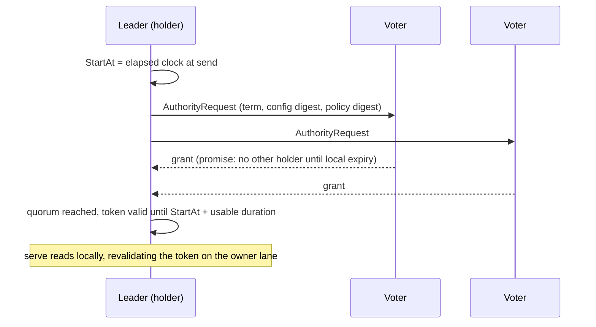

# Reads, leases, and time

[Documentation](../README.md) / [Design](README.md) / Reads and time · [Development status](../status.md)

Every RF3 read is a cut of one Raft group. The system has no global timestamp,
so a read that touches several groups returns several independent cuts. This
page defines the read modes, the optional quorum read authority that avoids a
`ReadIndex` round, and the separate time domains that the system relies on.

## Read modes

| Read | Admission | Guarantee |
| --- | --- | --- |
| Leader read with `ReadIndex` | Exact serving fence, current leader and term, quorum-confirmed read index, local apply through that index | Linearizable for that group. |
| Leader read with read authority | Same fence, plus a quorum-granted authority token that is still valid on the leader's elapsed clock | Linearizable for that group, under the clock-rate assumption below. |
| Catalog, route-gate, and ledger authority reads | Leader and quorum-backed `ReadIndex`. Transaction-recovery reads never use a lease or a follower. | Linearizable observation of that authority. |
| Explicit follower read | Exact serving fence and term, local applied index at or above the caller's floor | The caller's floor only. **Not linearizable, with no staleness bound.** |
| `read_batch` | Exact-key reads folded by group, each with its own leader cut | An explicit, sorted observation vector of per-group applied indexes. All-or-nothing. |
| General SQL `SELECT` over RF3 | Independent leader cut per target group | Per-group cuts merged at the frontend. No public observation vector. |

If leadership or node incarnation changes before a `ReadIndex` barrier is
applied locally, the barrier is lost and the read fails; it is never answered
from the new term's state. A successful read returns its admitted serving fence
with the applied watermark of the data it read, and does not pair the result
with a later status probe. Reads filter transferred ownership before joins,
aggregation, and `LIMIT`. Reads that meet an active transaction intent are
refused (see [distributed transactions](distributed-transactions.md#intents-and-conflicts)).

## Read authority

`ReadIndex` costs one quorum round per read barrier. The optional *read
authority* replaces it with a quorum-granted, time-bounded promise, in the
spirit of leader leases, but without trusting wall-clock time:

- **Promises block elections.** A voter that granted a promise refuses
  election edges until the promise expires on its own clock. A higher term does
  not clear it. Leader transfer first drains local rounds and waits out the
  election gate.
- **Conservative duration.** With maximum grant `D` and clock-rate bound `ρ`,
  the holder may use `D·(1−ρ)/(1+ρ) − margin` from the moment it *sent* the
  request. Voters hold promises for `D` on their own clock.
- **Restart quarantine.** A restarted voter stays out of elections for
  `D·(1+ρ)/(1−ρ) + margin`, so a promise it made before crashing cannot overlap
  a new leader.
- **Only elapsed clocks.** The protocol accepts a process-local elapsed clock
  that must never go backwards. On Linux it is `CLOCK_BOOTTIME`, which counts
  suspend time, so a paused process cannot resume with a stretched lease. A
  rollback or clock error permanently disables authority for that owner.
  Other platforms have no qualified clock and keep `ReadIndex`.
- **All or nothing.** Every voter must run the same enabled policy version,
  with one capability record per voter. A shrunk or stale policy cannot form a
  self-quorum. Anything else falls back to `ReadIndex`.

The development launcher enables authority for a fresh RF3 physical-node
cluster when the platform clock passes its first qualified sample, which means
Linux. The retained choice cannot silently change on restart. Its policy is
`D` = 5 s, `ρ` = 10 %, margin 1 ms: a usable window of about 4.09 s and a
restart quarantine of about 6.11 s. See
[local cluster](../operations/local-cluster.md) for the flag.

The tradeoff is failover time. When a leader with a live authority dies, the
survivors cannot elect a replacement until their promises expire, which adds
up to `D` to the election delay. A `ReadIndex`-only deployment has no such
wait.

## Time domains

| Domain | Source | Used for |
| --- | --- | --- |
| Raft ordering | Term and index | Commit order, `ReadIndex`, leadership. |
| Logical ticks | The owner's 50 ms ticker, fed as input | Elections, heartbeats, WAL generation cadence, checkpoint scheduling. |
| Catalog and topology | Monotone generations, epochs, and revisions | Routing, ownership, route gates, hot-shard cooldown. |
| Execution-pin leases | Intervals of catalog applied indexes | Takeover of an abandoned request program. |
| Transaction conflict clock | Bounded first-committer-wins history | Embedded and SQL-driver serializable validation. Overflow causes a conservative conflict. |
| Read authority | Process-local elapsed clock with drift bound | Leader read leases only. |
| Wall clock | UTC | TLS certificate validity, network and context deadlines, retry backoff, catalog-session deadline construction, and the static read-fence lane. |

No consensus or ordering decision derives from UTC. A UTC step can expire a
certificate or a deadline and thereby cause refusals or outcome-unknown
results, but it cannot reorder commits or grant a lease.

## Clock and suspend faults

The [clock-fault matrix](../../.github/workflows/clock-fault-matrix.yml) runs
[`clock-fault-matrix.sh`](../../scripts/ci/clock-fault-matrix.sh) on Linux on
every pull request. Skips fail the matrix. It covers:

| Gate | Fault |
| --- | --- |
| `TestPeerTLSIndependentUTCStepMatrix` | Independent peer UTC steps against TLS validity. |
| `TestRecoveryManifestMissingPageRequiresLogicalPulsesAcrossRestart` | Logical recovery pulses across restart. |
| `TestTwoRealRF3GroupsExecuteFusedTwoTargetTransactionAcrossLeaderIsolation` | Two-group leader isolation with exact transaction retry. |
| `TestRF3NativeServingThreeProcessRecoveryEvidence` | Real process suspend and resume, former-leader refusal, foreground failover latency. |
| `TestServeRF3ShippedFaultHarness` | Shipped `serve-rf3` kill and partition pressure. |

The read-authority protocol additionally has deterministic drift, delay,
renewal, and restart-deadline tests compared against independent
arbitrary-precision arithmetic; see the
[dated read-authority record](../qualification/read-authority-2026-09-05/README.md).
These are bounded tests, not a formal proof.

## Limitations

- No global MVCC timestamp, global snapshot read, or cross-group consistent
  analytical cut. `read_batch` vectors and backup certificates are per-group
  cut vectors.
- Follower reads have no staleness bound, and there is no external
  follower-staleness latency gate.
- Read authority relies on the configured clock-rate bound. It is qualified
  only on Linux, and it lengthens failover after a leader crash.
- The live database-process UTC is not stepped in the matrix, and arbitrary
  static read-fence suspension or overrun is unqualified.
- General RF3 SQL reads are not covered by the external process gates; only
  the exact-key `read_batch` lane is.

## Source map

| Area | Implementation | Decisive tests |
| --- | --- | --- |
| Data reads | [`raftservice/data_read.go`](../../internal/raftservice/data_read.go), [`replicatedstate/data_read.go`](../../internal/replicatedstate/data_read.go), [`replicatedstate/point_read.go`](../../internal/replicatedstate/point_read.go) | [`data_read_test.go`](../../internal/raftservice/data_read_test.go), [`read_index_freshness_test.go`](../../internal/raftservice/read_index_freshness_test.go) |
| Read authority protocol | [`raftauthority/authority.go`](../../internal/raftauthority/authority.go), [`raftauthority/clock_linux.go`](../../internal/raftauthority/clock_linux.go) | [`authority_drift_test.go`](../../internal/raftauthority/authority_drift_test.go) |
| Authority in the runtime | [`raftmember/read_authority.go`](../../internal/raftmember/read_authority.go), [`raftservice/read_authority_owner.go`](../../internal/raftservice/read_authority_owner.go) | [`read_authority_owner_test.go`](../../internal/raftservice/read_authority_owner_test.go) |
| Launcher default | [`cluster_dev_read_authority.go`](../../cmd/vibedb/cluster_dev_read_authority.go) | CI "RF3 read-authority default and protocol" job |
| Batch reads | [`replicated_sql_read.go`](../../gateway/replicated_sql_read.go) | [`read_batch_rf3_external_process_test.go`](../../internal/gatewayruntime/read_batch_rf3_external_process_test.go) |
| Conflict clock | [`txnclock/clock.go`](../../internal/txnclock/clock.go) | [sharded clock record](../qualification/sharded-clock-2026-09-04/README.md) |
