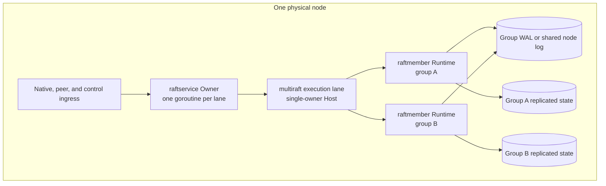

# Replication and Raft groups

[Documentation](../README.md) / [Design](README.md) / Replication · [Development status](../status.md)

VibeDB replicates each shard, the catalog, and the request ledger as an
independent Raft group. A physical node hosts replicas from many groups and
can share persistence and scheduling among them, but it never merges their
consensus. This page explains the group runtime, the two persistence lanes,
membership changes, and the peer transport. For how requests reach a group,
see [request routing](routing.md).

## Groups, replicas, and physical nodes

| Quantity | Meaning | Current development shape |
| --- | --- | --- |
| Raft group | One ordered log and one replicated state machine. | Separate groups for the catalog, the request ledger, and each data shard. |
| Replica | One member's copy of a group. | RF3: three voters in steady state; four voters briefly during replacement. |
| Physical node | One serving process that hosts replicas of many groups. | `vibedb cluster dev` starts three (or six) `vibedb-shard serve-node` processes. |

RF3 is a serving policy, not a property of the Raft kernel. The kernel
represents other voter counts, and generic tests exercise RF1 and RF2, but the
catalog publishes exactly three serving replicas per route
(`ServingReplicaCount`). The RF1 development topology is explicitly no-HA.

## Consensus core

The consensus core is the pinned `go.etcd.io/raft/v3` v3.7.0 library behind
the `raftmodel` integration boundary. The baseline configuration is locked by
tests:

| Setting | Value | Consequence |
| --- | --- | --- |
| Pre-vote and check-quorum | On | A partitioned member cannot disrupt a healthy leader; an isolated leader steps down. |
| Read-only option | `ReadOnlySafe` | Leader reads use a quorum `ReadIndex`, not a clock lease, unless [read authority](reads-and-time.md#read-authority) is enabled. |
| Proposal forwarding | Disabled | A follower refuses proposals; the gateway must find the leader. |
| Step down on removal | On | A removed leader stops leading. |
| Heartbeat / election | 1 / 10 logical ticks | `serve-rf3` and `serve-node` supply a tick every 50 ms. |
| Message and inflight bounds | 1 MiB per message, 64 messages or 8 MiB in flight, 64 MiB uncommitted | Admission limits, not wire validation; codecs reject oversized input separately. |

The core never samples wall-clock time or runs its own ticker. The owner feeds
logical ticks, which makes the deterministic simulator (`internal/raftsim`)
able to replay schedules. It also means election timing is only as regular as
the owner's scheduling.

## Runtime and scheduling

- A `raftmember.Runtime` binds exactly one authenticated WAL (or node-log group
  view) to one replicated SQL apply root. It owns incarnation minting, node
  construction, proposal admission order, and the Ready lifecycle. It has no
  network or serving authority of its own.
- `multiraft.ExecutionLanes` partitions groups deterministically across
  independent single-owner hosts. Lanes run concurrently; one group's work
  always stays on one lane, so its Raft ordering is unchanged. The command
  default is 8 lanes (power of two, 1–64). A host scans only runnable groups,
  so an idle group costs memory and storage but no scheduler scan.
- A `raftservice.Owner` goroutine is the sole caller of its host. Request
  handlers never enter Raft directly; they submit bounded work and wait for
  settlement through `raftserve.Registry`.

There are two Runtime variants. The synchronous runtime persists, sends, and
applies each Ready in order on the owner lane. The pipelined runtime uses the
library's ordered asynchronous-storage protocol, with log I/O on a dedicated
append lane. Both shipped serving commands adopt the pipelined variant, on
either persistence lane below; the synchronous variant remains for tests and
lower-level composition.

## Persistence lanes

Both lanes follow the library's ordered asynchronous-storage contract. A
leader may send appends to followers while its own append is in flight, but
anything that depends on local durability waits for it: a follower's append
acknowledgement, the leader's own contribution to a commit quorum, and a vote
are released only after the local append completes. Committed entries are
applied in log order, and state, membership, and results are published
atomically per apply batch.

### Per-group WAL

Without a `node_log` manifest section, each group owns a bounded,
preallocated, encrypted, authenticated, and digest-chained WAL tied to an
immutable placement identity. Each append follows an ordered protocol:

1. Capture one Ready and assign `(node incarnation, Ready ID)`.
2. Append the authenticated Ready record and complete the platform
   record-ordering barrier (`fdatasync` on Linux; `F_BARRIERFSYNC` with
   `File.Sync` fallback on Darwin; `File.Sync` elsewhere).
3. Write the alternate authenticated current slot, then `File.Sync`. This
   final sync is the power-safe acknowledgement boundary.

Retries of the same Ready ID must carry the same bytes. A failure after the
current-slot write begins is outcome-unknown; an exact retry reads the slot and
completes the final sync without rewriting an already exact image. An apply
failure is terminal for that runtime: restart and recovery reconcile the WAL
with applied state.

Startup authenticates the family manifest, header, both current slots, records,
key, recovery epoch, and SQL/apply binding before adoption. One torn slot can
be selected around, but local recovery cannot distinguish a crash tear from a
post-acknowledgement rollback. Such a root is quarantined and must not serve or
rejoin on the strength of a plausible higher slot.

### Shared node log

With a `node_log` manifest section, which the physical-node development
topology always uses, one `raftstore.NodeStore` owns the device-level
persistence for every group on the node:

- A submission sequencer admits bounded immutable per-group Ready submissions
  and persists them in node-level *waves*. `seglog.PersistWave` appends one
  frame and performs one data sync per wave. The frame checksum and payload
  digest cover every group batch in it, so recovery applies all of a wave or
  none of it.
- A group may contribute one contiguous series of Ready values per wave.
- Each group keeps its own log identity, incarnation, commit position, and
  applied state. A wave shares a sync, not consensus authority.
- A sync error poisons the handle, because the frame may be durable anyway.
  Reopen recovers it; an exact wave-ID and payload retry is then a no-op.
- One node-wide checkpoint coordinator captures application checkpoints and
  reclaims retired log segments asynchronously.

Segment size, maximum wave bytes, group capacity, and series span are
independent bounds. Capacity pressure is an admission condition, never
permission to discard live recovery state.

### Log retention

Retention follows the local application checkpoint. Per-group WALs are
replaced by certified compacted *generations* on a fixed logical cadence (ten
minutes of ticks by default), and a group near WAL exhaustion blocks new input
until a certified generation is selected. The node log retires segments after
node checkpoints. `internal/raftmember` does not hold log entries back for a
lagging follower. A follower that needs entries below the leader's retained
base cannot be repaired by ordinary append; it needs the out-of-band snapshot
path described below.

## Snapshots never travel as `MsgSnap`

Ordinary Raft snapshot messages are refused at the node, runtime, and peer
frame boundaries. The pipelined runtime intercepts an outbound `MsgSnap` and
sends an ordinary append probe carrying only the base index and term: that lets
a restarted peer that already holds the base resume, and it never transfers
snapshot data.

Real state transfer uses a separate authenticated snapshot traffic class:

1. The source captures a bounded, certified collection artifact at an exact
   applied index and term.
2. The target stages it in a non-serving root. Staged rows carry no routing or
   serving authority.
3. The target verifies the complete image, installs and checkpoints it, then
   publishes a new log base.
4. Normal runtime recovery adopts the result, and the Multi-Raft host admits
   the group as a learner.

A crash during staging can replay at most one chunk. Only the certified
snapshot/base relationship enters the Raft lifecycle.

## Membership changes

Replica replacement is an externally authorized, resumable sequence. It does
not use joint consensus.

```mermaid
stateDiagram-v2
    direction LR
    [*] --> Grant: catalog membership grant (linearizable)
    Grant --> Learner: add target as learner
    Learner --> CaughtUp: snapshot installed, match >= commit
    CaughtUp --> RF4: promote target to voter
    RF4 --> Transferred: transfer leadership if the source leads
    Transferred --> RF3: remove source voter
    RF3 --> [*]: catalog observes the exact final roster
```

The grant binds one source, one target, the initial three voters, the catalog
generation, and a transition digest. Adding the learner does not authorize
removal. Promotion must be durably observed, and removal is accepted only from
the four-voter state with no learner or joint configuration pending. Absence of
a grant is not revocation; revocation requires a linearizable catalog read.
[Topology changes](topology-changes.md) covers the controllers that drive this
sequence.

After a restart, durable membership returns but volatile leadership does not.
The group needs real peer traffic before it can lead again.

## Quorum behavior

| Reachable voters | Behavior |
| ---: | --- |
| 3 | Elect and commit, subject to fences and capacity. |
| 2 | Elect and commit with no remaining fault tolerance. |
| 1 | No commit. `ReadIndex` reads and writes fail or time out. |
| 0 | Unavailable. Recover processes or storage; never manufacture membership. |

All eight three-voter reachability masks are enumerated by
`TestRF3AllThreeVoterQuorumCutsFailClosedOrCommit` in CI.

## Peer transport

Peers use mutual TLS 1.3. A critical certificate extension carries the cluster
ID, cluster incarnation, and node ID; subject and DNS names grant nothing.
Ordinary Raft, snapshot data, shard-native, shard SQL, shard control, gateway
client, and gateway control traffic each use a distinct ALPN, so a stream
admitted for one class cannot be replayed against another. See
[security](security.md) for authorization.

Delivery is lossy and duplicating by design:

- `Send` means validation, bounded queue reservation, and local ownership of
  encoded bytes. A completed socket write is not a receiver, Raft, commit, or
  apply acknowledgement.
- A failed write retains its batch, so a retry can duplicate a frame.
- Under exact transport backpressure the owner may drop one ordinary packet to
  avoid head-of-line blocking; Raft retransmission repairs it.

This is crash-fault Raft among authenticated members, not Byzantine consensus.
A compromised member that holds a valid replication grant can inject
leader-origin replication messages; transport does not authenticate leadership.
Serving, snapshot, and read-authority frames carry stricter current-membership
fences than ordinary replication frames, which may legitimately lag a
configuration change.

## Evidence

| Claim | Proof |
| --- | --- |
| Majority commit and minority fail-closed | `TestRF3AllThreeVoterQuorumCutsFailClosedOrCommit` (CI "Hot-shard and transport qualification" job). |
| Lane scaling and hot-group isolation | `BenchmarkExecutionLanes*` in the same job; a benchmark, not a pass/fail bound. |
| Physical-node composition, SIGKILL, and reopen | [`fused-node-rf3.yml`](../../.github/workflows/fused-node-rf3.yml) runs `TestFusedRF3NodeProcessQualification` for three and six physical nodes. |
| WAL retention under crash loops | [`wal-retention.yml`](../../.github/workflows/wal-retention.yml) runs `TestServeRF3WALRetentionCrashQualification` three times. |
| Leader kill, stopped voter, rolling restart | [`durable-rf3-external.yml`](../../.github/workflows/durable-rf3-external.yml). |

The [distributed feature ledger](../distributed-feature-state.md) states which
of these are still partial.

## Limitations

- Linux and macOS are the only platforms on which WAL creation and opening
  succeed. Several process gates, including automatic replica replacement,
  skip on Darwin because its allocation contract cannot provide the Linux
  power-loss boundary.
- A torn-slot quarantine has no automatic repair; the replica must be rebuilt
  through replacement.
- Log truncation ignores follower progress. A follower that falls behind the
  retained base needs a snapshot-based replica move.
- Deterministic simulation does not model physical WAL tears, TLS framing,
  process scheduling, or autonomous election timing.
- There is no live-SIGHUP external gate, no exhaustive quorum/apply-cut
  process gate, and no 64-group process scaling gate.
- No mixed-build or rolling-upgrade path exists. Formats are unreleased and
  have no legacy decoder.

## Source map

| Area | Implementation | Decisive tests |
| --- | --- | --- |
| Raft configuration | [`raftmodel/config.go`](../../internal/raftmodel/config.go), [`raftmodel/node.go`](../../internal/raftmodel/node.go) | `internal/raftmodel` field-locking tests |
| Runtime | [`raftmember/runtime.go`](../../internal/raftmember/runtime.go), [`raftmember/node_checkpoint.go`](../../internal/raftmember/node_checkpoint.go) | [`generation_driver_test.go`](../../internal/raftmember/generation_driver_test.go) |
| Scheduling | [`multiraft/host.go`](../../internal/multiraft/host.go), [`multiraft/lanes.go`](../../internal/multiraft/lanes.go), [`raftservice/owner.go`](../../internal/raftservice/owner.go) | [`lanes_test.go`](../../internal/multiraft/lanes_test.go), [`owner_rf3_test.go`](../../internal/raftservice/owner_rf3_test.go) |
| Per-group WAL | [`raftstore/store.go`](../../internal/raftstore/store.go), [`raftstore/generation_activate.go`](../../internal/raftstore/generation_activate.go) | [`generation_test.go`](../../internal/raftstore/generation_test.go), [`fault_test.go`](../../internal/raftstore/fault_test.go) |
| Node log | [`raftstore/node_store.go`](../../internal/raftstore/node_store.go), [`raftstore/node_sequencer.go`](../../internal/raftstore/node_sequencer.go), [`seglog/engine.go`](../../internal/raftstore/seglog/engine.go) | [`node_series_test.go`](../../internal/raftstore/node_series_test.go), [`node_sequencer_test.go`](../../internal/raftstore/node_sequencer_test.go) |
| Transport | [`rafttransport/identity.go`](../../internal/rafttransport/identity.go), [`rafttransport/transport.go`](../../internal/rafttransport/transport.go) | [`owner_rf3_network_isolation_test.go`](../../internal/raftservice/owner_rf3_network_isolation_test.go) |
| Membership | [`membershipgrant/grant.go`](../../internal/membershipgrant/grant.go) | [`membership_test.go`](../../internal/raftservice/membership_test.go) |
| Command wiring | [`serve_rf3.go`](../../cmd/vibedb-shard/serve_rf3.go), [`rf3_node_manifest.go`](../../cmd/vibedb-shard/rf3_node_manifest.go), [`rf3_node_owner.go`](../../cmd/vibedb-shard/rf3_node_owner.go) | [`fused_node_process_test.go`](../../internal/gatewayruntime/fused_node_process_test.go) |
