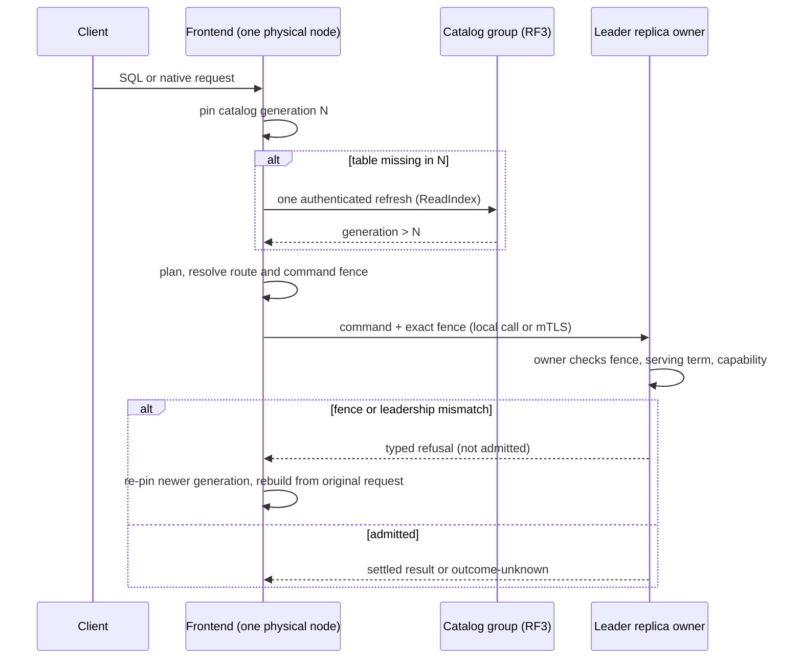

# Request routing and the catalog

[Documentation](../README.md) / [Design](README.md) / Request routing · [Development status](../status.md)

A frontend (the gateway) turns a client request into commands for specific Raft
groups. It never repairs a route or reinterprets a command: it pins one
immutable catalog generation, builds exact fences from it, and lets each
replica refuse anything that no longer matches. This page covers the gateway,
the replicated catalog, command fences, and schema generations.

## Where a frontend runs

| Deployment | Frontend | Catalog |
| --- | --- | --- |
| Physical-node development cluster (`vibedb cluster dev`, RF3) | Embedded in every `vibedb-shard serve-node` process. | Replicated catalog RF3 group. |
| Standalone gateway | `vibedb-gateway serve`, a thin wrapper around the same `internal/gatewayruntime` assembly. | Replicated catalog, or an explicit static development catalog file. |
| Static shards | `vibedb-gateway serve` over `vibedb-shard serve` endpoints. | Static file; leader-only SQL shards without RF3. |

The static lane is a development path with a narrower contract: it shares SQL
planning but not RF3 request identity, recovery, or read semantics. The rest of
this page describes the replicated catalog path.

Each frontend exposes an authenticated native endpoint (newline-delimited
canonical JSON over TLS) and, optionally, a loopback-only PostgreSQL endpoint.
In the physical-node topology exactly one frontend is the *controller
frontend*: it runs the topology, backup, schema, and hot-shard controllers and
owns DDL. The others are `ControlParticipantOnly`. They serve traffic and
answer catalog-drain requests, and they forward DDL to the owner. The role is
fixed by configuration.

## The request path

Local and remote dispatch share one contract. When the leader replica lives in
the same process, `ReplicatedServer.DispatchReplicated` skips the socket and
wire encoding but applies the same service authorization, owner admission, SQL
quotas, and serving fences as the authenticated socket path. Only a
certificate-bound local binding can install it.

## Catalog generations

A catalog `Snapshot` is one immutable, atomically published generation. It
holds distributions, table placements, routing manifests with per-shard
ownership epochs, endpoint membership, index descriptors, advisory statistics,
and the RF3 route for every group. The holder publishes generations lock-free;
a reader sees a whole old or a whole new generation.

Rules that follow from this:

- **Pin once per operation.** A request plans and builds every command from one
  generation. After a stale-fence refusal it pins a newer generation and
  rebuilds from the original request; it never splices newer metadata into an
  old command.
- **Refresh only on evidence.** A known-table lookup uses the pinned generation
  with no extra quorum read. A missing table is the only planner error that
  triggers one coalesced, authenticated refresh and one complete re-prepare.
  Other errors return immediately.
- **Publication only moves forward.** Controllers publish with an
  exact-predecessor compare-and-swap. A stale controller must re-observe and
  replan; it cannot publish an unrelated higher generation.
- **A generation is not a snapshot.** Groups routed from one generation still
  read through independent Raft barriers. Routing agreement does not create a
  cross-group point-in-time view.

### Replicated catalog authority

In replicated mode the catalog is an RF3 group, read with `ReadIndex` and
written through compare-and-swap mutations.

- **Genesis.** Generation one, its proof, the first head, the node directory,
  and the service directory are written in one base-relation transaction of
  put-absent-or-equal mutations. Identical bootstrap producers converge; a
  divergent plan fails atomically.
- **Certified heads.** The head is bound to the immutable genesis and to a
  generation/length/digest witness. The witness is a digest record, not a
  signature: authority comes from the authenticated catalog service and its
  Raft commit. Readers check the current proof, structure, and monotone
  identity; they do not replay historical membership receipts, so a reader may
  skip intermediate generations.
- **Route seed.** Each frontend keeps a private, mutable *route seed*: the
  last certified location of the catalog group itself. Byte-identical heads
  cost no disk I/O. When the catalog group's placement or voter addresses
  change, which happens when seamless scaling moves it, the seed is rewritten
  live. A change to the catalog session's command binding is staged until the
  durable predecessor-session handoff completes. Only local seed corruption or
  durability uncertainty requires a quiesced restart.

## Routes and command fences

A `ReplicatedRoute` names one allocation of one group:

| Part | Contents | Why it is exact |
| --- | --- | --- |
| Group key | Cluster ID and incarnation, topology recovery epoch, shard incarnation, group ID | A restored, split, or recreated group cannot alias an old one. |
| Allocation generation | Monotone per allocation | Ownership moves invalidate old routes. |
| Command fence | Replica-set version, active policy generation, protection and ownership epochs, schema generation, relation-manifest digest, routing version, route generation | Every admission-relevant coordinate is compared at the replica. |
| Lineage and range identity | Digests of placement history and key range | Split children and parents are distinct. |
| Replicas | Exactly three serving endpoints | Serving never widens beyond RF3. One extra *discovery* endpoint (an enrolled target or a retiring source) can be probed for leadership but is never selected for serving. |

The replica's owner compares the whole fence on its serialized lane,
immediately before proposal admission. A mismatch is a typed refusal before
the local Raft core admits anything, so the request can safely be rebuilt.
Leader discovery uses only endpoints the route already contains; a leader hint
never introduces a new address.

### Forwarding an old command

After a split or move, a command built from the previous generation can still
arrive at the old group. The route-forward authority, a replicated table in
the catalog group, can bind one exact old command to one immutable target. The
old command bytes are authenticated and wrapped, never rewritten. An entry
resolves only after the target group has applied past a floor. It is pruned
only after the catalog lifetime, the source route-gate epoch, and the request
ledger's retry low-water mark have all passed.

## Schema generations

Schema changes use the same fence discipline. A rollout moves one relation set
from schema generation N to N+1:

1. Each replica prepares an immutable relation bundle away from the serving
   state machine and returns an exact receipt (`internal/schemainstall`).
2. The catalog authorizes one cut that binds every group's receipt.
3. Replicas activate the bundle only with a byte-exact authorization
   certificate. Mixed old/new execution is refused.
4. The prior generation drains through its route gates before its
   artifacts can be retired. Before activation, the rollout can be aborted.

Requests carry the schema generation and relation-manifest digest in their
command fence, so a request planned against N is refused by a replica already
serving N+1 and is rebuilt. The operator procedure is in
[schema rollouts](../operations/schema-rollouts.md).

The PostgreSQL endpoint accepts a bounded DDL surface (table creation and
removal, index changes, and some table alterations; see the
[SQL reference](../reference/sql.md)). Participant frontends forward DDL to the
controller frontend. Online `CREATE TABLE` in the development cluster asks the
`vibedb cluster dev` supervisor to prepare a new RF3 group, which the
`serve-node` processes load on `SIGHUP`. That provisioning path exists only in
the development supervisor.

## Failure modes

| Observation | Meaning | Frontend response |
| --- | --- | --- |
| Stale fence or ownership refusal | Topology or schema changed after planning. | Re-pin a newer generation and rebuild from the original request. |
| Not leader | The contacted replica does not lead in the current term. | Probe the route's replicas; retry under the same logical identity. |
| Table missing from the pinned generation | Possibly created after the pin. | One authenticated refresh and re-prepare; otherwise keep the refusal. |
| Catalog group unavailable | No quorum for `ReadIndex` or publication. | Requests that need a refresh fail. Requests whose pinned generation still matches continue. |
| Route-seed durability failure | The frontend cannot prove where the catalog lives. | Quiesce and restart. |

## Limitations

- Autonomous controllers and DDL ownership run on one designated frontend.
  Their progress is durable and resumes after restart, but the role does not
  fail over automatically.
- Replicated tables support one scalar string or number placement key.
  Composite and tenant-path placement keys are absent.
- General RF3 SQL reads refuse global-index read plans and repartition-exchange
  plans; those remain static-lane or planner-only features.
- Online table provisioning depends on the development supervisor. There is no
  production provisioning service.
- Repeated schema rollouts are incomplete: the schema-digest caller audit,
  post-drain replacement of write-once rollout artifacts, and retained-identity
  rollover for repeated DDL remain open. No SQL DDL rollback gate exists.
- The PostgreSQL endpoint is loopback-only and runs every session under the
  frontend's own configured principal (see [security](security.md)).

## Source map

| Area | Implementation | Decisive tests |
| --- | --- | --- |
| Catalog generations | [`gateway/catalog.go`](../../gateway/catalog.go), [`gateway/catalog_refresh.go`](../../gateway/catalog_refresh.go) | [`catalog_refresh_review_test.go`](../../gateway/catalog_refresh_review_test.go) |
| Replicated catalog | [`replicated_catalog.go`](../../gateway/replicated_catalog.go), [`replicated_catalog_authority.go`](../../gateway/replicated_catalog_authority.go), [`replicated_catalog_genesis.go`](../../gateway/replicated_catalog_genesis.go), [`replicated_catalog_route_seed.go`](../../gateway/replicated_catalog_route_seed.go) | [`replicated_catalog_authority_test.go`](../../gateway/replicated_catalog_authority_test.go) |
| Routes and fences | [`replicated_native.go`](../../gateway/replicated_native.go), [`raftservice/owner.go`](../../internal/raftservice/owner.go) | [`membership_command_fence_test.go`](../../internal/raftservice/membership_command_fence_test.go) |
| Local dispatch | [`shardservice/replicated_dispatch.go`](../../shardservice/replicated_dispatch.go) | [`replicated_dispatch_test.go`](../../shardservice/replicated_dispatch_test.go) |
| Route forwarding | [`routeforward/types.go`](../../internal/routeforward/types.go), [`routeforward/resolve.go`](../../internal/routeforward/resolve.go) | [`forwarding_test.go`](../../internal/routeforward/forwarding_test.go) |
| Schema generations | [`schemainstall/types.go`](../../internal/schemainstall/types.go), [`gateway/schema_rollout.go`](../../gateway/schema_rollout.go) | [`schema_generation_delivery_test.go`](../../internal/raftservice/schema_generation_delivery_test.go) |
| Frontend assembly | [`gatewayruntime/runtime.go`](../../internal/gatewayruntime/runtime.go), [`serve_node.go`](../../cmd/vibedb-shard/serve_node.go) | [`fused_node_process_test.go`](../../internal/gatewayruntime/fused_node_process_test.go) |
