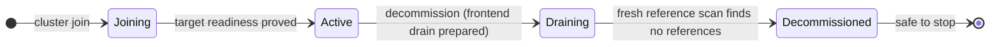
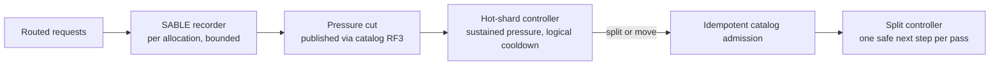

# Topology changes

[Documentation](../README.md) / [Design](README.md) / Topology changes · [Development status](../status.md)

VibeDB changes where data lives while it serves traffic: it replaces failed
replicas, moves groups onto new physical nodes, retires nodes, and splits hot
shards. Every such change is a durable, resumable operation whose authority
comes from replicated state (the catalog group, route gates, membership
grants), never from a controller's memory. This page explains the mechanisms.
Operator procedures are in [scaling](../operations/scaling.md),
[node failure](../operations/node-failure.md), and
[hot-shard splits](../operations/hot-shard-splits.md).

## Building blocks

| Mechanism | What it guarantees |
| --- | --- |
| Catalog operation journals | Each operation has a deterministic ID and advances by compare-and-swap. A second controller loses the CAS; a restarted one rereads the same row. |
| Membership grants | A catalog-committed grant is the only authority a replica accepts for learner, promotion, removal, and leader-transfer steps ([replication](replication.md#membership-changes)). |
| Route-gate drains | An exclusive drain waits for in-flight request pins, then advances the shard's gate epoch so old-epoch commands are refused ([exactly-once writes](exactly-once-writes.md#route-gate-sessions)). |
| Certified snapshot artifacts | State moves out of band through a non-serving, verified pipeline, never as a Raft `MsgSnap`. |
| Node migration budget | One per-process budget paces every transfer on a physical node. |

Controllers run on the designated controller frontend and advance each
operation through at most one durable boundary per pass.

## Snapshot transfer

`internal/snapshottransfer` moves a certified replicated-state artifact from a
healthy source to a target:

- The source exports an artifact certified at an exact applied index and term.
  Chunks are resumable, and every chunk and descriptor is authenticated.
- The target stages the artifact in a crash-safe repository. Staged data grants
  no serving authority. A crash can replay at most one chunk.
- After the learner is certified, the target's artifact moves through a
  crash-safe publish-to-delete transition. The source releases its export only
  after it sees the durable target-install witness.
- An abandoned stage can be cancelled only with a catalog cancellation witness
  that names the exact operation, step, artifact, source owner epoch, expired
  lease revision, target incarnation, and schema and replica generations.

## Replica moves and replacement

A move replaces one voter (the *source*) with a new learner (the *target*),
using a third healthy voter to certify the snapshot. The plan binds immutable
replica identities, so a restarted controller cannot mistake a process that
reused an endpoint or member ID for the original.

1. Admit the move in the catalog. When several independent groups have
   certified failures, they are admitted as one atomic operation set before
   any learner action.
2. Grant membership, add the learner, transfer and install the snapshot, and
   wait for catch-up.
3. Promote the learner to a fourth voter. If the source leads, transfer
   leadership first.
4. Publish ownership in the catalog, drain the old route through two
   catalog-drain fences, remove the source voter, retire it, and finalize the
   grant.

For a failed source, the already-elected surviving leader is kept; conditional
leader transfer is exercised separately by planned moves. A retired source is
fenced from rejoining.

## Seamless scale-out and scale-in

Scaling operates on whole physical nodes. Each node record in the catalog has a
lifecycle, and each operator request is a scaling intent:



- **Scale-out.** An empty node is enrolled. For each group moved onto it, the
  controller records a group enrollment intent, durably claims the right to
  call the node's `PrepareReplica`, and later adopts the replica after the
  membership grant commits. The node control service rereads the exact
  committed intent before acting, so a replayed or forged request cannot create
  a serving member.
- **Rebalance.** Moves are planned over the complete route inventory: catalog,
  request-ledger, internal, and application groups are treated the same way.
  Moving the catalog group rolls every frontend's
  [route seed](routing.md#replicated-catalog-authority) live.
- **Scale-in.** Decommission moves every replica off the node, closes its
  frontend, and retires it. `Draining → Decommissioned` requires a fresh,
  complete reference scan whose digest is stored with the terminal state, so
  a restart cannot lose the safe-to-stop evidence.

Intents move through `Reserved → Running → Complete` or `Cancelled`.
Cancellation is allowed only after every journaled move has settled. Missing
capacity, readiness, or enrollment evidence becomes a durable *blocker* on the
intent; it is never inferred as success.

### Frontend drain

Retiring a node also retires its embedded frontend without cutting clients off:

1. **Prepared.** Public native and PostgreSQL admission closes. Control
   listeners and every already-accepted session keep running. The frontend
   reports an acknowledgement cut of open connections and active sessions.
2. **Enforcing.** The catalog publishes a continuation grant for sockets that
   were accepted before the fence. Each receiver installs the grant only after
   applying the complete committed service cut.
3. **Retired.** The drain record and node directory advance together.

There is no timeout or forced close. `safe_to_stop` stays false while a
connection to the retiring frontend is open; the client must finish and
disconnect.

## Hot-shard splits



- **Evidence.** `autosplit` (SABLE) keeps a fixed-space load sketch per shard
  allocation, fed from routed requests, and recommends split points. It never
  publishes a manifest or moves data.
- **Decision.** The clockless `hotshard` controller qualifies *sustained*
  pressure across catalog generations, then chooses a split or a replica move.
  Splits take priority over moving the same allocation. Cooldown is measured
  in replicated progress, not time.
- **Execution.** `splitcontroller` derives the next step from durable
  authorities alone (the catalog, capture, stage cursors, SQL binding, WAL
  binding, and Raft runtime), so it needs no progress journal of its own:

```text
start capture -> build artifacts -> stage child -> catch up tail -> seal source
-> certify cutover -> activate child -> create child WAL -> adopt child runtime
-> await child ready -> publish catalog -> await catalog drain -> prune retained
-> complete
```

Children are staged from an immutable artifact and caught up by replaying the
source's tail. Each tail batch is accepted by a receiver only if it is the next
entry, its pending crash receipt, or its exact completed result. The source
acknowledges only after every prepared replica has durably recognized a batch.
Old-route commands are refused or [forwarded](routing.md#forwarding-an-old-command)
after cutover.

## Migration budget and pressure feedback

Every source and target transfer on a physical node draws from one
`migrationbudget.Budget`:

| Resource | Default |
| --- | --- |
| Concurrent heavyweight phases | 2 |
| Transient chunk workspace | 16 MiB |
| CPU, disk read, disk write | 64 MiB/s each, 4 MiB burst |
| Network send, network receive | 32 MiB/s each, 2 MiB burst |

A sampler reads node-log pressure every 250 ms and scales all rates:

- **Multiplicative decrease.** Submission backpressure, a queue above 75 %, or
  a high ready-queue wait halves the rate scale, down to a 12.5 % floor.
- **Pause.** Severe pressure (backpressure, queue above 90 %, or wait at the
  severe threshold) for two consecutive windows pauses new heavyweight phases.
- **Additive increase.** Three quiet windows restore 12.5 % of the scale and
  resume paused work.
- **Scheduling latency.** The interval p99 Go scheduler latency is a separate
  CPU-contention signal (5 ms high, 20 ms severe). It halves rates but never
  pauses, so migration keeps its minimum share even when foreground load alone
  saturates the CPU.

## Evidence

| Claim | Proof |
| --- | --- |
| Online 3 → 4 → 3 scaling, three waves, with open-loop traffic, controller and target restarts, exact acknowledgement conservation, and forced pacing | [`seamless-scale-in-out.yml`](../../.github/workflows/seamless-scale-in-out.yml) runs `TestSeamlessScaleInOutProcessQualification`; see the [method](../benchmarks/seamless-scale-in-out-method.md). |
| Automatic replica replacement with a cold target, controller `SIGKILL`, cleanup, and non-rejoin | `TestGatewayAutomaticReplicaReplacementProcesses`, three runs in CI. |
| Write-driven hot-shard move across leader loss and reopen | `TestGatewayHotShardMutationProcesses` in CI. |
| Zero-config and custom-table terminal splits | [`dev-hot-split.yml`](../../.github/workflows/dev-hot-split.yml), three runs each. |

## Limitations

- Online split is base-relation only. Global-index snapshot partitioning, tail
  replay, and retained pruning are not integrated, so a globally indexed split
  plan fails closed.
- A split divides key ranges; it cannot relieve a single hot key.
- Repeated descendant splits and range-scan routing proofs are not yet
  qualified.
- The pressure sampler runs only on the node-log persistence lane; per-group
  WAL processes use static budget rates.
- Controllers run on one designated frontend. There is no general operator
  split command.
- The development topology publishes no automatic replica-move candidates
  because it has no certified cold target host; scale-out requires explicitly
  joining a node.
- Replica replacement gates are Linux-only; Darwin skips them.

## Source map

| Area | Implementation | Decisive tests |
| --- | --- | --- |
| Snapshot transfer | [`snapshottransfer/repository.go`](../../internal/snapshottransfer/repository.go), [`abandonment.go`](../../internal/snapshottransfer/abandonment.go), [`learner_install.go`](../../internal/snapshottransfer/learner_install.go) | `internal/snapshottransfer` tests |
| Replica moves | [`rebalance/plan.go`](../../internal/rebalance/plan.go), [`rebalance/replicated_controller.go`](../../internal/rebalance/replicated_controller.go), [`replica_move_controller.go`](../../internal/gatewayruntime/replica_move_controller.go) | [`replica_replacement_process_test.go`](../../internal/gatewayruntime/replica_replacement_process_test.go) |
| Scaling | [`scaling_metadata.go`](../../gateway/scaling_metadata.go), [`replicated_scaling.go`](../../gateway/replicated_scaling.go), [`scaling_controller.go`](../../internal/gatewayruntime/scaling_controller.go), [`nodecontrol/control.go`](../../internal/nodecontrol/control.go) | [`seamless_scale_process_test.go`](../../internal/gatewayruntime/seamless_scale_process_test.go) |
| Frontend drain | [`gateway/frontend_drain.go`](../../gateway/frontend_drain.go), [`gatewayruntime/frontend_drain.go`](../../internal/gatewayruntime/frontend_drain.go), [`frontenddrain/prepared_ack.go`](../../internal/frontenddrain/prepared_ack.go) | [`prepared_ack_test.go`](../../internal/frontenddrain/prepared_ack_test.go) |
| Hot shards | [`autosplit/sketch.go`](../../autosplit/sketch.go), [`hotshard/controller.go`](../../internal/hotshard/controller.go), [`splitcontroller/reconcile.go`](../../internal/splitcontroller/reconcile.go) | [`hot_shard_mutation_process_test.go`](../../internal/gatewayruntime/hot_shard_mutation_process_test.go) |
| Migration budget | [`migrationbudget/budget.go`](../../internal/migrationbudget/budget.go), [`pressure.go`](../../internal/migrationbudget/pressure.go), [`scheduling.go`](../../internal/migrationbudget/scheduling.go), [`rf3_migration_pressure.go`](../../cmd/vibedb-shard/rf3_migration_pressure.go) | [`pressure_test.go`](../../internal/migrationbudget/pressure_test.go) |
