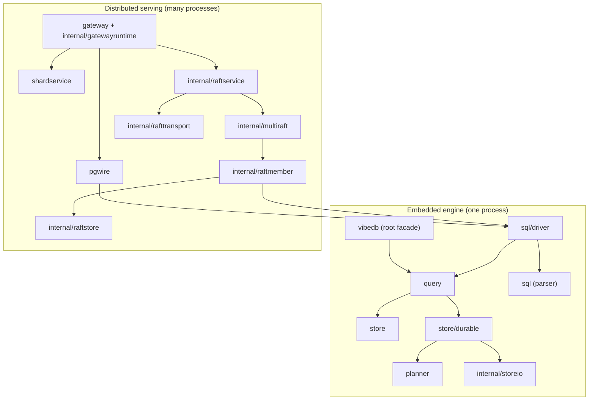

# Repository map

[Documentation](../README.md) / [Developer guide](README.md)

This page lists every package in the root module and every nested module, with
a one-line responsibility taken from its package documentation. To regenerate
the raw list:

```sh
GOEXPERIMENT=simd go list -f '{{.ImportPath}}: {{.Doc}}' ./...
```

For how the pieces fit at run time, read the [architecture guide](../architecture.md)
and the [design index](../design/README.md).

## Layers at a glance



Arrows point from importer to imported package. The embedded path runs within
one process. On the distributed path, each RF3
group is an independent Raft group. A physical node (`vibedb-shard`) hosts
members of many groups, and `internal/multiraft` schedules them.

## Commands

| Package | Responsibility |
| --- | --- |
| `cmd/vibedb` | Operator workflows composed from the shipped gateway and shard commands, including the local development cluster and cluster control. |
| `cmd/vibedb-shard` | Serves a static development shard, or one process bundle with 1 to 64 prepared members of authenticated three-replica Raft groups. |
| `cmd/vibedb-gateway` | Standalone process wrapper around `internal/gatewayruntime`. |
| `cmd/vibedb-verify` | Offline verify and salvage tool for store files and database directories. |
| `cmd/vibedb-operator` | Renders and prepares the small Kubernetes test lane (`render`, `validate`, bootstrap). |
| `cmd/vibedb-kube-qualify` | Bounded client and process inspector for the development-only Kubernetes qualification. |
| `cmd/vibedb-sql-audit` | Inventories SQL feature evidence in a local source tree. |
| `bench/gate` | Allocation-regression gate (`go run ./bench/gate`); see [its README](../../bench/gate/README.md). |
| `bench/rf3chaos` | Repeats the shipped three-process RF3 fault harness and writes canonical raw evidence. |

## Public packages

| Package | Responsibility |
| --- | --- |
| `vibedb` (root) | Small, owned-lifecycle API for the embedded JSON database. |
| `store` | In-memory collection engine and the source model shared by durable reads and query execution. |
| `store/durable` | Bounded-residency, automatically persisted collection. |
| `query` | Typed query engine over a segment, heap snapshot, or durable snapshot: one compiled plan from indexing, projection, containment, and grouping primitives. |
| `planner` | Bounded, deterministic search core that turns relational expressions into physical plans. |
| `sql` | Parser for VibeDB's bounded SQL dialect into an explicit syntax tree. |
| `sql/driver` | JSON/SQL runtime through `database/sql` and a lower-level Session API. |
| `pgwire` | Serves the `sql/driver` runtime over PostgreSQL protocol v3. |
| `distribution` | Cross-shard placement identity: scalar set, tuple framing, virtual buckets, range manifests, and fenced routing targets. |
| `gateway` | Development routing and execution layer for static shards and the RF3 replicated path. |
| `shardservice` | Bounded gateway-to-shard protocols and their servers. |
| `shardcontrol` | Authenticated, bounded control protocol used by the distributed split controller. |
| `autosplit` | SABLE: bounded bottleneck and locality evidence recorder, recommender, and generation-fenced split planner. |

All of these are **development** interfaces; see [stability](../status.md).

## Internal packages

### Storage and encoding

| Package | Responsibility |
| --- | --- |
| `internal/storeio` | Durable page and device engine behind `store/durable`: superblock, page envelope, directory and leaf pages, checksums, copy-on-write commit. |
| `internal/storekey` | Persistent key directory used by keyed stores. |
| `internal/storemem` | Pointer-free anonymous memory for the mapped Store's cold metadata. |
| `internal/orderedkey` | Typed JSON scalar encoding whose byte order is query order. |
| `internal/collectionname` | Reversible mapping between collection names and portable filenames. |
| `internal/buildgate` | Allocation-free compatibility boundary for the one current wire and disk grammar. |
| `internal/buildgate/manifestgen` | Derives opaque build-compatibility identities from the canonical manifest. |
| `internal/tin` | Full-text search core: tokenizer, positional inverted index, TINQL evaluator, BM25 top-K. |
| `internal/txnclock` | Bounded first-committer-wins conflict histories shared by the SQL driver and native facade. |
| `internal/pginput` | Allocation-free PostgreSQL text input grammars for shared scalar domains. |
| `internal/benchcorpus` | Deterministic JSON corpus shared by root gates and the competitive module. |

### Raft and replication

| Package | Responsibility |
| --- | --- |
| `internal/raftmodel` | Executable Raft integration model over the pinned etcd Raft core. |
| `internal/raftsim` | Deterministic scheduling and trace substrate that replays Raft integration faults. |
| `internal/raftstore` | Bounded disk-backed Raft StableStore. |
| `internal/raftstore/seglog` | Canonical node-wide segmented Raft log. |
| `internal/raftmember` | Binds one Raft WAL to one prepared replicated SQL shard root and adopts the pair into a Runtime. |
| `internal/multiraft` | Bounded in-process scheduling for `raftmember` runtimes. |
| `internal/raftservice` | Connects the synchronous Multi-Raft kernel to bounded serving and transport queues. |
| `internal/raftserve` | Bounded proposal waiter and result-settlement safe point. |
| `internal/raftauthority` | Protocol state for the optional leader read authority. |
| `internal/rafttransport` | Static identity registry, message frame boundary, and authenticated peer streams. |
| `internal/replication` | Deterministic state-machine command and completion envelopes. |
| `internal/replicatedstate` | Bounded replicated apply adapter. |
| `internal/requestledger` | Byte-canonical durable request-ledger grammar. |
| `internal/resultformat` | Registry for fixed replicated completion grammars. |
| `internal/systemkey` | Registry for hidden replicated state keyspaces. |
| `internal/snapshottransfer` | Transport and crash-safe repository for certified replicated-state snapshots. |

### Gateway, routing, and transactions

| Package | Responsibility |
| --- | --- |
| `internal/gatewayruntime` | Complete gateway serving assembly; home of most multi-process qualifications. |
| `internal/distributedtxn` | Durable record vocabulary for cross-shard transaction coordinators and targets. |
| `internal/distributedagg` | Combines algebraic aggregate fragments carried as canonical vibejson cells. |
| `internal/exchange` | Bounded worker-to-worker rendezvous state for distributed execution. |
| `internal/executionpin` | String-free logical catalog and schema pin carried by durable requests. |
| `internal/routegate` | Replicated gate that orders durable request pins against topology drains on one shard. |
| `internal/routeforward` | Replicated catalog authority that forwards one exact old command after a topology change. |
| `internal/frontenddrain` | Authenticated receiver protocol for a gateway's prepared frontend drain. |

### Topology, placement, and movement

| Package | Responsibility |
| --- | --- |
| `internal/rangesplit` | Non-serving, topology-fenced physical split primitives. |
| `internal/splitcapture` | Bounded split command that binds a portable split recipe to one exact source publication. |
| `internal/splitartifact` | Authenticated data plane that streams immutable split child artifacts between shards. |
| `internal/splitcontroller` | Derives one safe next step for an online split from durable authorities. |
| `internal/hotshard` | Connects bounded shard-pressure evidence to the topology schedulers. |
| `internal/topologyscheduler` | Side-effect-free admission for topology work. |
| `internal/scaling` | Pure scaling admission planners. |
| `internal/rebalance` | Evidence-driven replica movement for one intact shard allocation. |
| `internal/rebalanceexec` | Composes the replica-move controller with gateway and shard-control capabilities. |
| `internal/replicaaction` | Ownership transition and retired-source closure after replica catch-up. |
| `internal/replicacontrol` | Read-only authenticated Raft observation for restart-safe movement. |
| `internal/membershipgrant` | The bounded authority exchanged between the catalog and a runtime during replica replacement. |
| `internal/migrationbudget` | Bounds replica-migration work on one physical node. |
| `internal/nodecontrol` | Durable control plane that prepares a replica on an empty node and adopts it after the grant commits. |

### Schema, control, backup, and restore

| Package | Responsibility |
| --- | --- |
| `internal/schemachange` | Bounded change stream that reconciles unpublished schema images. |
| `internal/schemainstall` | Shard-local durable half of a replicated schema rollout. |
| `internal/clustercontrol` | Authenticated operator control contract. |
| `internal/shardcontrol` | Multiplexes fixed binary services on one mutually authenticated shard-control listener. |
| `internal/clusterbackup` | Catalog-authorized boundary between per-group snapshot artifacts and a future backup controller. |
| `internal/clusterbackupservice` | Adapts the target-free backup wire to the RF3 owner. |
| `internal/clusterrestore` | Activates one verified backup into a new cluster identity. |
| `internal/restoreservice` | Composes cluster-restore authority with SQL replica roots. |
| `internal/kubeoperator` | Implementation behind `vibedb-operator`: manifest rendering, bootstrap state, gateway seeds, group restore. It has no package comment. |

### Security and service plumbing

| Package | Responsibility |
| --- | --- |
| `internal/servicetls` | Turns the certificate-bound transport identity into an application-service listener. |
| `internal/serviceauthz` | Fixed-width authorization for authenticated service principals. |
| `internal/servicemetrics` | One fixed-size authenticated RF3 progress snapshot on the shard-control listener. |
| `internal/serviceerrors` | Preserves real component failures during shutdown. |
| `internal/processprofile` | Opt-in CPU and execution-trace profiles through `VIBEDB_PROFILE_DIRECTORY`. |

### Evidence, generators, and test support

| Package | Responsibility |
| --- | --- |
| `internal/conformance` | Executable capability manifest; generates [capabilities.md](../capabilities.md). |
| `internal/featurestate` | Evidence-backed distributed feature ledger; generates [distributed-feature-state.md](../distributed-feature-state.md). |
| `internal/unsafeaudit` | Executable inventory guard for [UNSAFE.md](../../UNSAFE.md). |
| `internal/rf3bench` | Stable evidence format for RF3 benchmark and chaos runners. |
| `internal/rf3testfixture` | Durable-member and credential preparation for cross-package RF3 process tests. |

`internal/buildgate/cmd/buildgategen`, `internal/conformance/cmd/capabilitygen`,
and `internal/featurestate/cmd/featurestategen` are the generators that
`go generate` runs.

## Nested modules

Each nested module has its own `go.mod` with
`replace github.com/thesyncim/vibedb => ../..` (relative to its own directory),
so its dependencies stay out of the root module's graph. `go test ./...` from
the root does **not** run them.

| Module | Contents | CI coverage |
| --- | --- | --- |
| `bench/competitive` | Competitive benchmark harness against bbolt, Badger, Pebble, and SQLite; lifecycle, churn, and SQL-surface commands; generated [COVERAGE.md](../../bench/competitive/COVERAGE.md). | `bench-gate` and `competitive-evidence` workflows; repository-contracts job |
| `integration/pgclient` | pgx, lib/pq, and stock `psql` 18.4 client tests against `pgwire`. | Recovery job in `ci` |
| `integration/pgcompat` | Pinned PostgreSQL 18.6 upstream regression corpus runner. | Nightly `postgresql-compatibility` workflow |
| `x/vitessroute` | Optional Vitess-compatible keyspace-ID mapper with differential golden vectors. | No workflow runs its tests; run them locally |

## Other top-level directories

| Directory | Contents |
| --- | --- |
| `integration/jdbc` | Manual Java/JDBC client probes. They are not a Go module, and CI does not run them. |
| `deploy/kubernetes` | Dockerfiles, Kind config, and `qualify-kind.sh` for the Kubernetes RF3 lane. |
| `scripts/ci` | CI shard selection, storage race lanes, clock-fault matrix, and their Python self-tests. |
| `scripts/bench` | Benchmark and qualification runners and summarizers. |
| `scripts/docs` | Markdown link and structure checker. |
| `docs` | Guides, reference, design notes, and dated evidence. |
