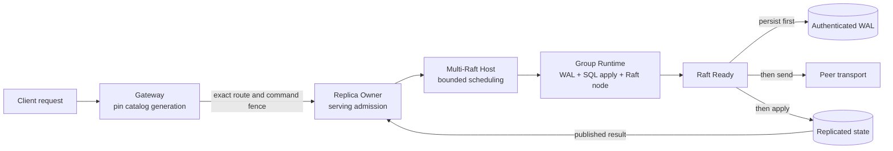
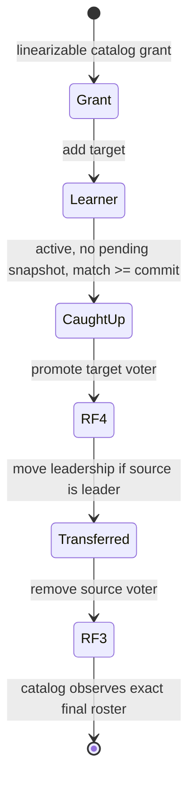

# Distributed internals and operation

[Documentation](../README.md) / [Operations](README.md) · [Development status](../status.md)

This design guide explains routing fences, consensus, persistence, and recovery.
For commands, use the [operator guide](README.md) or
[troubleshooting](troubleshooting.md). Physical-node composition is shown in
[architecture](../architecture.md#system-map).

## Start with the deployment model

“Static” and “RF3” describe different things. Treating them as synonyms leads to unsafe
recovery and misleading availability claims.

| Term | What it means | What it does not mean |
| --- | --- | --- |
| Embedded or local operation | One process owns a local database without the distributed RF3 serving path. | A replicated database or a quorum-backed fallback for RF3. |
| Static bootstrap | The immutable index-one snapshot and initial `ConfState` from which one Raft group starts. | Membership must remain static forever, or that the group has one member. |
| Static peer enrollment | A bounded list of authenticated nodes that may participate in configured groups. | Permission to send traffic; committed group membership grants that authority. |
| RF3 serving policy | A steady-state catalog, data, or request-ledger group has three voters and commits through a majority. | A property built into the generic Raft kernel. The kernel can represent other voter counts. |

Replacement temporarily has four voters and returns to three only after catch-up, safe
leadership, and source removal. Generic tests also exercise RF1 and RF2; that does not make a
non-RF3 layout a supported distributed deployment.

## Follow one operation through the ownership chain

The distributed path is a chain of single-owner boundaries. There is no hidden layer that can
repair an invalid route, reinterpret a command, or make a stale replica authoritative.

The boundaries have distinct jobs:

1. The gateway pins one catalog generation and sends exact ownership, schema, route,
   replica-set, and policy coordinates.
2. The replica `Owner`, sole caller of its host, rejects any command or serving-fence mismatch.
3. The host gives runnable groups bounded Ready, input, proposal, and logical-tick turns.
4. One runtime owns one group identity, WAL namespace, SQL apply root, state machine, and node;
   physical and logical incarnations prevent accidental path adoption.

An accepted proposal is not committed, and a transport write is not proposal acceptance. A log
entry is not externally complete until deterministic apply and result publication finish.

## Catalog generations are operation leases

Catalog publication is atomic: a reader sees one whole old or new immutable generation, never
a mixture. Pin that generation, retain it through return, and build every route and command from
it. After a stale-fence failure, pin a newer generation and rebuild from the original request;
do not splice newer metadata into the old command.

Forwarding, where explicitly supported, preserves the old command bytes and checks a
catalog-authorized window. Generation drain is a metadata and execution fence, not a database
snapshot: groups that read through separate Raft barriers do not gain one global point-in-time
cut merely because their routes came from one catalog generation.

Publication only moves forward. Exact-predecessor cutovers compare-and-publish; a stale
controller must re-observe and replan, not publish an unrelated higher generation.

## Raft persistence and reads

The current profile uses pre-vote, quorum checking, safe ReadIndex, heartbeat tick 1, and
election tick 10. Proposal forwarding is disabled. Ticks are logical inputs supplied by the
owner; the consensus core does not sample wall-clock time or run an autonomous ticker.

Physical-node serving uses a shared `NodeStore` and submission sequencer. Each
group retains its own log identity, incarnation, commit position, and apply
state. The sequencer admits bounded immutable submissions, persists node-log
waves, and returns completion to the submitting groups. A wave can share
physical persistence across groups; it does not share consensus authority.
Contiguous Ready values from one group can form a bounded series, with at
most one series per group in a wave.

The older per-group WAL path remains in the repository. Its dual-slot protocol
below explains that storage lane; do not interpret its two durability phases
as the physical-node log's barrier count. Use [node diagnostics](observability.md)
for shared append waves and persistence observations.

### Per-group WAL persistence

Ready processing is an ordered durability protocol:

1. Capture one Ready and assign its `(node incarnation, Ready ID)`.
2. Prove the named WAL, append the authenticated Ready record, and complete the
   platform record-ordering barrier before any selector can name it. Linux uses
   `fdatasync`; Darwin uses `F_BARRIERFSYNC` with `File.Sync` fallback; other
   platforms use `File.Sync`.
3. Prove the namespace again, write the alternate authenticated current slot,
   complete the final `File.Sync`, and re-prove the named file. This final sync
   is the power-safe acknowledgement boundary for the selected image.
4. Release outbound messages. A failed callback may cause the same message to be sent again.
5. Apply committed entries serially and atomically publish state, membership, and results.
6. Release eligible read barriers and advance the Raft node.

The same Ready ID may be retried only with the exact same bytes. Persistence failure is
retryable while that captured batch remains owned. A record/barrier failure is definite, but a
failure after the current-slot write begins is outcome-unknown; exact retry reads the slot,
avoids rewriting an already exact image, and completes the final sync. Apply failure is terminal
for the runtime: publication may be ambiguous, so restart and recovery must reconcile WAL and
applied state.

### Read modes

| Read path | Admission | Guarantee |
| --- | --- | --- |
| Leader data read | Exact serving fence, current leader/term, quorum-backed ReadIndex, local apply through the barrier, storage-generation lease | A group-local leader/quorum cut. It is not a multi-group snapshot. |
| Route-gate or catalog-authority read | Leader and quorum-backed ReadIndex, exact authority revision | Linearizable authority observation for that group. |
| Explicit follower read | Exact serving fence and term, local applied index at or above the caller’s floor | A local applied-floor read only. **It is not linearizable and has no bounded-staleness promise.** |

If leadership or node incarnation changes before a ReadIndex barrier becomes locally applied,
the barrier is lost and the read fails. It is never silently answered from the new leadership
state. Data reads also filter transferred ownership before joins, aggregation, and `LIMIT`, and
fail closed when a group-level active transaction intent blocks the requested cut.

A serving-discovery probe reads status and publication plus one fixed-width durable authorization
fence. It does not acquire collection snapshots or scan the hidden state image, and pending result
settlement remains a hard fence. After a read request's complete serving fence is admitted, a
successful response preserves that exact fence and advances only the monotonic applied/commit
watermarks to the returned data cut; it does not pair the result with a later status probe. Failure
paths may probe again to return refreshed refusal state.

### Shared node log

The node store owns its descriptor catalog, segmented log, and checkpoint
inventory. Group registration and persistence go through the node owner;
shared files do not permit independent group writers. Recovery validates the
node and group identities before exposing each group's retained log.

Node segment size, maximum wave bytes, group capacity, and Ready-series span
are independent bounds. Capacity pressure is an admission or maintenance
condition, not permission to discard a group's live recovery state. See
[NodeStore](../../internal/raftstore/node_store.go),
[submission sequencing](../../internal/raftstore/node_sequencer.go), and
[series tests](../../internal/raftstore/node_series_test.go).

## WAL generations and snapshots

The Raft WAL is bounded, preallocated, encrypted/authenticated, digest-chained, and tied to an
immutable placement identity. Its active limits are sealed into the format; a manifest may choose
smaller values than the constructor defaults. See [defaults and limits](../reference/limits.md)
for the current ceilings. Capacity exhaustion is an admission failure, not permission to
overwrite live history.

Startup authenticates the family manifest, header, dual current slots, records, key, recovery
epoch, and SQL/apply binding before adoption. One torn current slot can be selected around, but
the process cannot prove whether the damage was a crash tear or post-ack rollback without an
external anti-rollback witness. Such a root is quarantined and must not serve or rejoin merely
because local recovery found a plausible higher slot.

Snapshots do not travel as ordinary Raft `MsgSnap` messages. The ordinary node, runtime, WAL
Ready path, and peer frame preflight reject `MsgSnap`.

The supported mechanism is a separate authenticated snapshot-data traffic class:

1. Capture a bounded collection artifact and certificate at an exact applied index and term.
2. Transfer and stage it in a non-serving target. Staged rows carry no routing or serving
   authority.
3. Verify the complete image and install/checkpoint it before making a new WAL base selectable.
4. Publish and activate the sibling WAL generation, then adopt it through normal runtime
   recovery.

Artifact data is therefore out-of-band; only the certified snapshot/base relationship enters
the Raft/WAL lifecycle. A crash during staging can replay at most one chunk. A crash during WAL
generation activation is settled from the authenticated family state before runtime adoption.
There is no cluster-wide or multi-group snapshot protocol here.

## Peer transport: authenticate, bound, then distrust delivery

Internal peers use mutual TLS 1.3. A critical certificate extension carries the exact cluster
ID, cluster incarnation, and node ID; subject names, DNS names, and common names do not grant
peer authority. Ordinary Raft, snapshot data, shard-native, SQL, client, and control traffic use
separate ALPN classes. Handshake and stream deadlines are mandatory.

TLS authenticates a node. The per-group registry then checks whether that node is enrolled and
whether the exact committed roster/version authorizes its voter or learner role. Frames are
checked for group, source, destination, trust domain, roster, role, size, and transition grant
before protobuf allocation or Raft admission.

Delivery remains a lossy, duplicating boundary:

- `Send` means validation, bounded queue reservation, and local ownership of encoded bytes.
- A completed socket write increments local counters; it is **not** a receiver ACK, Raft ACK,
  commit acknowledgement, or apply acknowledgement.
- A write failure retains the batch, so retry can duplicate a frame.
- Exact transport backpressure may cause the owner to discard one ordinary packet to avoid
  head-of-line blocking. Raft retransmission is expected to repair it.
- Queue, byte, coalescing, peer, and deadline limits fail closed; they are not elastic buffers.

Certificate validity and I/O deadlines are explicit wall-clock seams. Raft ordering, leases,
and recovery do not derive authority from that clock.

## RF3 quorum and replica replacement

In a healthy steady-state RF3 group, any two voters form a quorum. One reachable voter cannot
elect or commit. It must refuse, time out, or return an outcome-unknown condition rather than
claim progress.

| Reachable voters | Expected behavior |
| ---: | --- |
| 3 | Elect and commit, subject to normal fencing and capacity. |
| 2 | Elect and commit with reduced fault tolerance. Restore the third replica before another fault. |
| 1 | No safe commit. Reads requiring ReadIndex and all writes fail or time out. |
| 0 | Unavailable. Recover processes/storage; do not manufacture membership. |

Replacement is an externally authorized, resumable sequence—not automatic joint consensus:

The grant binds one source, one target, the initial three voters, catalog generation, and exact
transition digest. Adding the learner does not authorize removal. Promotion must be durably
observed. Removal is accepted only from the four-voter intermediate state, with no learner or
joint configuration, after an exact same-term leadership transfer when needed.

Absence of a grant is not by itself revocation; revocation requires a linearizable catalog
observation. After restart, durable membership returns, but volatile leadership does not. The
group needs real peer traffic and heartbeats before it can serve as leader again.

## Retries and outcome-unknown

Retry safety exists at three layers:

| Layer | Purpose |
| --- | --- |
| In-flight waiter registry | Coalesces the exact same local attempt onto one enqueue and shares settlement with bounded waiters. |
| Replicated session ring | Retains recent sequence outcomes under tenant/client/session epoch, retry home, fingerprint, logical digest, and cumulative ACK. |
| Durable request ledger | Recovers multi-step or cross-group work from authenticated request identity through planning, preparation, terminal outcome, ACK, and reclamation. |

The safe operator/client rule is simple: after possible admission, retry the **exact canonical
request bytes with the same identity**. Do not create a new request ID, change the fingerprint,
or infer failure from a lost connection.

- A refusal before local core admission is safe to reroute or rebuild as directed by its typed
  error.
- Cancellation or connection loss after registry admission returns outcome-unknown with the
  exact retry bytes because the entry may still commit and apply.
- An exact duplicate within the retained session window returns the retained result. Changed
  bytes under the same logical identity conflict.
- Cumulative ACK advances retention; a sequence below the retained floor is retired, not
  guessed. Session release validates and removes the full bounded retry ring atomically.
- Durable ledger ACK is final only after all pre-ACK durable bytes are reclaimed. Work wider
  than 256 participants proceeds in monotone waves; 256 is a wave bound, not a workflow bound.

Transport retry and request retry solve different problems. Re-sending a peer frame repairs
Raft delivery. Re-submitting the exact client command settles whether the logical operation
committed and what result it produced.

## Indexed updates and deletes

> [!IMPORTANT]
> The checked-in static listener exposes this path only through `exec` for one
> single-base-owner statement. Independently placed index writes may add
> transaction participants, but general multi-statement or cross-base-shard
> static `exec_batch` is not exposed. Public `exec_batch` is reserved for
> authenticated durable RF3 and never takes an unsequenced fallback.

The static and RF3 lanes reach the same index relations through different
replay contracts:

| Lane | Base-row proof | Retry behavior |
| --- | --- | --- |
| Static `exec` | The base shard captures canonical key, before-image, and after-image without publishing. Prepare checks the old digest, executes the original SQL, and checks the resulting digest before any participant commits. | Apply executes the staged SQL again. A computed right-hand side is therefore not an exactly-once evaluation contract. |
| Durable RF3 `exec_batch` | An exact-primary-key update performs one linearizable old-row read, evaluates supported top-level declared-column assignments simultaneously over that row, canonicalizes the postimage, and retains it with the old byte length and SHA-256 digest. | The retained mutation bytes are the recovery program. Apply uses an exact old-value CAS and never re-evaluates the SQL expression. |

An RF3 update of a missing key retains a durable zero-row no-op and does not
evaluate its assignments.

Both lanes derive global-index changes from canonical images. RF3 removal is
digest-guarded; a new locator is absent-or-equal. When an index key stays the
same, one digest-compare replacement proves the exact old locator before
installing the new one. A stale base row or locator aborts rather than
publishing a partial base/index state.

This is optimistic materialization, not an automatic recompute loop. An
ordinary exact retry may first replan, but after ledger admission the retained
program is authoritative; transaction execution and recovery use those bytes.
Recomputing from a newer row requires a new logical request identity.

Only `Ready` global indexes are read-plannable, although every lifecycle state
is write-maintained. RF3 computed updates remain inside the narrow mutation
surface: exact primary-key equality, top-level declared columns, supported
scalar expressions, and no primary-key move. `RETURNING`, `ORDER BY`, `LIMIT`,
nested targets, and `ON CONFLICT` remain fenced; gateway pgwire exposes writes
only as durable autocommit operations. Local tests cover retained canonical
postimages, simultaneous evaluation, exact retry, index derivation, and
same-key locator replacement. The external RF3 chaos workload still uses
whole-document updates, so it does not qualify computed-update recovery under
process, leader, or partition faults.

## Transactions and logical clocks

> [!WARNING]
> Current static distributed-transaction journal compaction omits durable
> coordinator recovery-pulse records. Reopening after compaction can reset that
> pulse state. Do not treat the compacted journal as qualified recovery
> authority for an in-flight coordinator.

Replicated commands carry deterministic bytes and explicit fences. They do not contain local
time, SQL text, a serialized planner, a physical WAL generation, or a Raft term/index chosen by
the client. At apply, transaction control, participant intents, relation mutations, and state
publication are committed atomically within that group. Conflicting ordinary mutations fail
closed while an active intent owns the affected scope.

The request ledger coordinates recoverable cross-group work, but it does not create a global
clock. Its program is bound to exact catalog/schema/routing identities and progresses through
monotone durable revisions. Recovery replays those durable facts rather than process memory.

Time-like values have separate domains:

- Raft elections and maintenance use logical ticks.
- Catalog publication, ownership, route gates, and transaction records use monotone revisions
  or epochs.
- Execution-pin leases are catalog applied-index intervals, not wall-clock durations. External
  effects must re-read the exact lease certificate and stay inside that interval.
- The bounded transaction conflict clock implements first-committer-wins. History overflow or
  uncertainty causes a conservative conflict; it never permits an unproven commit.
- X.509 validity, network deadlines, and caller-supplied session deadlines are outer wall-clock
  inputs. They do not provide cross-group timestamp ordering.

There is no global MVCC timestamp, global snapshot read, or wall-clock-derived consensus lease.

## Failure handling

| Observation | Meaning | Safe response |
| --- | --- | --- |
| Not leader or leadership lost | The local serving term is no longer authoritative. | Refresh the exact route/fence and retry under the same logical identity. |
| Outcome unknown / connection lost after admission | Commit and apply may still happen. | Retry identical canonical bytes and identity; query durable ledger state when applicable. |
| Transport backpressure | A bounded local queue refused work; one ordinary Raft packet may have been dropped. | Relieve pressure and let Raft repair; do not count `Send` as delivery. |
| Retryable Ready persistence error | The exact captured batch is still pending. | Preserve the root, restore the storage condition, and drive another owner pulse/ingress. |
| Apply failure | Durable publication may be ambiguous. | Stop that runtime and recover from WAL plus applied state; do not continue in place. |
| Torn-slot quarantine | Local WAL recovery lacks an external anti-rollback proof. | Keep the replica non-serving and rebuild or certify it through the supported recovery path. |
| No RF3 majority | The group cannot safely commit or perform ReadIndex. | Restore connectivity/processes; never force a voter set from local observations. |
| Snapshot staging interruption | The target is incomplete and non-serving. | Resume the certified artifact transfer; do not expose staged rows. |
| Stale catalog or ownership fence | Topology changed after planning. | Re-pin a newer catalog generation and rebuild from the original logical request. |

## Bounds worth monitoring

The current numeric ceilings live in [defaults and limits](../reference/limits.md); do not copy
them into deployment assumptions. Watch queues, WAL generations, read barriers, retained
results, ledger cleanup reserve, leadership churn, and catalog drains. These are admission
accounts, not sizing recommendations or exact RSS limits. Raising one requires complete
same-build qualification because tighter bounds at another layer still win.

The checked-in `serve-rf3` command uses a 112 MiB process-wide native frame
account shared by every local RF3 group. From an otherwise empty account, that
admits two worst-bound 40 MiB SQL execution reservations and their maximum
request frames while retaining headroom for ordinary native traffic; a third
worst-bound query is refused before execution. The reservation is conservative,
not actual allocation, RSS, or a throughput promise, and other in-flight native
traffic can reduce available concurrency.

## Current non-guarantees

The earlier sections define the principal non-guarantees. Additional gaps are:

- request-ledger ranges cannot change online; a different range needs a fresh certified group;
- local `UNIQUE` indexes are not supported on replicated relations;
- large completion-digest references have no finished durable blob-store fulfillment path;
- deterministic simulation does not prove physical WAL tears, TLS/framing, process behavior,
  autonomous election timing, or external-network behavior;
- production PKI provisioning is outside this repository and does not relax the exact
  certificate and trust-domain model.

Several formats explicitly identify themselves as unreleased and have no legacy decoder.
Preserve artifacts, but assume only the exact creating build can understand them.

## Source map

- Catalog pinning/routing: [`gateway/catalog.go`](../../gateway/catalog.go), [`gateway/route.go`](../../gateway/route.go)
- Serving: [`internal/raftservice/owner.go`](../../internal/raftservice/owner.go), [`internal/raftservice/data_read.go`](../../internal/raftservice/data_read.go), [`shardservice/replicated_server.go`](../../shardservice/replicated_server.go)
- Group ownership: [`internal/raftmember/runtime.go`](../../internal/raftmember/runtime.go), [`internal/multiraft/host.go`](../../internal/multiraft/host.go)
- Raft: [`internal/raftmodel/config.go`](../../internal/raftmodel/config.go), [`internal/raftmodel/node.go`](../../internal/raftmodel/node.go), [`internal/raftmodel/ports.go`](../../internal/raftmodel/ports.go)
- WAL/snapshots: [`internal/raftstore/store.go`](../../internal/raftstore/store.go), [`internal/raftstore/generation_activate.go`](../../internal/raftstore/generation_activate.go), [`internal/replicatedstate/snapshot_artifact.go`](../../internal/replicatedstate/snapshot_artifact.go)
- Peer transport: [`internal/rafttransport/identity.go`](../../internal/rafttransport/identity.go), [`internal/rafttransport/registry.go`](../../internal/rafttransport/registry.go), [`internal/rafttransport/transport.go`](../../internal/rafttransport/transport.go)
- Membership: [`internal/membershipgrant/grant.go`](../../internal/membershipgrant/grant.go), [`internal/raftservice/owner.go`](../../internal/raftservice/owner.go)
- Retry/state: [`internal/raftserve/registry.go`](../../internal/raftserve/registry.go), [`internal/replicatedstate/apply.go`](../../internal/replicatedstate/apply.go), [`internal/requestledger/types.go`](../../internal/requestledger/types.go)
- Static indexed mutations: [`sql/driver/mutation_capture.go`](../../sql/driver/mutation_capture.go), [`shardservice/execute.go`](../../shardservice/execute.go), [`gateway/writer.go`](../../gateway/writer.go), [`gateway/transaction.go`](../../gateway/transaction.go)
- Fences/clocks: [`internal/executionpin/transition.go`](../../internal/executionpin/transition.go), [`internal/routegate/machine.go`](../../internal/routegate/machine.go), [`internal/routeforward/resolve.go`](../../internal/routeforward/resolve.go), [`internal/txnclock/clock.go`](../../internal/txnclock/clock.go)
