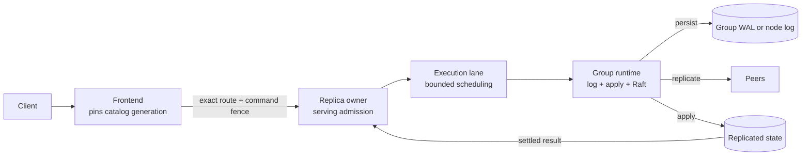

# Distributed internals

[Documentation](../README.md) / [Operations](README.md) · [Design](../design/README.md) · [Development status](../status.md)

This guide is the operator's map of the RF3 runtime: what each layer owns,
which invariants a procedure must not break, and how to read a failure. Each
section links to the design page that explains the mechanism. For commands,
use the [operator guide](README.md) and [troubleshooting](troubleshooting.md).

## Deployment model

"Static" and "RF3" describe different things. Treating them as synonyms leads
to unsafe recovery and misleading availability claims.

| Term | Means | Does not mean |
| --- | --- | --- |
| Embedded operation | One process owns a local database without the RF3 serving path. | A replicated database or a fallback for RF3. |
| Static shards | Development `vibedb-shard serve` endpoints with a static catalog file. | RF3 request identity, recovery, or read semantics. |
| Static bootstrap | The immutable index-one snapshot and initial configuration a Raft group starts from. | That membership stays fixed or that the group has one member. |
| RF3 serving policy | A catalog, request-ledger, or data group has three voters and commits through a majority. | A property of the Raft kernel, which can represent other voter counts. |
| Physical node | One `serve-node` process hosting replicas of many groups and an embedded frontend. | A consensus domain; groups stay independent. |

The development launcher starts three (or six) physical nodes with a shared
node log per node, independent catalog, request-ledger, and data groups, and
one designated controller frontend. See the [local cluster guide](local-cluster.md).

## Ownership chain

A request crosses a chain of single-owner boundaries. No layer repairs an
invalid route, reinterprets a command, or makes a stale replica authoritative.

| Layer | Owns | Design page |
| --- | --- | --- |
| Frontend | Catalog pin, planning, request identity, ledger programs | [Request routing](../design/routing.md), [exactly-once writes](../design/exactly-once-writes.md) |
| Replica owner | Fence and term checks immediately before proposal admission | [Request routing](../design/routing.md#routes-and-command-fences) |
| Execution lane and runtime | Raft ordering, persistence, apply, membership | [Replication](../design/replication.md) |
| Controllers | Replica moves, scaling, splits, backup, schema rollouts | [Topology changes](../design/topology-changes.md), [backup internals](../design/backup-restore.md) |

An accepted proposal is not committed, and a socket write is not an
acknowledgement. An entry is externally complete only after deterministic
apply and result publication.

## Invariants a procedure must preserve

- **Exact identity.** Group, member, node, store, and incarnation identities are
  never reused, copied into another cluster, or edited. Restore creates fresh
  ones.
- **Catalog generations move forward.** Controllers publish by exact-predecessor
  compare-and-swap. Never hand-edit a catalog, route seed, or journal.
- **Membership comes from grants.** Replicas accept membership changes only from
  catalog-committed grants. Never force a voter set from local observations.
- **Recovery uses the original identity.** An uncertain write is retried with the
  same identity and bytes, in the lane that produced it.
- **Non-serving stays non-serving.** Staged snapshots, restored roots, and
  quarantined WALs gain serving authority only through their certified path.
- **One build.** Use documentation, binaries, and data from one revision. There
  is no rolling or mixed-build upgrade path.

## RF3 quorum and replica replacement

| Reachable voters | Behavior |
| ---: | --- |
| 3 | Elect and commit, subject to fences and capacity. |
| 2 | Elect and commit with no remaining fault tolerance. Restore the third replica before another fault. |
| 1 | No commit; `ReadIndex` reads and writes fail or time out. |
| 0 | Unavailable. Recover processes or storage; do not manufacture membership. |

Replacement is an authorized, resumable sequence: grant, add learner, install
snapshot and catch up, promote to a fourth voter, transfer leadership if
needed, remove the source, and observe the final roster in the catalog. It
never uses joint consensus, and a removed source is fenced from rejoining.
With read authority enabled, an election after a leader crash also waits for
outstanding voter promises (up to 5 s under the development policy). See
[membership changes](../design/replication.md#membership-changes),
[replica moves](../design/topology-changes.md#replica-moves-and-replacement),
and [node failure](node-failure.md).

After a restart, durable membership returns but volatile leadership does not.
Scaling status includes the current move error while the controller is
reachable; only durable catalog and retirement proofs decide completion or
safe-to-stop.

## Retries and outcome-unknown

After possible admission, retry the exact canonical request bytes under the
same identity. Do not mint a new request ID, change the payload, or infer
failure from a lost connection.

| Response | Meaning | Action |
| --- | --- | --- |
| Pre-admission refusal (stale fence, not leader, proposal refused) | This attempt reached no Raft log. | Rebuild from the original request; a newer catalog is fine. |
| Outcome unknown | The write may still commit. | Re-drive the same identity; query ledger state where applicable. |
| Terminal result | Retained outcome for that identity. | Use it; acknowledge coordinated results so they can be collected. |
| Deterministic abort | The state machine durably rejected the command. | New identity for any new attempt. |

The frontend's PostgreSQL endpoint resolves its own attempts but cannot make an
application's retry after a lost connection exactly-once. Resending a peer frame
repairs Raft delivery; it is not a request retry. Details:
[exactly-once writes](../design/exactly-once-writes.md).

## Read guarantees

Leader reads are linearizable per group. Follower reads guarantee only the
caller's applied floor. Multi-group reads return independent per-group cuts;
there is no global timestamp. Reads that meet an active transaction intent are
refused rather than blocked. See [reads, leases, and time](../design/reads-and-time.md).

## Failure handling

| Observation | Meaning | Safe response |
| --- | --- | --- |
| Not leader, leadership lost | The local term is no longer authoritative. | Refresh the route; retry under the same identity. |
| Stale catalog or ownership fence | Topology or schema changed after planning. | Re-pin a newer generation and rebuild from the original request. |
| Outcome unknown after admission | Commit and apply may still happen. | Re-drive the identical identity and bytes. |
| Read refused for an active intent | A distributed transaction holds the key or group. | Retry after it completes. |
| Transport backpressure | A bounded queue refused work; one ordinary Raft packet may have been dropped. | Relieve pressure; Raft repairs delivery. |
| Retryable persistence error | The captured batch is still pending. | Preserve the root, fix the storage condition, let the owner retry. |
| Apply failure | Durable publication may be ambiguous. | Stop that runtime and recover from the log and applied state. |
| Torn-slot quarantine | Local recovery lacks an anti-rollback proof. | Keep the replica non-serving; replace it. |
| No majority | The group cannot commit or confirm reads. | Restore connectivity or processes. |
| Interrupted snapshot staging | The target is incomplete and non-serving. | Let the controller resume or cancel through its catalog witness. |
| Route-seed durability failure | The frontend cannot prove where the catalog lives. | Quiesce and restart that frontend. |

## Bounds worth monitoring

Numeric ceilings live in [defaults and limits](../reference/limits.md). Watch
queues, log capacity, read barriers, retained results, ledger collection,
leadership churn, migration pacing, and catalog drains
([observability](observability.md)). These are admission accounts, not sizing
recommendations or RSS limits. Raising one requires same-build qualification,
because a tighter bound at another layer still wins.

## Current gaps

- One designated frontend runs controllers and owns DDL, with no automatic
  failover of that role.
- Request-ledger ranges are immutable; the ledger cannot split online.
- Online splits are base-relation only; globally indexed tables do not split.
- Coordinated writes run participant waves sequentially.
- Local `UNIQUE` indexes are not supported on replicated relations.
- Large completion-digest references have no durable blob-store path.
- Deterministic simulation does not model physical log tears, TLS framing,
  process scheduling, or autonomous election timing.
- Production PKI, key management, and mixed-build upgrades are out of scope.
  Formats are unreleased and have no legacy decoder.

The [distributed feature ledger](../distributed-feature-state.md) records the
primitive, integration, command, and qualification state of each feature.

## Source map

| Area | Entry points |
| --- | --- |
| Frontend and catalog | [`gateway/catalog.go`](../../gateway/catalog.go), [`gateway/replicated_native.go`](../../gateway/replicated_native.go), [`gatewayruntime/runtime.go`](../../internal/gatewayruntime/runtime.go) |
| Serving and admission | [`raftservice/owner.go`](../../internal/raftservice/owner.go), [`shardservice/replicated_server.go`](../../shardservice/replicated_server.go) |
| Raft and persistence | [`raftmodel/config.go`](../../internal/raftmodel/config.go), [`raftmember/runtime.go`](../../internal/raftmember/runtime.go), [`raftstore/node_store.go`](../../internal/raftstore/node_store.go) |
| Retry and ledger | [`raftserve/registry.go`](../../internal/raftserve/registry.go), [`requestledger/types.go`](../../internal/requestledger/types.go) |
| Physical node command | [`serve_node.go`](../../cmd/vibedb-shard/serve_node.go), [`serve_rf3.go`](../../cmd/vibedb-shard/serve_rf3.go) |
