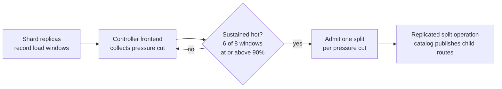

# Hot-shard splits

[Documentation](../README.md) / [Operations](README.md) / Hot-shard splits

A data shard that stays hot is split automatically into child groups, each
with three replicas, while reads and writes continue. There is no manual split
command. This page explains what triggers a split, how to configure and observe
it, and what it does not cover. The `dev-hot-split` workflow qualifies the
behavior on Linux with the local launcher, for the built-in data table and for
a custom table across a restart. [Topology changes](../design/topology-changes.md#hot-shard-splits)
explains the split pipeline and its safety fences.

## How a split is triggered

1. Each shard records a per-window load vector: write CPU, read CPU, scan CPU,
   I/O, requests, latency debt, and live bytes. Units come from the collector
   and are compared against provisioned capacity in the same units.
2. The designated controller frontend (node 1 in the local launcher)
   publishes a pressure cut every `hot-shard-interval` (default 1 s).
3. A shard qualifies when its dominant resource is at or above 90% of its
   window capacity in 6 of the last 8 windows. After a recommendation it
   enters an 8-window cooldown.
4. The scheduler admits at most one split per pressure cut, and at most one
   replica move, because the catalog publishes one global generation change at
   a time. A split must also promise at least a 10% benefit.
5. The split runs as a durable replicated operation. Clients re-route after
   the catalog publishes the child routes; the source retires afterwards.

When a shard's current pressure is at or above 90% and it reports demand, the
controller can also admit one replica move for it to a node with spare
provisioned capacity.

## Configure capacity

The controller frontend reads a provisioned-capacity file named by the
gateway's `-hot-shard-capacity` flag (the local launcher writes
`hot-shard-capacity.vibejson` in the cluster root). It is strict canonical
`vibejson`, format 1, at most 1 MiB:

| Field | Meaning |
| --- | --- |
| `recorder_lanes` | Per-shard recorder lanes. |
| `window_capacity` | Seven-element capacity vector for one window, in the resource order above. |
| `node_capacity` | Default per-node capacity vector. |
| `migration_capacity` | Byte budget for moves admitted from one cut. |
| `shard_migration_bytes` | Assumed bytes to move one shard. |
| `max_receives` | Concurrent receives per target node. |
| `nodes` | Endpoint, failure domain, and optional per-node capacity override. |

The local launcher writes a fixed synthetic profile: 64 units per resource per
window, 1 GiB migration capacity, 384 MiB per shard, and two receives. At the
default 1 s cadence, a shard sustaining roughly 58 or more counted operations
per second trips the 90% threshold. That is intentionally low so development
load can exercise the path; it is not a measured capacity.

The capacity file is not live utilization, liveness, or serving authority. No
shipped tool derives it from measured hardware.

## Observe splits

- The authenticated `metrics` request returns `controller_metrics` with
  `split_passes`, `split_discovered`, `split_triggered`, `split_completed`,
  `split_faults`, and pass durations. It requires the `topology` capability,
  which the launcher's generated client credential does not have. See
  [observability](observability.md#controller-loop-counters).
- `split_control_requests`, `split_control_completions`, and
  `split_control_faults` in the node aggregates count the shard side.
- A split does not appear in `vibedb cluster status`, which reports physical
  scaling operations only.

**Success check:** `split_completed` advances and existing keys stay readable
through the same client connection. The qualification verifies every
acknowledged row by exact value after the split and again after a restart.

## Limitations

- Splits are automatic only. There is no command to request, cancel, pause, or
  merge a split, and no merge of cold children.
- One topology operation is admitted per pressure cut. Many simultaneously hot
  shards split one after another.
- Every child group uses a group slot on each of its three nodes; the
  checked-in node manifests allow at most 64 groups per node. See
  [capacity planning](capacity-planning.md).
- Request-ledger key ranges cannot change online, so the ledger group is
  never split; see [current non-guarantees](distributed.md#current-gaps).
- Splits are qualified only with the local launcher on Linux, at the fixed
  synthetic capacity profile. Real capacity numbers and multi-host placement
  are not qualified.

## Source map

| Concern | Source |
| --- | --- |
| Sustained-hotness tracker defaults | [autosplit/tracker.go](../../autosplit/tracker.go) |
| Load resources | [autosplit/sketch.go](../../autosplit/sketch.go) |
| Split admission policy | [internal/topologyscheduler/admission.go](../../internal/topologyscheduler/admission.go) |
| Controller policy and one-per-cut limit | [internal/hotshard/controller.go](../../internal/hotshard/controller.go) |
| Capacity file grammar | [internal/hotshard/static_capacity.go](../../internal/hotshard/static_capacity.go) |
| Launcher capacity profile | [cluster_dev_physical.go](../../cmd/vibedb/cluster_dev_physical.go) |
| Qualification | [hot_shard_dev_process_test.go](../../internal/gatewayruntime/hot_shard_dev_process_test.go), [dev-hot-split.yml](../../.github/workflows/dev-hot-split.yml) |
