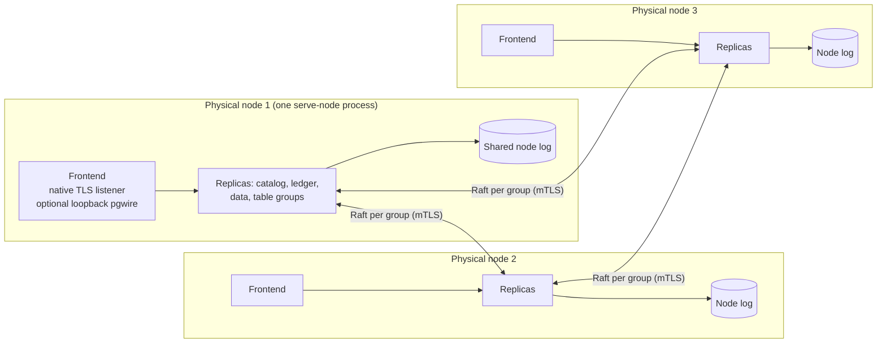

# Deployment readiness and topology

[Documentation](../README.md) / [Operations](README.md) / Deployment readiness

VibeDB has no supported production deployment. This page states which
operator workflows exist at the current revision, what evidence backs each
one, and what an evaluation deployment has to provide itself. Read it before
planning anything longer-lived than a disposable cluster. The shared
compatibility boundary is on the [stability page](../status.md).

## Readiness by workflow

**Development** means the command exists and is exercised by tests, but the
interface can change and no support is offered. **Qualified** means a named CI
workflow runs the complete scenario against shipped binaries at each revision
it gates; it is evidence for that revision and scenario only.

| Workflow | Level | Evidence | Operator entry point |
| --- | --- | --- | --- |
| Start, write, stop, and reopen an RF3 cluster on one host | Development | `portable-rf3` job in `ci.yml` on Linux and macOS | [Local cluster](local-cluster.md) |
| Survive process kills and peer partitions | Qualified (Linux) | `durable-rf3-external.yml`, `durable-rf3-multirelation.yml`, [node-fault record](../qualification/node-fault-2026-09-04/README.md) | No launcher procedure; see [node failure](node-failure.md) |
| Add, rebalance, and retire a physical node under traffic | Qualified (Linux) | `seamless-scale-in-out.yml`, [method](../benchmarks/seamless-scale-in-out-method.md) | [Scale and decommission](scaling.md); join inputs have no shipped generator |
| Split a hot shard automatically | Qualified (Linux, development launcher) | `dev-hot-split.yml` | [Hot-shard splits](hot-shard-splits.md) |
| Export a live backup and restore it into fresh identities | Development; restored-replica serving and failover are qualified (Linux) | `restore-rf3-external.yml` | [Backup and restore](backup-restore.md) |
| Install one schema generation with the rollout command | Development | Unit and process tests | [Schema rollouts](schema-rollouts.md) |
| Restart a fixed topology on Kubernetes | Qualified (Kind only) | `kubernetes-rf3` job in `ci.yml` | [Kind qualification](kubernetes.md) |
| Copy, verify, salvage, or repack an embedded database | Development | `cmd/vibedb-verify` tests | [Embedded backup](embedded-backup.md), [verification](verification.md) |
| Upgrade or downgrade between builds | Not supported | None | [Upgrades and compatibility](upgrades.md) |

A qualification workflow passing on one revision says nothing about a later
revision, a different host, or a scenario the workflow does not run.

## Physical topology

The current RF3 runtime composes each physical node as one
`vibedb-shard serve-node` process. The process owns one shared node log and
hosts one replica of every group placed on it, plus an embedded frontend.

- Every group (catalog, request ledger, data, and each table or split child)
  has exactly three voting replicas on three distinct physical nodes. Any two
  voters form a quorum; see [quorum behavior](distributed.md#rf3-quorum-and-replica-replacement).
- A node listens on six endpoints: Raft peer, RF3 native, snapshot transfer,
  replica control, gateway control, and the frontend's native client listener.
  All use TLS with VibeDB identities. The optional pgwire listener is
  loopback-only, trust-authenticated, and plaintext.
- One frontend is the designated topology controller: it runs the move,
  split, scaling, and backup controllers. In the local launcher this is
  physical node 1. It cannot be decommissioned because controller handoff is
  not implemented.
- A node log serves at most 64 groups in the checked-in manifests. Every
  table and every split child consumes one group slot on each of its three
  nodes. See [capacity planning](capacity-planning.md).

The [Kind lane](kubernetes.md) uses a different layout: one `serve-rf3`
process per group replica in role StatefulSets plus a separate gateway. Do not
transfer conclusions between the two layouts.

## Identity and secret material

Every RF3 deployment depends on material that the repository only generates
for disposable use:

| Material | Purpose | Generated by |
| --- | --- | --- |
| CA certificate and key | Signs every node, frontend, and client leaf | `vibedb cluster dev` (or supplied with `--tls-ca-certificate`/`--tls-ca-key`); `vibedb-operator bootstrap` |
| Leaf certificates with the VibeDB identity extension | Binary node identity; subject and DNS names grant nothing | Same |
| Authorization policy (`authorization-policy.vibejson`) | Maps each node ID to capabilities | Same |
| Durable ACK key (`durable-ack-key`) | Cluster-shared key for durable request acknowledgements | Same |
| WAL key source (`wal-key-source`) | Node-log encryption key material | Same |
| Operator client credential and profile | Authenticates `vibedb cluster` control commands | **Nothing shipped**; see [scaling](scaling.md#prerequisites) |

The policy capabilities are `data_read`, `data_write`, `schema`, `delegate`,
`membership`, `topology`, `transaction_recovery`, `request_ledger`,
`execution_pin`, `backup`, and `restore_activate`. The local launcher grants
its generated client identity only `data_read` and `data_write`. That
credential cannot request metrics (`topology`), run cluster control
(`topology`, plus `membership` for mutations), or start backups (`backup`).

No shipped command rotates certificates, edits the policy, or integrates an
external secret store. Treat every generated root as containing private keys.

## What an evaluation deployment must provide

Before running VibeDB anywhere that matters, account for each gap:

1. **Placement across failure domains.** The launcher places all nodes on one
   host. Nothing ships that deploys physical nodes to separate machines.
2. **Process supervision.** The launcher stops the whole cluster when any
   child exits; it never restarts a node. Real supervision is yours to build.
3. **PKI and policy.** Generate a CA, identity-extension leaf certificates, and
   a policy with least-privilege capabilities, including an operator principal.
4. **Exact-build rollout.** Every process must run the same commit. There is
   no rolling upgrade; see [upgrades](upgrades.md).
5. **Backups off the host.** The gateway writes backups to a server-local
   directory. Copying them elsewhere is outside VibeDB.
6. **Monitoring.** The metrics surface has raw counters only, no latency
   histograms or alerts; see [observability](observability.md).
7. **Capacity headroom.** Process RSS, disk, and file descriptors are not
   bounded by VibeDB as a whole; see [capacity planning](capacity-planning.md).

## Limitations

- No release, support window, or license is published.
- SQL access to an RF3 cluster is the loopback development pgwire listener.
  Remote SQL clients have no authenticated SQL listener to connect to.
- The native client protocol is exact-build and unstable; do not build a
  long-lived client against it.
- Host loss has not been qualified on separate machines. Six local processes
  on one host do not establish resilience to host failure.
- Deterministic simulation and process tests do not prove behavior under
  device power loss.

## Source map

| Concern | Source |
| --- | --- |
| Physical-node composition and embedded frontend | [serve_node.go](../../cmd/vibedb-shard/serve_node.go) |
| Launcher credentials, policy, and placement | [cluster_dev_physical.go](../../cmd/vibedb/cluster_dev_physical.go) |
| Capability names | [internal/serviceauthz/load.go](../../internal/serviceauthz/load.go) |
| Sole-controller retirement refusal | [scaling_controller.go](../../internal/gatewayruntime/scaling_controller.go) |
| Qualification workflows | [.github/workflows/](../../.github/workflows) |
