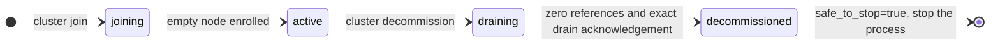

# Scale out, rebalance, and decommission nodes

[Documentation](../README.md) / [Operations](README.md) / Scaling

Add an empty physical node, move replicas onto it, and retire a node without
stopping client traffic. The `vibedb cluster` control commands drive these
durable operations through an authenticated frontend. The
`seamless-scale-in-out` workflow qualifies a 3 → 4 → 3 physical-node cycle,
three times, on Linux, with open-loop SQL and native traffic running
throughout; see the [method](../benchmarks/seamless-scale-in-out-method.md).
[Topology changes](../design/topology-changes.md#seamless-scale-out-and-scale-in)
explains the node lifecycle, frontend drain, and migration pacing behind
these commands.

> [!IMPORTANT]
> The control commands ship; their inputs do not. No shipped command creates
> the operator credential, the empty-node preparation manifest, or the public
> node descriptor. The qualification builds them with test fixtures. Until
> provisioning tooling exists, this procedure is for evaluators who can author
> those inputs from the [source grammar](#source-map).

## How an operation runs

Every mutating command creates one durable scaling operation in the
replicated catalog, identified by a 64-hex operation ID. The designated
controller frontend advances it in the background. The client only submits and
observes.



- **Join** registers an empty node, prepares it as a learner for groups, and
  moves replicas onto it. Each move is learner catch-up, promotion to a
  four-voter group, leadership transfer if needed, and source removal.
- **Rebalance** plans further moves against a desired node count, bounded by a
  move count and byte budget for the whole operation.
- **Decommission** drains every reference to one node incarnation: serving and
  learner replicas, outstanding moves, catalog and control voters, and live
  frontend sessions. Only then does the node record become `decommissioned`.

Snapshot copying is paced by each node's [migration budget](migration.md),
which also backs off when foreground work is under pressure.

## Prerequisites

- Every process runs the same build; see [upgrades](upgrades.md).
- An RF3 physical-node cluster whose frontends have a replica-control manifest
  and a designated controller. The local launcher configures both on node 1.
- An **operator profile**, a canonical `vibejson` file:

  ```json
  {"format":1,"address":"127.0.0.1:17400","server_node":"<32 hex characters>","certificate":"/path/operator-cert.pem","key":"/path/operator-key.pem","roots":"/path/roots.pem","identity_oid":"1.3.6.1.4.1.32473.1.1"}
  ```

  `address` is a frontend's native client listener and `server_node` is that
  frontend's gateway node ID. The certificate must carry the VibeDB identity
  extension for a node ID that the cluster's authorization policy grants
  `topology` (all commands) and `membership` (`join`, `rebalance`,
  `decommission`). The launcher's generated client credential has neither.
- Point the profile at a frontend you do **not** plan to retire. Status polls
  against a draining frontend lose their server when it stops.
- For a join: a new node prepared with `vibedb-shard prepare-node-rf3` from an
  empty-node manifest, started with `vibedb-shard serve-node`, and a public
  node descriptor listing its ID, incarnation, service-key SPKI digest,
  failure domain, roles, the four listener addresses, and capacity. The
  descriptor must not contain paths or private keys; the decoder rejects them.

## List nodes

```sh
vibedb cluster nodes --profile /path/operator-profile.vibejson
```

Text output has one summary line, then one line per node:

```text
op=cluster_nodes ok=true request_id=<64 hex> catalog_generation=<n> directory_revision=<n> safe_to_stop=false
node=<32 hex> incarnation=1 lifecycle=active revision=<n> catalog_generation=<n> safe_to_stop=false
```

Record each node ID and incarnation. Decommission requires both.

## Add a node

1. Start the prepared empty node and confirm it logged its readiness marker.
2. Submit the join with an explicit request ID, and keep the ID:

   ```sh
   request_id=$(openssl rand -hex 32)
   vibedb cluster join --profile /path/operator-profile.vibejson \
     --node-file /path/node-descriptor.vibejson \
     --request-id "$request_id" --wait 10m --json
   ```

3. Read `operation_id` from the response. If the command times out or the
   connection drops, rerun it with the **same** `--request-id`; the server
   returns the same operation instead of creating another.
4. Poll until `state` is `complete`:

   ```sh
   vibedb cluster status --profile /path/operator-profile.vibejson \
     --operation <operation-id> --wait 5m --json
   ```

**Success check:** `state=complete`, no blockers, and the new node listed as
`active` by `cluster nodes`. With `--json`, `application_groups_moved` and
`internal_groups_moved` count completed moves, and `group_inventory_digest`
changes when placement changes.

## Rebalance

```sh
vibedb cluster rebalance --profile /path/operator-profile.vibejson \
  --desired-node-count 4 --max-moves 32 --max-migration-bytes 67108864 \
  --request-id "$(openssl rand -hex 32)" --wait 10m --json
```

| Flag | Default | Meaning |
| --- | ---: | --- |
| `--desired-node-count` | `0` | Target physical-node count for planning; at most 4096. |
| `--max-moves` | `4096` when omitted or `0` | Moves admitted across the whole operation; at most 4096. |
| `--max-migration-bytes` | 1 GiB when omitted or `0` | Snapshot bytes admitted across the whole operation. |
| `--hysteresis-ppm` | `0` | Minimum placement improvement, in parts per million, before a move is planned. |

Both budgets count the entire durable operation, including controller
restarts; they never reset per planning wave. A rebalance that runs out of
budget keeps a blocker. It can legitimately complete with no moves when the
placement is already balanced.

## Decommission a node

1. Find the node's ID and incarnation with `cluster nodes`. Do not pick the
   designated controller (node 1 in the local launcher); its decommission is
   refused with blocker `sole_designated_controller`.
2. Submit:

   ```sh
   vibedb cluster decommission --profile /path/operator-profile.vibejson \
     --node <32 hex> --incarnation <n> \
     --request-id "$(openssl rand -hex 32)" --wait 10m --json
   ```

3. Poll `cluster status --operation <id>` until the response shows
   `safe_to_stop=true`, no blockers, and `retiring_references=0`. The `state`
   of a decommission reports the node lifecycle: `draining`, then
   `decommissioned`.
4. Close client sessions on the retiring frontend. An open SQL or native
   session holds blocker `gateway_sessions` until it disconnects; VibeDB does
   not terminate it for you.
5. Stop the node's process only after `safe_to_stop=true`. Keep its data
   directory until you have confirmed the cluster is healthy.

A `draining` lifecycle is an admission fence, never a stop proof. Only the
terminal retirement with an exact drain acknowledgement makes the node safe to
stop.

## Read blockers

Blockers are returned with the status response. The common codes:

| Code | Meaning | Action |
| --- | --- | --- |
| `serving_replicas`, `learner_replicas`, `outstanding_moves`, `enrolled_targets` | Replicas or moves still reference the node. | Wait; check migration progress and budget throttling. |
| `catalog_voters`, `control_voters` | The node still votes in catalog or control groups. | Wait for internal group moves. |
| `gateway_sessions` | A frontend session still references the node. | Disconnect clients from that frontend. |
| `retirement_fence` | No references remain, but the scan is not yet a stop proof. | Keep polling. |
| `frontend_drain_terminal_ack_pending` | The node is retired but the final drain acknowledgement is not durable. | Keep polling; do not stop the node. |
| `move_execution` | The current move saga reported an error. The detail clears after a successful pass. | Check node health and logs. |
| `sole_designated_controller` | The node runs the only topology controller. | Retire a different node. |
| `target_not_ready`, `target_not_verified` | The joining node failed its authenticated readiness check. | Check the new node's process, listeners, and credential. |
| `placement_blocked` | The planner found no admissible target. | Add capacity or relax `--hysteresis-ppm`. |
| `retirement_scan_unavailable`, `controller_error` | The controller could not complete an observation. | Check catalog quorum and controller health, then poll again. |
| `*_unavailable` (other) | The frontend lacks a required controller component. | The cluster is not configured for online scaling. |

## Retry and outcome rules

- A request ID is a 64-character lowercase hex idempotency key. Omitting it
  makes the CLI generate one, which you then cannot reuse after a lost
  response. Always pass it explicitly for mutations.
- `--wait` asks the server to hold the response for progress, up to 24 hours.
  The CLI's own deadline is the wait plus 15 seconds, or 30 seconds without
  `--wait`. Ending the wait never cancels the operation.
- The operation survives controller and target restarts; the qualification
  restarts both mid-migration and resumes the same operation IDs.
- The CLI prints every response it receives. It exits 0 only for `ok=true`,
  1 for `ok=false` or a transport failure, and 2 for a usage error. A
  successful response can still carry blockers; read them as well.

## Limitations

- No shipped tool builds the operator credential, empty-node manifest, or node
  descriptor. The launcher cannot add a fourth node by itself.
- The designated controller node cannot be retired.
- There is no cancel or rollback command for a scaling operation.
- Only the `seamless-scale-in-out` scenario is qualified: Linux, one host,
  3 → 4 → 3 nodes, fixed foreground load. Larger clusters, other failure
  domains, and multi-host networks are not.
- The request-ledger group's key ranges cannot change online.
- Text output omits phase, budget, and moved-group counts; use `--json`.
- Error messages from the CLI carry a doubled prefix, for example
  `cluster cluster_status: ...`. The operation name is still correct.

## Source map

| Concern | Source |
| --- | --- |
| CLI flags and output | [cmd/vibedb/cluster_control.go](../../cmd/vibedb/cluster_control.go) |
| Request, response, profile, and descriptor grammar | [internal/clustercontrol/control.go](../../internal/clustercontrol/control.go) |
| Capability check, status, phases, and blockers | [internal/gatewayruntime/cluster_control.go](../../internal/gatewayruntime/cluster_control.go) |
| Controller, retirement, and blocker codes | [internal/gatewayruntime/scaling_controller.go](../../internal/gatewayruntime/scaling_controller.go) |
| Safe-to-stop evidence | [gateway/scaling_metadata.go](../../gateway/scaling_metadata.go) |
| Qualification fixture | [seamless_scale_process_test.go](../../internal/gatewayruntime/seamless_scale_process_test.go) |
