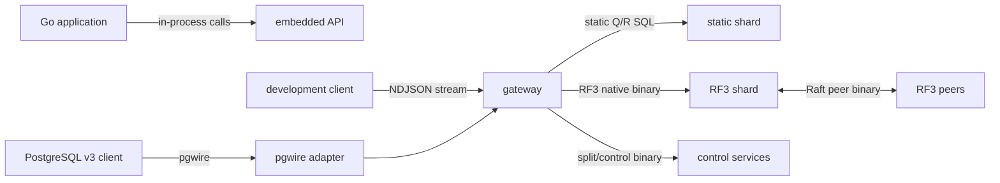
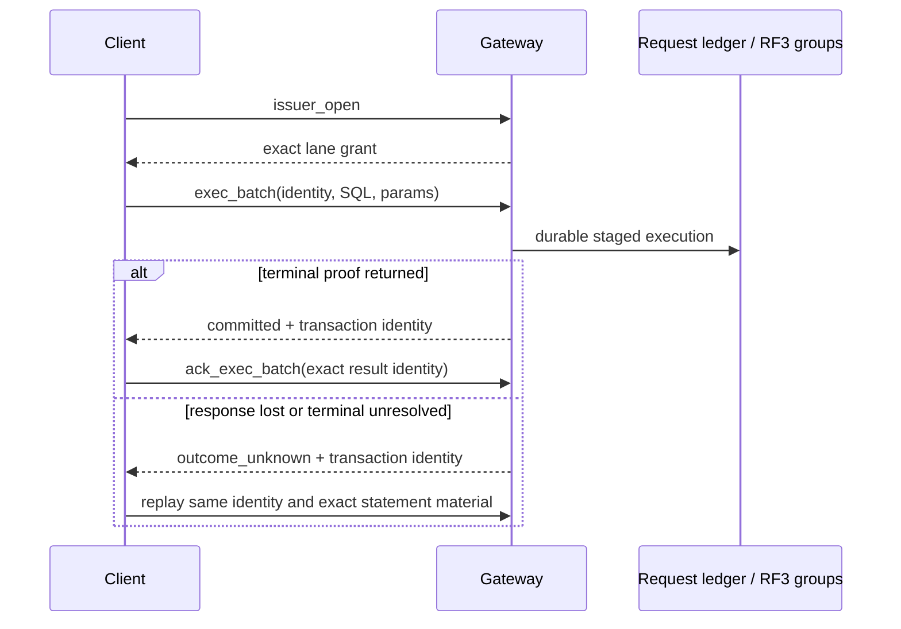

# Development protocol reference

> [!CAUTION]
> **Unreleased and unstable.** These protocols are current implementation
> details, not public compatibility contracts. They may change or disappear at
> any commit. Use one exact build at every endpoint; there is no mixed-build
> upgrade, downgrade, or rolling-compatibility promise.

VibeDB has several unrelated client and service protocols. None is HTTP or
REST. A listener accepting one protocol must not be probed with another.

## Protocol map



| Surface | Framing | Intended boundary | Compatibility |
| --- | --- | --- | --- |
| Embedded Go API | none; direct calls | application and embedded database in one process | source-level development API |
| Gateway development protocol | one JSON object plus newline | development client to gateway | exact-build only |
| Static shard SQL | tagged, length-prefixed binary | gateway to one statically owned shard | internal, exact-build only |
| RF3 native | tagged binary frames | authenticated gateway/control client to RF3 member | internal, exact-build only |
| pgwire | PostgreSQL protocol v3 framing | PostgreSQL client to adapter | protocol adapter, not PostgreSQL compatibility |
| TLS and control | mTLS stream plus traffic-specific binary protocol | service to service | internal, exact-build only |

## Embedded API is not a wire protocol

For the in-process interface, use the [Native Go API](../api/native.md). This
page deliberately does not duplicate that API or imply that its types can be
serialized onto a gateway connection.

## Placement tuple identity

Cross-shard placement uses tuple codec version 1 and native mapper version 1.
Both identifiers, field order and type, mapper parameters, and canonical tuple
bytes belong to placement identity. Changing any of them requires regenerating
every dependent placement artifact in the same change.

The scalar set is deliberately closed to raw-byte strings and exact JSON
numbers. Strings are not normalized or checked for UTF-8. Numerically equal
spellings such as `5`, `5.0`, `5e0`, and `50e-1` encode identically, as do
positive and negative zero. Booleans, null, arrays, objects, timestamps, and a
zero-value `distribution.Scalar` are refused.

Each scalar is self-delimiting: `0x01` identifies a string followed by a
uvarint byte length and its bytes; `0x02` identifies a canonical exact number.
`0x00` is reserved. `AppendScalar` leaves its destination unchanged on an
invalid scalar, while `AppendTuple` may return the already encoded valid prefix
when a later scalar fails.

The native mapper accepts one through eight fields. A complete tuple is hashed
with xxHash64 and its high bits choose a virtual bucket in the eight-byte
keyspace. Bucket width is 8 through 24 bits; the default is 20. A shorter bound
prefix cannot predict the rest of that hash and maps to the complete keyspace,
so a tenant-only predicate may scatter. xxHash64 selects placement; canonical
tuple bytes, not the hash, define equality.

## Gateway newline-delimited JSON

`vibedb-gateway serve` accepts a raw byte stream. Each request is one JSON
object terminated by a newline; the connection may carry multiple sequential
requests. There is no HTTP request line, header block, content type, chunking,
or HTTP status code. One request line is limited to 1 MiB.

The generic envelope carries SQL, typed parameters, an operational class, and
operation-specific identity. Clients do not supply shard targets, merge plans,
or ownership fences: the gateway derives those from one pinned immutable
catalog generation.

| `op` | Current use | Important boundary |
| --- | --- | --- |
| empty or `query` | routed read-only SQL | result may combine independent shard observations |
| `exec` | static, colocated single-shard execution | availability depends on serving mode; not the durable RF3 batch lane |
| `read_batch` | RF3 exact-primary-key whole-document SELECT vector | all-or-nothing result; one observation per group |
| `issuer_open` | open a durable request issuer lane | authenticated write authority and durable service required |
| `exec_batch` | sequenced durable RF3 mutation batch | closed identity grammar; no unsequenced fallback |
| `ack_exec_batch` | acknowledge an exact terminal durable result | reclaim signal, not a new mutation |
| `get` | RF3 native point read | implemented |
| `put`, `delete` | reserved native mutation grammar | decoded, then rejected before storage or network I/O |
| `metrics` | bounded process/runtime counters | development diagnostics, not a monitoring compatibility API |
| `backup`, `backup_status` | configured backup control | requires the corresponding operator capability |

Native point operations use a closed, case-sensitive, canonical field order.
Keys are strict unpadded URL-safe base64. IDs are nonzero lowercase hexadecimal.
A linearizable read is:

```json
{"op":"get","table":"documents","key":"YWJj","consistency":"linearizable"}
```

`at_least_applied` additionally requires the exact nonzero `route_id` and
`applied` value returned by an earlier operation. Applied indexes are local to
one route lineage. A split, move, schema rollout, or group replacement changes
that lineage and produces a position-mismatch refusal; a numerically larger
index from another route is not comparable.

The native response uses typed codes and a `retryable` bit. Retryable examples
include stale catalog, read-behind, conflict, overload, and some unavailable
conditions. A non-retryable result can still be a definite refusal rather than
success. Callers must classify the response, not parse diagnostic text.

### Durable write identity and unknown outcomes

`exec_batch` requires all of `request_id`, `installation_id`, `issuer_epoch`,
`lane_ordinal`, `grant_digest`, and `issuer_sequence`. Legacy issuer fields are
decode-only and rejected. The gateway has no fallback that silently executes an
unsequenced batch.



`committed` and `outcome_unknown` are mutually exclusive. A disconnect,
deadline, cancellation, or TLS rotation after possible admission does not prove
abort. Retain the same request identity, SQL bytes, parameter kinds and bytes,
statement order, and grant. Resolve or replay that exact request; never generate
a fresh ID for an ambiguous mutation. At the lower RF3 layer, retry is stricter
still: the executor resends the exact original canonical command bytes.

## Static shard SQL

The static shard service uses big-endian frames: a one-byte tag, then an `int32`
length that includes its own four bytes but not the tag, then a body beginning
with wire version 1. Requests use `Q`; responses use `R`.

A request carries SQL text and typed parameters, not a serialized plan. The
shard parses and plans locally. Parameter kinds are null, boolean, exact-number
spelling, UTF-8 string, and complete JSON document. Ownership coordinates,
read policy, execution mode, deadline, row/byte bounds, access scopes, read
fences, and specialized transaction/exchange fields are explicit.

| Property | Static service behavior |
| --- | --- |
| ownership | one immutable distribution/shard/allocation/routing/epoch identity |
| concurrency | one goroutine and one single-consumer SQL session per SQL connection |
| reads | only strong, leader-owner reads; session and stale policies are reserved and refused |
| writes | require explicit read-write mode; distributed gateways do not select it |
| failures | closed typed classes such as not-owner, stale epoch/version, deadline, resource, malformed, read-only, unsupported policy, and outcome-unknown |
| availability | the endpoint itself creates no Raft election, replication, or failover |

Authentication is an outer listener responsibility. The checked-in command
requires either the authenticated TLS profile or explicit plaintext loopback
development mode. Do not expose the codec as an unauthenticated remote service.

## RF3 native service

RF3 native is not static `Q`/`R` SQL. It is an authenticated binary service
with version 1 and request tags `P`, `M`, `T`, `L`, `E`, and `G`; responses use
`A`. The operation byte further selects the request family.

| Family | Operations |
| --- | --- |
| serving discovery | probe, member state, leader hint |
| consensus mutation | propose exact canonical command |
| membership | authenticated fixed-width membership transition |
| data read | leader ReadIndex read or explicit applied-floor follower read |
| recovery | transaction, request-ledger, execution-pin, and route-gate reads |
| batches and SQL | leader batch point read and leader fenced SQL query |

Every request carries exact authority/capability and serving fences. Responses
separate completion, not-leader, outcome-unknown, pre-admission refusal,
membership acceptance, and read results. Terminal proposal responses bind the
exact command with a digest; remote diagnostic strings are not part of the hot
wire.

The public RF3 serving catalog requires three replicas. That is a topology
policy, not a property of generic Raft framing. Replacement may temporarily use
a separately authorized fourth member, which never widens the public data
route.

### Read cuts are per group

A linearizable point read is leader-only and waits for a quorum-backed
ReadIndex plus local apply. An `at_least_applied` follower read proves only that
one exact route reached the supplied floor; it is neither linearizable nor a
bounded-staleness promise.

Points routed to one group can share one coherent ReadIndex cut. Scatter and
`read_batch` partition by group, acquire one cut independently for each group,
and merge only if every group succeeds. The returned observation vector is
therefore **not a global MVCC snapshot, global timestamp, or transaction cut**.
One definite stale fence permits at most one catalog refresh and complete
replay from the original request.

General RF3 SQL is also a leader ReadIndex-fenced request, with narrower
per-request bounds than static SQL. The optimized `read_batch` lane accepts only
exact-primary-key, whole-document SELECTs; joins, projections, ranges,
aggregates, ordering, and limits continue through the general executor.

## PostgreSQL wire adapter

The [`pgwire` API](../api/pgwire.md) implements PostgreSQL protocol v3 framing,
simple Query, extended Parse/Bind/Describe/Execute/Sync, prepared statements,
portals, cancellation, selected text/binary formats, SCRAM-SHA-256, and
SSLRequest TLS negotiation. It is not a PostgreSQL server or catalog clone.
Direct TLS, SCRAM-SHA-256-PLUS, replication, `COPY`, `LISTEN`/`NOTIFY`, a
queryable `pg_catalog`, and the full PostgreSQL type/function surface are absent.

| Deployment | Backend and security | SQL/transaction boundary |
| --- | --- | --- |
| embedded `pgwire` package | local SQL database; caller must explicitly choose Trust or SCRAM and TLS policy | shares the embedded SQL runtime, including its documented local transaction surface |
| gateway `-pg-dev-listen` | RF3 distributed backend; literal loopback only; Trust auth; user `local`, database `vibedb`; no TLS on this listener | per-statement quorum reads; durable autocommit `INSERT`/`UPDATE`/`DELETE` without `RETURNING`; no mutation inside explicit transactions |

The gateway adapter rejects repeatable-read and serializable snapshot claims,
savepoints, `INSERT ... SELECT`, `ON CONFLICT`, computed update forms that need
coordinator-owned post-images, and unsupported distributed DML shapes. DDL is
available only when a coordinated callback is configured; it is never executed
as a replica-local schema change. An unknown commit outcome is propagated.

## TLS, build gate, and control protocols

Internal services use TLS 1.3 identities derived from a critical certificate
extension containing fixed binary identity. Subject, common-name, and DNS text
do not grant identity. Traffic classes isolate Raft, snapshot, shard native,
SQL, client, and control streams. An allowlist authenticates the peer NodeID;
the next layer authorizes an explicit capability.

After TLS, internal streams exchange a fixed 104-byte build preface. Wire and
disk grammar IDs are opaque equality identities with no ordering semantics.
Both peers must have exact grammar IDs and mutually sufficient capability bits.
This is an exact-build gate, not version negotiation.

Credential/allowlist rotation atomically publishes a new admission generation
and closes streams admitted under the retired generation. That revocation is
why an in-flight mutation can lose its response without proving non-execution.

Shard split control is another protocol, not gateway NDJSON. It carries fixed
operation and step identities, an exact multi-field fence, a plan digest, and
at most 1 MiB of canonical JSON payload inside binary frames. One TLS stream
carries one request. `Accepted` means the durable idempotency witness exists;
`Retry` never proves execution. A write or read failure after sending a request
is outcome-unknown, and exact replay must return a byte-identical result digest
and payload.

Raft peer transport and service metrics have their own binary grammars. Neither
is a client SQL/JSON surface, and a successful socket write is not a Raft ACK,
commit acknowledgement, or apply acknowledgement.

## Source map

| Area | Authoritative source |
| --- | --- |
| gateway stream and dispatch | `cmd/vibedb-gateway/serve.go`, `serve_request_wire.go` |
| native JSON grammar and errors | `cmd/vibedb-gateway/data_wire.go`, `data_handler.go`, `data_response.go` |
| durable request grammar | `cmd/vibedb-gateway/durable_exec_batch_wire.go`, `durable_exec_batch.go`, `exec_batch_ack_wire.go` |
| static shard framing and admission | `shardservice/codec.go`, `wire.go`, `server.go`, `admit.go` |
| RF3 native framing and serving | `shardservice/replicated_wire.go`, `replicated_server.go`, `replicated_query.go` |
| RF3 routing and retry | `gateway/replicated_native.go`, `replicated_data_read.go`, `replicated_data_scatter_read.go`, `replicated_sql_read.go` |
| pgwire base and gateway adapter | `pgwire/doc.go`, `pgwire/proto.go`, `gateway/pgwire.go`, `gateway/pgwire_write.go` |
| TLS identity and rotation | `internal/servicetls/`, `internal/rafttransport/identity.go` |
| exact-build gate | `internal/buildgate/profile.go`, `internal/buildgate/preface.go` |
| split control | `shardcontrol/protocol.go`, `shardcontrol/service.go` |
