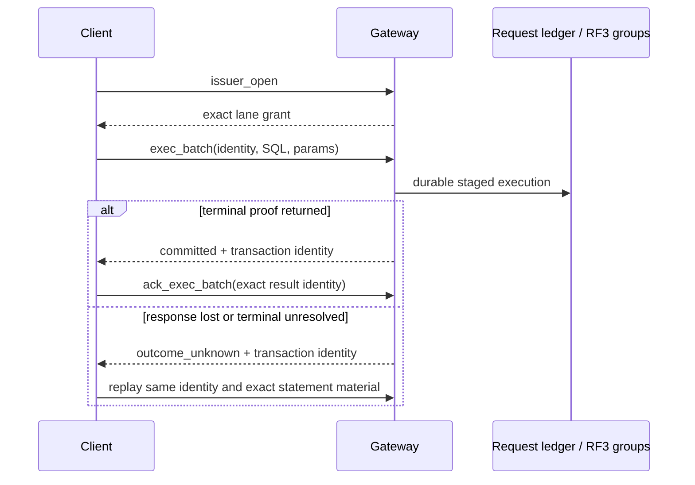

# Development protocol reference

> [!CAUTION]
> **Unreleased and unstable.** These protocols are current implementation
> details, not public compatibility contracts. They may change or disappear at
> any commit. Use one exact build at every endpoint; there is no mixed-build
> upgrade, downgrade, or rolling-compatibility promise.

VibeDB has several unrelated client and service protocols. None is HTTP or
REST. A listener accepting one protocol must not be probed with another.

## Protocol map

| Boundary | Protocol |
| --- | --- |
| application to embedded database | direct Go calls; see the [Native Go API](../api/native.md) |
| development client to gateway | one JSON object per line |
| PostgreSQL client to adapter | PostgreSQL v3 framing; adapter behavior, not PostgreSQL compatibility |
| gateway to static shard | tagged, length-prefixed `Q`/`R` binary frames |
| gateway or control client to RF3 member | authenticated RF3 native binary frames |
| RF3 peers and control services | mTLS plus a traffic-specific binary protocol |

The embedded API has no wire encoding. Every network protocol in this table is
an exact-build development surface unless its section says otherwise.

## Placement tuple identity

Cross-shard placement identity includes tuple codec version 1, native mapper
version 1, field order and types, mapper parameters, and canonical tuple bytes.
Changing any part requires regenerating every dependent placement artifact in
the same change.

The scalar set is deliberately closed to raw-byte strings and exact JSON
numbers. Strings are not normalized or checked for UTF-8. Numerically equal
spellings such as `5`, `5.0`, `5e0`, and `50e-1` encode identically, as do
positive and negative zero. Booleans, null, arrays, objects, timestamps, and a
zero-value `distribution.Scalar` are refused.

`0x01` encodes a string with a uvarint byte length; `0x02` encodes a canonical
exact number; `0x00` is reserved. `AppendScalar` leaves its destination
unchanged on refusal, while `AppendTuple` may return an encoded valid prefix
when a later scalar fails. The mapper accepts one through eight fields and uses
the high bits of xxHash64 to select an 8- to 24-bit virtual bucket (20 by
default). A bound prefix maps to the full keyspace because it cannot predict
the remaining hash input. The hash selects placement; canonical tuple bytes
define equality.

## Gateway newline-delimited JSON

`vibedb-gateway serve` accepts a raw byte stream. Each request is one JSON
object terminated by a newline; the connection may carry multiple sequential
requests. There is no HTTP request line, header block, content type, chunking,
or HTTP status code. One request line is limited to 1 MiB.

The generic envelope carries SQL, typed parameters, an operational class, and
operation-specific identity. Clients do not supply shard targets, merge plans,
or ownership fences: the gateway derives those from one pinned immutable
catalog generation.

| `op` | Current use | Important boundary |
| --- | --- | --- |
| empty or `query` | routed read-only SQL | result may combine independent shard observations |
| `exec` | one static single-base-owner write; index maintenance may add transaction participants | not a general static batch or the durable RF3 batch lane |
| `read_batch` | RF3 exact-primary-key whole-document SELECT vector | all-or-nothing result; one observation per group |
| `issuer_open` | open a durable request issuer lane | authenticated write authority and durable service required |
| `exec_batch` | sequenced durable RF3 mutation batch | closed identity grammar; no unsequenced fallback |
| `ack_exec_batch` | acknowledge an exact terminal durable result | reclaim signal, not a new mutation |
| `get` | RF3 native point read | implemented |
| `put`, `delete` | reserved native mutation grammar | decoded, then rejected before storage or network I/O |
| `metrics` | bounded process/runtime counters | development diagnostics, not a monitoring compatibility API |
| `backup`, `backup_status` | configured backup control | requires the corresponding operator capability |

Native point operations use a closed, case-sensitive, canonical field order.
Keys are strict unpadded URL-safe base64. IDs are nonzero lowercase hexadecimal.
A linearizable read is:

```json
{"op":"get","table":"documents","key":"YWJj","consistency":"linearizable"}
```

`at_least_applied` additionally requires the exact nonzero `route_id` and
`applied` value returned by an earlier operation. Applied indexes are local to
one route lineage. A split, move, schema rollout, or group replacement changes
that lineage and produces a position-mismatch refusal; a numerically larger
index from another route is not comparable.

The native response uses typed codes and a `retryable` bit. Retryable examples
include stale catalog, read-behind, conflict, overload, and some unavailable
conditions. A non-retryable result can still be a definite refusal rather than
success. Callers must classify the response, not parse diagnostic text.

### Durable write identity and unknown outcomes

`exec_batch` requires `request_id`, `installation_id`, `issuer_epoch`,
`lane_ordinal`, `grant_digest`, and `issuer_sequence`. Legacy issuer fields are
decode-only and rejected; there is no unsequenced fallback.



`committed` and `outcome_unknown` are mutually exclusive. After possible
admission, a disconnect, deadline, cancellation, or TLS rotation does not prove
abort. Resolve or replay the same identity, grant, statement order, SQL bytes,
and parameter kinds and bytes; never replace an ambiguous mutation with a new
ID. RF3 retries resend the original canonical command bytes.

## Static shard SQL

The static shard service uses big-endian frames: a one-byte tag, then an `int32`
length that includes its own four bytes but not the tag, then a body beginning
with wire version 1. Requests use `Q`; responses use `R`.

A request carries SQL text and typed parameters, not a serialized plan. The
shard parses and plans locally. Parameter kinds are null, boolean, exact-number
spelling, UTF-8 string, and complete JSON document. Ownership coordinates,
read policy, execution mode, deadline, row/byte bounds, access scopes, read
fences, and specialized transaction/exchange fields are explicit.

| Property | Static service behavior |
| --- | --- |
| ownership | one immutable distribution/shard/allocation/routing/epoch identity |
| concurrency | one goroutine and one single-consumer SQL session per SQL connection |
| reads | only strong, leader-owner reads; session and stale policies are reserved and refused |
| writes | require explicit read-write mode; the distributed gateway selects it for admitted mutations |
| failures | closed typed classes such as not-owner, stale epoch/version, deadline, resource, malformed, read-only, unsupported policy, and outcome-unknown |
| availability | the endpoint itself creates no Raft election, replication, or failover |

Authentication is an outer listener responsibility. The checked-in command
requires either the authenticated TLS profile or explicit plaintext loopback
development mode. Do not expose the codec as an unauthenticated remote service.

### Static mutation capture

Two mutually exclusive optional request markers run `UPDATE`/`DELETE` target
selection without publishing:

| Marker | Response columns, all JSON OID 114 | Computed `UPDATE` |
| --- | --- | --- |
| legacy `0xdc` | `primary_key`, `document` | refused |
| mutation image `0xe4` | `primary_key`, `before_document`, `after_document` | admitted; DELETE returns SQL NULL for `after_document` |

Both modes carry SQL and typed parameters, execute as read-only, and require
delegated data-read plus data-write capability. They cannot combine with a
transaction, read fence, global-index lookup, primary-key read, document scan,
partial aggregate, row batch, exchange, or repartition request. Result row and
byte limits cover every returned key and image; excess is a resource-limit
failure. Returned images are canonical and owned by the response.

## RF3 native service

RF3 native is not static `Q`/`R` SQL. It is an authenticated binary service
with version 1 and request tags `P`, `M`, `T`, `L`, `E`, and `G`; responses use
`A`. The operation byte further selects the request family.

| Family | Operations |
| --- | --- |
| serving discovery | probe, member state, leader hint |
| consensus mutation | propose exact canonical command |
| membership | authenticated fixed-width membership transition |
| data read | point, batch, and fenced SQL reads |
| recovery | transaction, request-ledger, execution-pin, and route-gate reads |
| batches and SQL | leader batch point read and leader fenced SQL query |

Every request carries exact authority/capability and serving fences. Responses
separate completion, not-leader, outcome-unknown, pre-admission refusal,
membership acceptance, and read results. Terminal proposal responses bind the
exact command with a digest; remote diagnostic strings are not part of the hot
wire.

The public RF3 serving catalog requires three replicas. That is a topology
policy, not a property of generic Raft framing. Replacement may temporarily use
a separately authorized fourth member, which never widens the public data
route.

### Read cuts are per group

Every linearizable RF3 read is leader-only and waits for a quorum-backed
ReadIndex plus local apply. An `at_least_applied` follower read proves only that
one exact route reached the supplied floor; it is neither linearizable nor a
bounded-staleness promise.

Points routed to one group can share one coherent ReadIndex cut. Scatter and
`read_batch` partition by group, acquire one cut independently for each group,
and merge only if every group succeeds. The returned observation vector is
therefore **not a global MVCC snapshot, global timestamp, or transaction cut**.
One definite stale fence permits at most one catalog refresh and complete
replay from the original request.

General RF3 SQL has narrower per-request bounds than static SQL. The optimized
`read_batch` lane accepts only exact-primary-key, whole-document SELECTs; joins,
projections, ranges, aggregates, ordering, and limits use the general executor.

## PostgreSQL wire adapter

See the [pgwire guide](../api/pgwire.md) for framing, authentication, client
features, and unsupported PostgreSQL facilities. This reference only separates
the two deployment boundaries.

| Deployment | Backend and security | SQL/transaction boundary |
| --- | --- | --- |
| embedded `pgwire` package | local SQL database; caller must explicitly choose Trust or SCRAM and TLS policy | shares the embedded SQL runtime, including its documented local transaction surface |
| gateway `-pg-dev-listen` | RF3 distributed backend; literal loopback only; Trust auth; user `local`, database `vibedb`; no TLS on this listener | per-statement quorum reads; durable autocommit `INSERT`/`UPDATE`/`DELETE` without `RETURNING`; no mutation inside explicit transactions |

For an exact-primary-key autocommit `UPDATE`, the gateway admits supported
computed declared-column assignments. It reads the old row with a linearizable
point read, evaluates the expressions once, canonicalizes the postimage, and
retains that postimage in the durable program with the expected old-value
length and SHA-256 digest. Apply is an exact old-value compare-and-swap; retry
may initially replan, but after admission transaction execution and recovery
use the retained bytes instead of re-evaluating the expressions.

The gateway still fences `RETURNING`, `ON CONFLICT`, nested write targets,
multi-statement pgwire writes, and mutations inside an explicit transaction.
It also rejects repeatable-read and serializable snapshot claims, savepoints,
`INSERT ... SELECT`, and unsupported distributed DML shapes. DDL requires a
coordinated callback and never runs as a replica-local schema change. Unknown
commit outcomes are propagated.

## TLS, build gate, and control protocols

Internal services use TLS 1.3 identities derived from a critical certificate
extension containing fixed binary identity. Subject, common-name, and DNS text
do not grant identity. Traffic classes isolate Raft, snapshot, shard native,
SQL, client, and control streams. An allowlist authenticates the peer NodeID;
the next layer authorizes an explicit capability.

After TLS, internal streams exchange a fixed 104-byte build preface. Wire and
disk grammar IDs are opaque equality identities with no ordering semantics.
Both peers must have exact grammar IDs and mutually sufficient capability bits.
This is exact-declared-grammar admission, not version negotiation or proof that
the peers came from the same commit.

> [!WARNING]
> The grammar manifest was not advanced for static-shard marker `0xe4` or for
> commit `e9ac566f`. Across the first boundary, builds advertise the same wire
> ID although the older decoder rejects the marker. Across the second, builds
> advertise the same wire and disk IDs although RF3 global-index relations now
> admit `PutDigestEqual` and stored transactions normalize
> `ResultInvalidDocument` and `ResultTargetBound` to `ResultIndexConflict`. Run
> one exact binary commit across every endpoint; the current preface does not
> prove compatibility across either boundary.

Credential/allowlist rotation atomically publishes a new admission generation
and closes streams admitted under the retired generation. That revocation is
why an in-flight mutation can lose its response without proving non-execution.

Shard split control is another protocol, not gateway NDJSON. It carries fixed
operation and step identities, an exact multi-field fence, a plan digest, and
at most 1 MiB of canonical JSON payload inside binary frames. One TLS stream
carries one request. `Accepted` means the durable idempotency witness exists;
`Retry` never proves execution. A write or read failure after sending a request
is outcome-unknown, and exact replay must return a byte-identical result digest
and payload.

Raft peer transport and service metrics have their own binary grammars. Neither
is a client SQL/JSON surface, and a successful socket write is not a Raft ACK,
commit acknowledgement, or apply acknowledgement.

## Source map

| Area | Authoritative source |
| --- | --- |
| gateway stream and dispatch | `cmd/vibedb-gateway/serve.go`, `serve_request_wire.go` |
| native JSON grammar and errors | `cmd/vibedb-gateway/data_wire.go`, `data_handler.go`, `data_response.go` |
| durable request grammar | `cmd/vibedb-gateway/durable_exec_batch_wire.go`, `durable_exec_batch.go`, `exec_batch_ack_wire.go` |
| static shard framing and admission | `shardservice/codec.go`, `wire.go`, `server.go`, `admit.go` |
| static mutation-image execution | `sql/driver/mutation_capture.go`, `shardservice/execute.go`, `gateway/executor.go`, `gateway/writer.go` |
| RF3 native framing and serving | `shardservice/replicated_wire.go`, `replicated_server.go`, `replicated_query.go` |
| RF3 routing and retry | `gateway/replicated_native.go`, `replicated_data_read.go`, `replicated_data_scatter_read.go`, `replicated_sql_read.go` |
| pgwire base and gateway adapter | `pgwire/doc.go`, `pgwire/proto.go`, `gateway/pgwire.go`, `gateway/pgwire_write.go` |
| TLS identity and rotation | `internal/servicetls/`, `internal/rafttransport/identity.go` |
| declared-grammar gate | `internal/buildgate/profile.go`, `internal/buildgate/preface.go` |
| split control | `shardcontrol/protocol.go`, `shardcontrol/service.go` |
