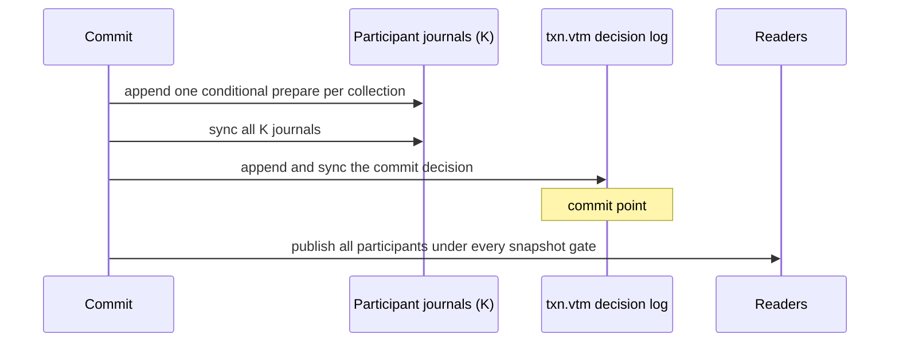

# Transactions

[Documentation](README.md) / [Design](design/README.md) · [Development status](status.md)

Use the root `vibedb` package for serializable application transactions over
named collections. This page explains what those transactions guarantee, how
they detect conflicts, and how a commit that touches several durable
collections stays atomic across a crash. SQL transactions (Read Committed,
Repeatable Read, Serializable, savepoints) are described in the
[SQL API](api/sql.md#transactions-and-savepoints).

The code calls each independently committed resource a **transaction
target**; commit-protocol literature calls it a participant. In the embedded
engine a target is one dirty collection.

## Choose an API

| Need | API | Contract |
| --- | --- | --- |
| Read and write application data | `(*vibedb.Database).Update` | Serializable; commits when the callback returns nil |
| Read one coherent database cut | `(*vibedb.Database).View` | Read-only; mutations return `ErrTxReadOnly` |
| Control commit and rollback | `Begin` / `BeginReadOnly` | Caller owns the `Tx` lifetime |
| Publish several heap collections atomically | `store.UpdateCollections` | Visibility-atomic to `store.Database.Snapshot`; no persistence |
| Batch one durable collection | `(*durable.Collection).Update` | One logical failure-atomic publication |
| Commit several durable collections | `(*durable.Database).Update` | Conditional prepares plus one durable decision |

## Run a transaction

```go
err := db.Update(func(tx *vibedb.Tx) error {
	accounts := tx.Collection("accounts")
	audit := tx.Collection("audit")

	if _, err := accounts.Put("account:1", []byte(`{"balance":90}`)); err != nil {
		return err
	}
	_, err := audit.Put("entry:1", []byte(`{"account":"account:1","delta":-10}`))
	return err
})
```

`Update` rolls back when the callback returns an error or panics (and then
re-panics). It does not retry.

Use `Begin` when the commit decision belongs outside a callback:

```go
tx, err := db.Begin()
if err != nil {
	return err
}
defer tx.Rollback()

if _, err := tx.Collection("jobs").Put("job:7", body); err != nil {
	return err
}
return tx.Commit()
```

After `Commit` or `Rollback`, the `Tx` and every escaped `TxCollection` return
`ErrTxDone`. `Rollback` after `Commit` is a nil no-op.

## What a transaction sees

The two transaction kinds read differently:

| Kind | Reads | Guarantee |
| --- | --- | --- |
| `View` / `BeginReadOnly` | One coherent cut of every collection, captured at begin | Every read belongs to the same database state |
| `Update` / `Begin` | Each collection is snapshotted when the transaction first touches it, plus the transaction's own staged writes | A successful commit is serializable |

A read-write transaction samples a database-wide logical revision at begin
and snapshots collections lazily. Its reads are therefore **provisional**: if
another transaction commits between the moments two collections are first
touched, the callback can observe values from different database states. Such
a transaction never commits; validation rejects it with `ErrTxConflict`. Code
inside `Update` must not trigger external side effects based on reads, and
must tolerate seeing a combination of values that no committed state
contained. Use `View` when a callback needs a coherent read-only cut.

`Get`, `Range`, and `Run` all include the transaction's own staged writes.
Uncommitted changes are invisible outside the transaction.

## How conflicts are detected

Commit validates, against every commit published after the transaction's
begin revision:

- exact point reads, including reads of absent keys;
- the existence assumptions behind each `Put` and `Delete` result, including
  ABA changes;
- whole-collection reads by `Range` and `Run` (phantoms), tracked as a coarse
  collection dependency;
- races on lazily created collections.

Disjoint-key transactions on the same collection can both commit. Each
transaction tracks up to 4,096 exact read keys or 1 MiB of key bytes; beyond
that the collection escalates to a coarse dependency, so any later write to
that collection conflicts. Each collection keeps a bounded history of up to
4,096 recently written keys while transactions are active; when history is
discarded, transactions that began before the discard conflict
conservatively. `ErrTxConflict` can therefore occur without a real anomaly.
Treat it as a normal retry signal.

## Retry conflicts

Retry the complete closure against a fresh transaction. Never reuse a finished
`Tx`.

```go
for attempt := 0; ; attempt++ {
	err := db.Update(applyTransfer)
	if !errors.Is(err, vibedb.ErrTxConflict) {
		return err
	}
	if attempt == 7 {
		return err
	}
	time.Sleep(time.Duration(1<<attempt) * time.Millisecond)
}
```

VibeDB supplies no default backoff, deadline, or retry count.

## Admission limits

| Scope | Resource | Default maximum |
| --- | --- | ---: |
| Per dirty collection | Distinct staged keys | 64 |
| Per dirty collection | Staged key and value bytes | 16,793,600 |
| Whole transaction | Dirty collections | 16 |
| Whole transaction | Distinct staged keys | 256 |
| Whole transaction | Staged key and value bytes | 67,174,400 |
| Whole transaction | Exact read keys before coarse escalation | 4,096 |
| Whole transaction | Retained read-key bytes before coarse escalation | 1 MiB |
| Whole transaction | Collections with read dependencies | 128 |
| Whole transaction | Distinct absent collections touched | 128 |

Staging beyond a write bound returns `ErrTxTooLarge` from that `Put` or
`Delete` and leaves the transaction usable. Configure the three
whole-transaction write bounds with `AdvancedOptions.TxnLimits`; per-collection
bounds come from each collection's `MaxBatchDocuments` and `MaxBatchBytes`.

## Profile support

| Profile | One dirty collection | Two or more dirty collections |
| --- | --- | --- |
| `Durable` | One journal record and one sync | Crash-atomic decision protocol |
| `Buffered` | Supported; durable only after `Flush` or `Close` | Refused at commit with `ErrTxUnsupportedLane` |
| `Memory` | Supported | Visibility-atomic; no persistence |

An empty or read-only commit publishes nothing and does not create lazy
collections, but a read-write transaction with reads and no writes still
validates its reads.

## Commit concurrency

Commit acquires the fence of every collection it read or wrote, in name
order, and holds them through validation and publication. A direct `Put` or
`Delete` on one of those collections therefore happens entirely before
validation or entirely after publication. A transaction that reads and writes
only one collection commits in parallel with transactions on other
collections; a transaction that spans collections takes a database-wide
commit lock. Direct writes to unrelated collections never wait.

For a durable single-collection commit, rows and exact-index postings publish
as one logical failure-atomic publication. Preparing a batch can first publish
a content-equivalent topology generation. If a later step fails, logical rows
are unchanged, but `Generation` may advance. Never use generation equality as
proof that a failed batch changed nothing.

## Durable multi-collection commit

With two or more dirty durable collections:



Scope: one database directory on one node. The commit uses `K+1` sync
operations. Publication after the durable decision is designed not to fail.
On reopen, a valid decision rolls every participant forward; no decision
means presumed abort. A standalone open of one collection with an
unresolved conditional record fails closed.

A failed decision append or sync returns `ErrCommitOutcomeUnknown` and
poisons the catalog's writers. It does not prove abort. Close and reopen the
complete database directory to resolve the all-or-none outcome before
inspecting or retrying.

Low-level `durable.UpdateCollections` requires explicit nonzero `TxnLimits`
for two or more dirty collections; `durable.Database.Update` supplies
defaults. Only the synchronous-journal and buffered-journal lanes can join a
multi-collection commit. `durable.Database.Update` holds the catalog read lock
through its callback, so do not run collection DDL inside it. The heap
`store.Database.Update` instead copies the catalog and releases its lock
before the callback.

## Heap publication

`store.UpdateCollections` stages all participant batches before locking, then
locks the participants in name order, plans every next state, and publishes
the state pointers only after all fallible work succeeds. A concurrent
`store.Database.Snapshot` sees every participant before or after the commit.
Independent single-collection snapshots can observe different sides of the
pointer-flip sequence.

## Errors and nesting

| Error | Meaning |
| --- | --- |
| `ErrTxConflict` | Serialization conflict; nothing published |
| `ErrTxTooLarge` | Bounded admission refusal |
| `ErrTxDone` | Finished transaction handle |
| `ErrTxReadOnly` | Mutation in `View` or `BeginReadOnly` |
| `ErrTxUnsupportedLane` | Multi-collection commit on `Buffered` |
| `ErrCommitOutcomeUnknown` | Ambiguous durable decision; close and reopen |
| `ErrTxNested` | `Update` or `View` reentered on the same goroutine |

A `Tx` is single-consumer and must not be copied or shared across
goroutines. `ErrTxNested` only detects closure reentry; a manual `Begin`
inside a callback starts an independent transaction that can conflict with
the outer one.

## Limitations

- No savepoints, nested transactions, or automatic retry in the native API.
- Read-write transactions are optimistic and give no cross-collection read
  consistency before commit (no opacity).
- Conflict tracking is bounded; heavy write traffic or long transactions
  produce conservative conflicts.
- A multi-collection commit takes a database-wide lock; throughput of
  cross-collection transactions does not scale with collection count.
- `Buffered` cannot commit multi-collection transactions.
- A transaction's snapshot is a local visibility cut, not a durable or
  distributed timestamp.
- Full-text matching is refused inside a transaction after staging writes to
  the searched collection.

## Source map

- Facade transactions: [vibedb_txn.go](../vibedb_txn.go), [vibedb.go](../vibedb.go)
- Conflict history: [internal/txnclock/clock.go](../internal/txnclock/clock.go), [internal/txnclock/history.go](../internal/txnclock/history.go)
- Serializable anomaly tests: [vibedb_txn_serializable_test.go](../vibedb_txn_serializable_test.go)
- Cut and fractured-read tests: [vibedb_txn_snapshot_internal_test.go](../vibedb_txn_snapshot_internal_test.go)
- Profile and retry tests: [vibedb_txn_test.go](../vibedb_txn_test.go), [capability_matrix_facade_test.go](../capability_matrix_facade_test.go)
- Heap atomic publication: [store/store_database_txn.go](../store/store_database_txn.go)
- Durable decision protocol and recovery: [store/durable/store_database_txn.go](../store/durable/store_database_txn.go), [store/durable/store_database_txn_recovery.go](../store/durable/store_database_txn_recovery.go)
- Crash matrix: [store/durable/store_database_txn_crash_test.go](../store/durable/store_database_txn_crash_test.go)
